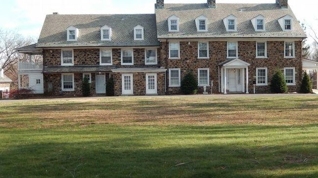
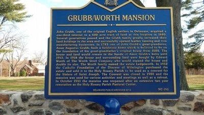

{width="6.770833333333333in"
height="3.8020833333333335in"}

Grubb-Worth Mansion

{width="4.166666666666667in"
height="2.34375in"}

[Grubb Historical Marker](https://www.hmdb.org/m.asp?m=146375)

John [Grubb](https://www.firstfamilies.us/ancestors/england/grubb), one
of the original English settlers in Delaware, acquired a one-third
interest in a 600 acre tract of land at this location in 1680. Several
generations passed and the Grubb family greatly increased their land
holdings in the area and successfully opened leather tanning and iron
manufacturing businesses. In 1783 one of John Grubb's great-grandsons,
Amor Augustus Grubb, built a fieldstone home which is believed to be on
the foundation of his great-grandfather's original house from 1684. The
house and land would remain in the hands of Amor Grubb's heirs until
1913. In 1918 the house and surrounding land were bought by Edward Worth
of The Worth Steel Company who would expand the house and double its
size. The Worth family named the estate Ledgeworth. In 1952 the Catholic
Foundation of the Diocese of Wilmington purchased the estate and sold it
to the Holy Rosary Parish to be used as a convent for the Sisters of
Saint Joseph. The Convent was closed in 1980 and the mansion was used
for various activities and meetings as well as a retreat. 
