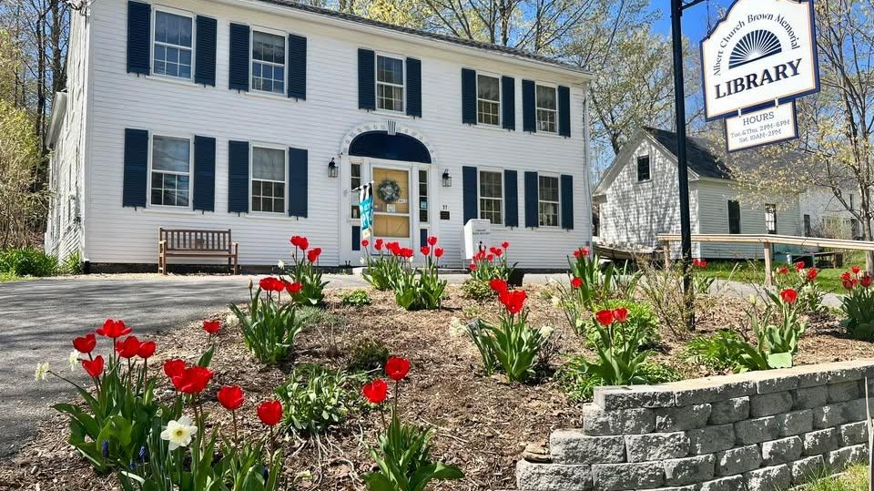
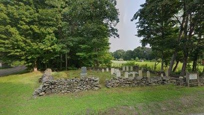

Resources

[Kennebec County, Maine -
Wikipedia](https://en.wikipedia.org/wiki/Kennebec_County,_Maine) 

[Kennebec County, Maine Genealogy •
FamilySearch](https://www.familysearch.org/en/wiki/Kennebec_County,_Maine_Genealogy) 

[National Register of Historic Places listings in Kennebec County,
Maine -
Wikipedia](https://en.wikipedia.org/wiki/National_Register_of_Historic_Places_listings_in_Kennebec_County,_Maine) 

[China, Maine - Wikipedia](https://en.wikipedia.org/wiki/China,_Maine) 

[China Village Historic
District](https://en.wikipedia.org/wiki/China_Village_Historic_District)

[China, Kennebec County, Maine Genealogy •
FamilySearch](https://www.familysearch.org/en/wiki/China,_Kennebec_County,_Maine_Genealogy) 

[Vassalboro, Maine -
Wikipedia](https://en.wikipedia.org/wiki/Vassalboro,_Maine) 

[Vassalboro Historical Society & Museum](http://www.vhsme.org/)

{width="2.0208333333333335in"
height="1.1354166666666667in"}

[Majek Seafood & Grill](https://majekseafood.com/)

239 Lakeview Dr, China, ME 04358

+12074458043

{width="7.5in"
height="4.211111111111111in"}

[Albert Church Brown Memorial
Library ](https://www.facebook.com/chinalibrary/)

35 Main St, China, ME, United States, Maine

chinalibraryacb@gmail.com 

1 207-968-2926

{width="7.5in"
height="4.214583333333334in"}

[China Lake](https://www.lakesofmaine.org/lake-overview.html?m=5448)

571 Lakeview Dr, China, ME 04358

{width="4.25in"
height="2.3854166666666665in"}

[Haskell
Cemetery](https://www.findagrave.com/cemetery/90027/haskell-cemetery)

CF92+96 China, Maine
