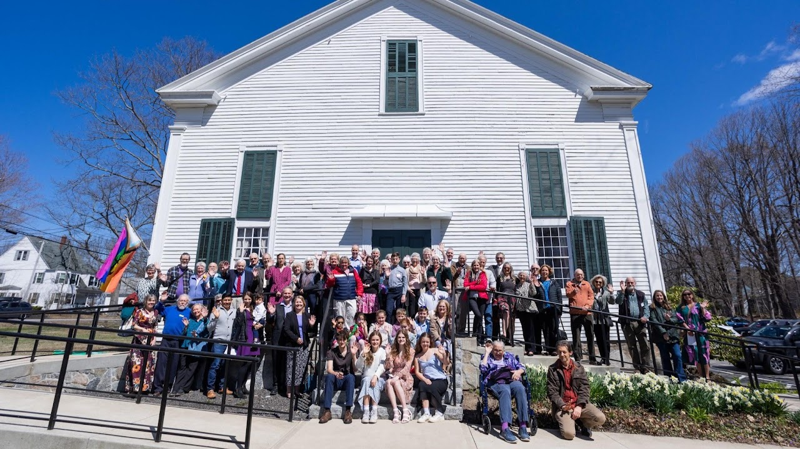
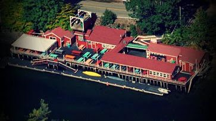

Resources

[York County, Maine -
Wikipedia](https://en.wikipedia.org/wiki/York_County,_Maine) 

[York County, Maine Genealogy •
FamilySearch](https://www.familysearch.org/en/wiki/York_County,_Maine_Genealogy) 

[National Register of Historic
Places](https://en.wikipedia.org/wiki/National_Register_of_Historic_Places_listings_in_York_County,_Maine)

[Kittery, Maine -
Wikipedia](https://en.wikipedia.org/wiki/Kittery,_Maine) 

[Kittery Point, Maine -
Wikipedia](https://en.wikipedia.org/wiki/Kittery_Point,_Maine) 

[Portsmouth Naval Shipyard -
Wikipedia](https://en.wikipedia.org/wiki/Portsmouth_Naval_Shipyard) 

[Berwick, Maine -
Wikipedia](https://en.wikipedia.org/wiki/Berwick,_Maine) 

[Town of Berwick, ME](https://www.berwickmaine.gov/) 

{width="7.5in"
height="4.2131944444444445in"}

[First Congregational
Church](https://en.wikipedia.org/wiki/First_Congregational_Church_and_Parsonage_%28Kittery,_Maine%29)

possibly the oldest church building in Maine, built in 1703
(Congregational).

 23 Pepperrell Rd, Kittery Point, ME 03905

+12074390650

[Calendar](https://www.kitterypointucc.org/calendar-events)

[Chauncey Creek Lobster Pier](http://www.chaunceycreeklobsterpier.com/)

16 Chauncey Creek Rd, Kittery Point, ME 03905

+12074391030
