Resources

[Annapolis, Maryland -
Wikipedia](https://en.wikipedia.org/wiki/Annapolis,_Maryland) 

[Annapolis, Maryland •
FamilySearch](https://www.familysearch.org/en/wiki/Annapolis,_Maryland) 

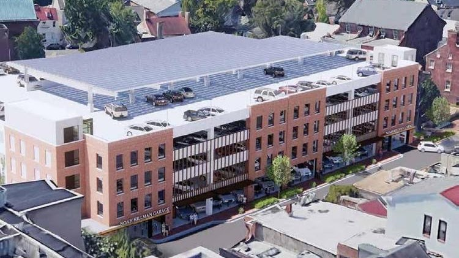{width="6.371239063867017in"
height="3.576388888888889in"}

[Premium Parking](https://www.premiumparking.com/P4902)

150 Gorman St, Annapolis, MD 21401

+14102165620

Can make online reservations

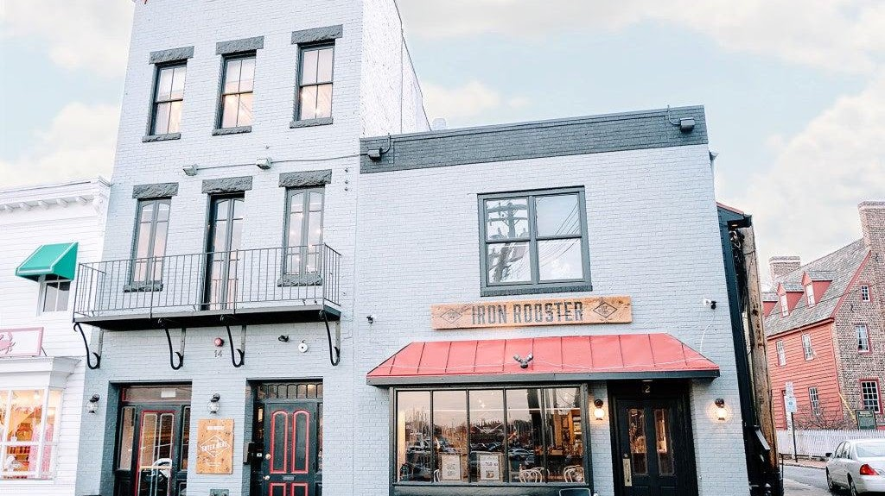{width="7.210048118985127in"
height="4.048611111111111in"}

[Iron
Rooster](https://www.iron-rooster.com/uploads/b/6668a660-fbf1-11e9-bcb2-df8b067fb297/Annapolis%20Menu%20Spring%202025%20copy.pdf)

8:00 am - 9:00 pm

12 Market Space Annapolis, Maryland 21401

\(410\) 990-1600

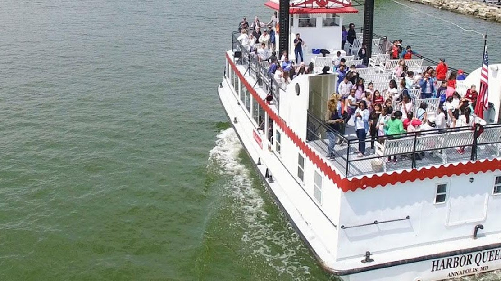{width="7.042666229221347in"
height="3.9583333333333335in"}

[Cruise & Tours
Annapolis](https://watermarkjourney.com/events/annapolis-harbor-usna-cruise/) 

Susan Campbell Park, Annapolis, MD 21401

410-268-7601 x 100

\$25/Adult \$10/Child

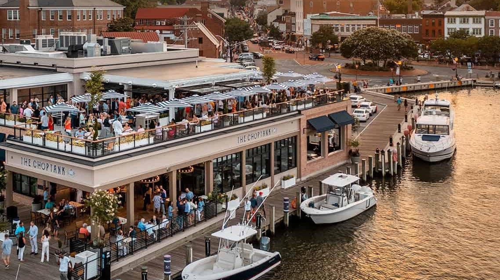{width="7.131944444444445in"
height="4.004668635170604in"}

[The
Choptank](https://www.opentable.com/r/the-choptank-annapolis?ref=1068)

[https://thechoptankrestaurant.com/annapolis/\
\
](https://thechoptankrestaurant.com/annapolis/)

110 Compromise St, Annapolis, MD 21401

+14438081992

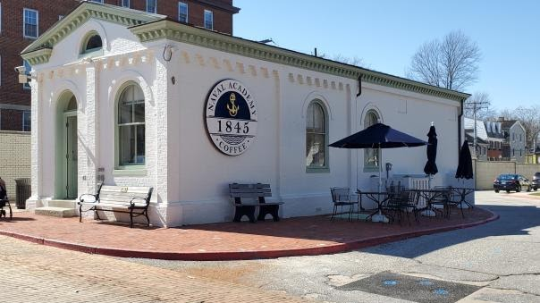{width="6.291666666666667in"
height="3.53125in"}

[1845 Coffee & Tea](https://www.navalacademyclub.com/1845-coffee)

2 Truxtun Road, Annapolis, Maryland 21402 

Phone: 410-293-2611   

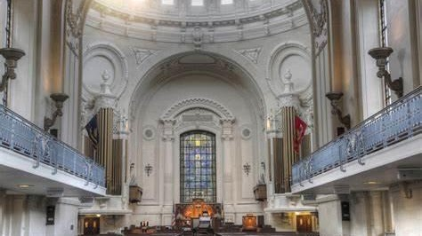{width="4.9375in"
height="2.7708333333333335in"}

[Naval Academy
Chapel](https://usna.edu/Chaplains/FaithCommunity/index.php#panel2Protestant)

 

The United States Naval Academy Chapel is one of nine designated chapel
spaces on the grounds of the United States Navy\'s service academy.
Protestant and Catholic services are held there. The Brigade Chapel is a
focal point of the Academy and the city of Annapolis. The chapel is an
important feature which led to the Academy being designated a National
Historic Landmark in 1961. The remains of [John Paul
Jones](https://en.wikipedia.org/wiki/John_Paul_Jones#Exhumation_and_reburial) were
interred in the crypt beneath 

[121 Blake Road, Annapolis,
MARYLAND.](https://maps.app.goo.gl/uDMZyrgX3JHX3wfe7)   (410) 293-1100

Sun. at 1100  Traditional Protestant Worship Main Chapel

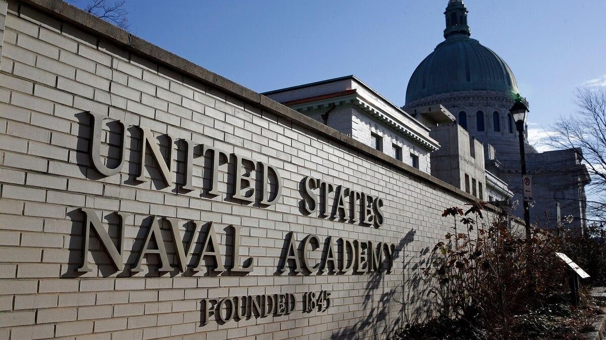{width="7.3071216097987755in"
height="4.104166666666667in"}

[Leftwich Visitor Center](https://www.usna.edu/Visit/index.php)

Naval Academy tours are a must-do! Wander the Yard's scenic walkways by
foot or cover more ground quickly by electric car. Either way, you'll
enjoy a behind-the-scenes look at the life of a midshipman and the rich
and tumultuous history of one of the greatest fighting forces on Earth!

52 King George St, Annapolis, MD 21402    (410) 293-8687

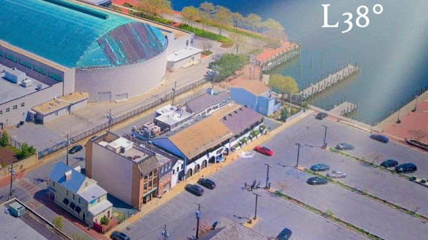{width="7.5in"
height="4.208333333333333in"}

[Latitude 38° Waterfront Dining](http://www.latitude38waterfront.com/)

+16672042282

12 Dock St, Annapolis, MD 21401

[Opentable](https://www.opentable.com/r/latitude-38-annapolis)

[Storm Bros. Ice Cream Factory](http://www.stormbros.com/great-flavors/)

130 Dock St, Annapolis, MD 21401

+14102633376

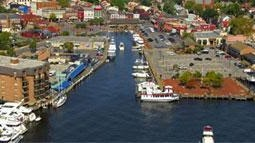{width="2.65625in"
height="1.4895833333333333in"}

[Susan Campbell
Park](http://www.annapolis.com/venue/susan-campbell-park/)

Dock St, Annapolis, MD 21401

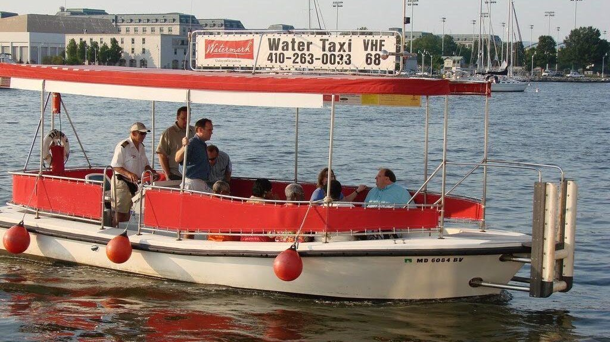{width="6.3938167104111985in"
height="3.5902777777777777in"}

[Water
Taxi](https://watermarkjourney.com/public-cruises-water-taxi/water-taxi/)

Watermark operates Annapolis Water Taxi service throughout the Annapolis
Harbor including Spa Creek & Back Creek. Service operates continually,
advanced reservations not required for public use. \$4.00 to \$9.00 per
person, depending on destination. Minimums apply in Back Creek and upper
Spa Creek. Rates are for one-way transit.

410-263-0033

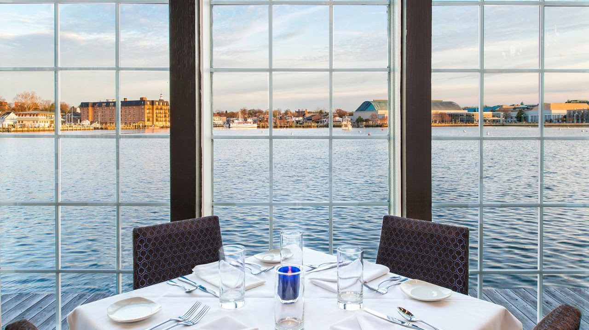{width="7.133363954505687in"
height="4.006944444444445in"}

[Chart
House](https://www.charthouseprime.com/location/chart-house-prime/)

300 Second St, Annapolis, MD 21403 (410) 268-7166

SUN: 10:00 AM - 9:00 PM

MON - THU: 4:30 PM - 10:00 PM

FRI - SAT: 4:30 PM - 11:00 PM

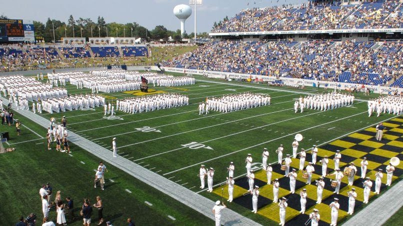{width="7.215845363079615in"
height="4.055555555555555in"}

Navy-Marine Corps Stadium

The Navy-Marine Corps Memorial Stadium is home to the Navy football and
lacrosse teams as well as local, regional and state sports tournaments.
The stadium also hosts a multitude of local, regional, national, and
international events. Within the past few years, the stadium has been
completely renovated into a state-of-the-art complex that provides an
amazing sporting event experience for both players and spectators.  Four
home contests on the schedule for October and November\--most notably,
the contest against Navy archrival Air Force (Oct. 5) \-- offer an equal
number of opportunities to take in the pregame (and postgame) pageantry
unfolding outside the gates of the stadium proper.

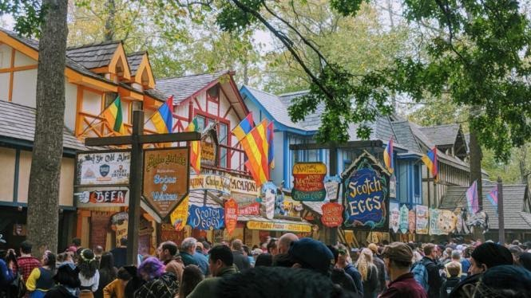{width="6.927083333333333in"
height="3.8958333333333335in"}

Maryland Renaissance Festival

Hear ye! Hear ye! Leave your modern woes behind and step into
16th-century Revel Grove--- the 27-acre village overseen by King Henry
VIII. Beginning in August and lasting through the end of October, Lords,
and Ladies from faraway lands gather to experience one of Maryland\'s
most extravagant events: [**The Maryland Renaissance
Festival**](https://rennfest.com/)! 

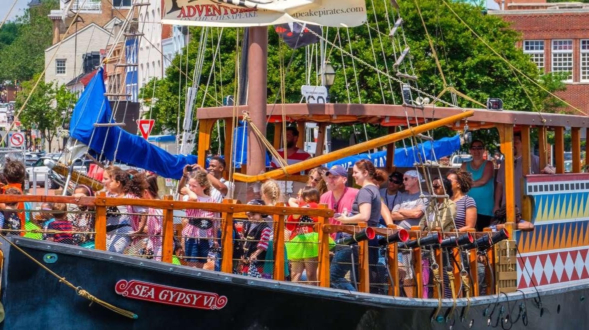{width="7.111111111111111in"
height="3.996227034120735in"}

Bay Cruises
