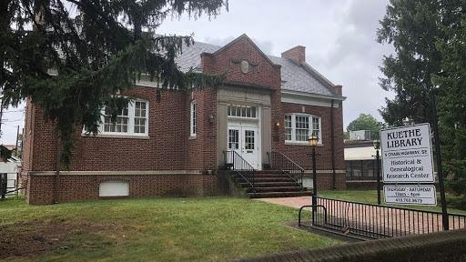
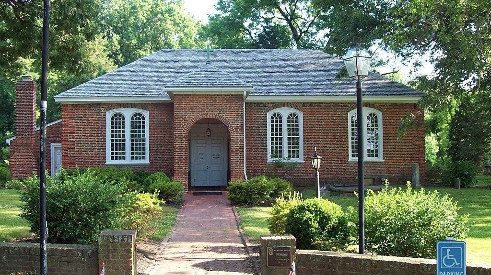
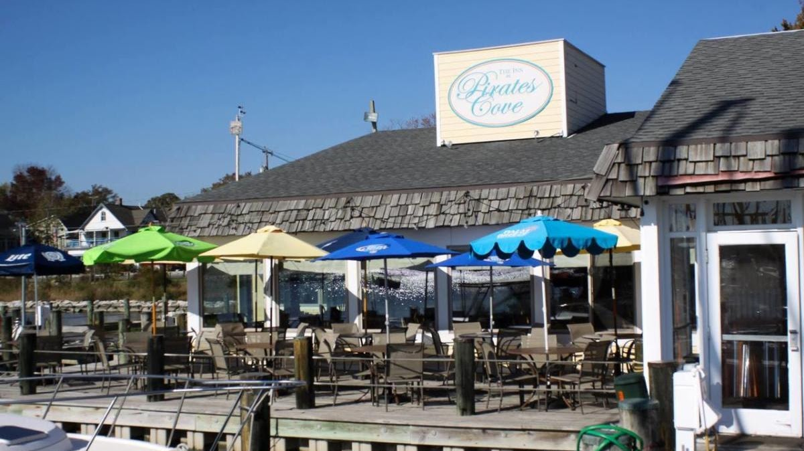
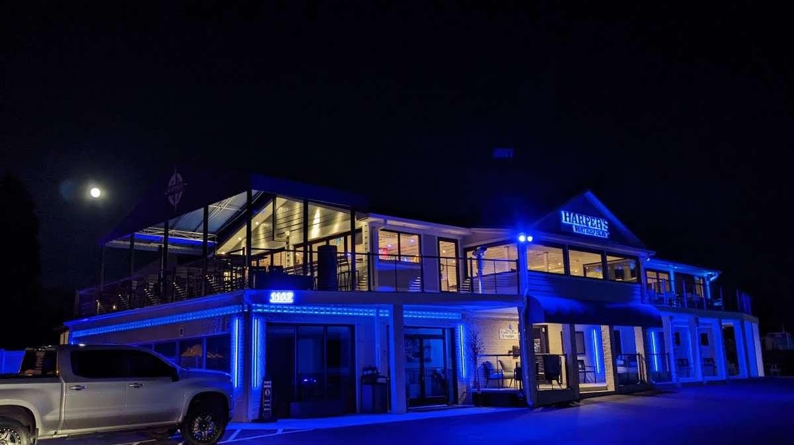

Research Resources

<https://www.familysearch.org/en/wiki/Anne_Arundel_County,_Maryland_Genealogy>

<https://en.wikipedia.org/wiki/Anne_Arundel_County%2C_Maryland>

[Anne Arundel Genealogical Society ](https://aagensoc.org/surname.php)

{width="5.333333333333333in"
height="3.0in"}

[Kuethe Library](https://aagensoc.org/cpage.php?pt=9)

5 Crain Hwy S Glen Burnie, MD 21061

410-769-9679

Winter Hours (Labor Day-Memorial Day): Thursday, Friday, and Saturday 10
am - 4 pm.  

Summer Hours (Memorial Day-Labor Day): Thursday, Friday, and Saturday 10
am - 2 pm.

{width="6.733912948381453in"
height="3.78125in"}

[All Hallows Parish](https://allhallowsparish.org/calendar/)

All Hallows\' Church was listed on the National Register of Historic
Places

Services:

5:00 pm Saturdays, "come-as-you-are" Holy Eucharist at the Chapel.

8:30 am Sundays, Rite I Holy Eucharist at the Chapel --- a quiet
contemplative service.

10:30 am Sundays, Rite II Holy Eucharist at the Brick Church
---broadcast via Facebook Live.

3600 Solomons Island Road Edgewater, Maryland 21037

{width="6.552083333333333in"
height="3.6800863954505685in"}

[Pirates Cove
Restaurant](https://piratescovemd.com/entertainment/entertainment-calendar)

At Pirates Cove we provide a lively and interesting selection of musical
entertainers on Wednesday, Thursday, Friday and Saturday evenings, as
well as Sunday afternoons, all year round.  During the summer months
while the weather is warm and our Dock Bar is open, music moves
outdoors.   You can hear great local singer/songwriters and all around
entertainers who can keep you singing along with covers of rock and folk
favorites. We\'ve got specials in food and drink, and, as always, a
great waterfront dining and entertainment experience.

4817 Riverside Dr. Galesville, MD 20765         

\(410\) 867-2300

{width="7.1875in"
height="4.036979440069992in"}

[Harper\'s Waterfront
Restaurant](https://www.harperswaterfront.com/menus)

+14107988338

1107 Turkey Point Rd, Edgewater, MD 21037
