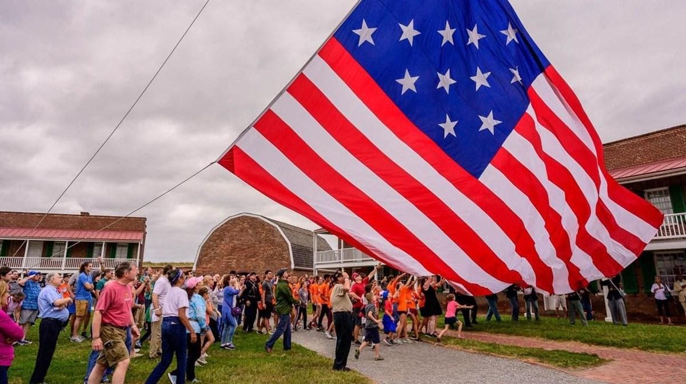
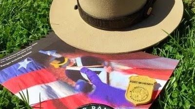
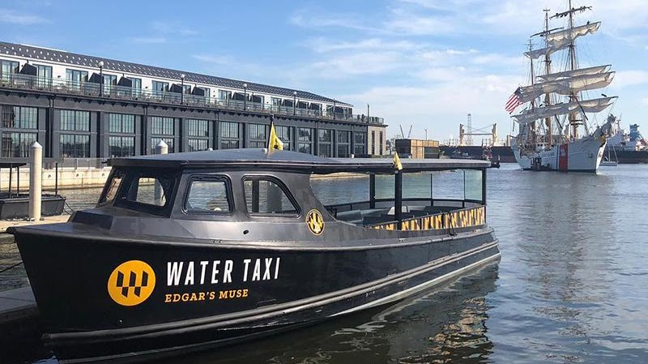
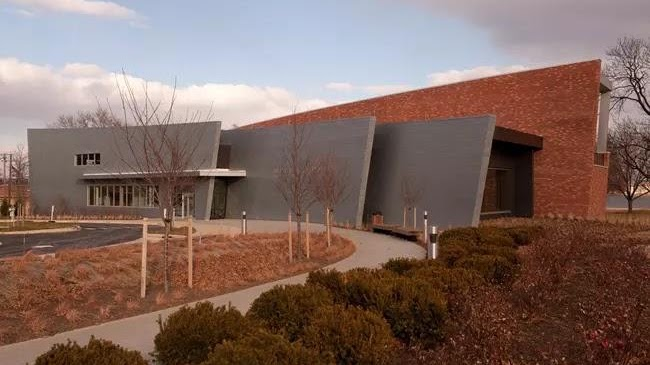
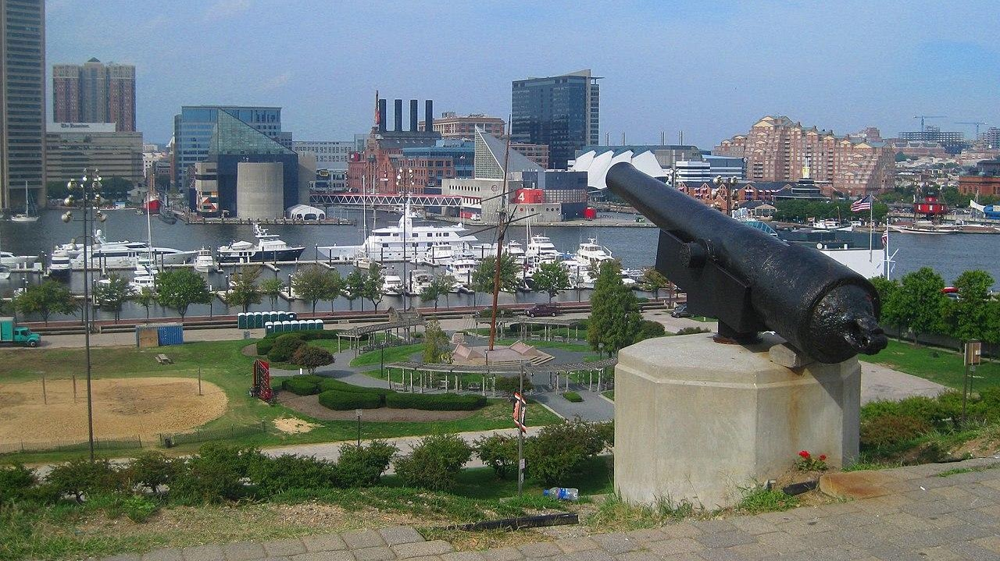
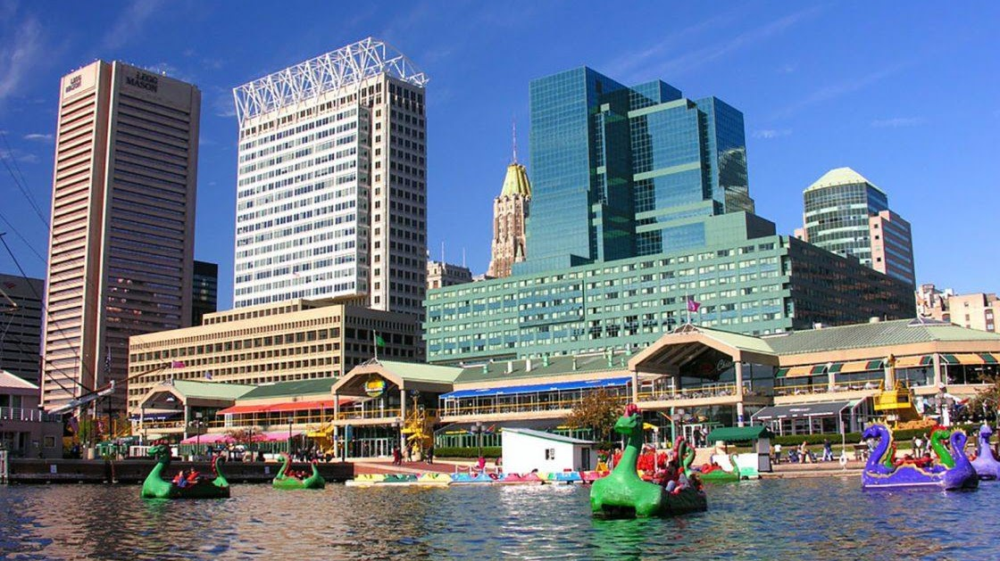
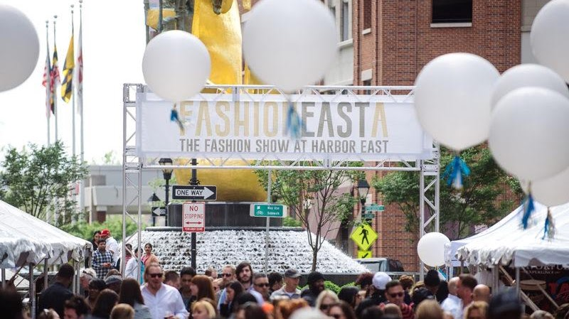
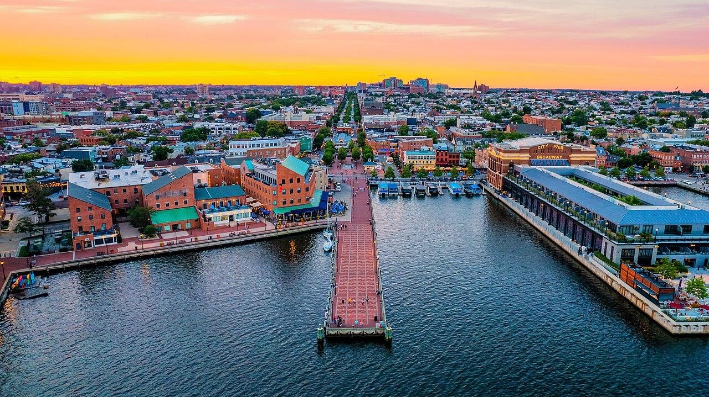
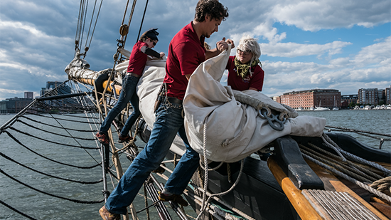
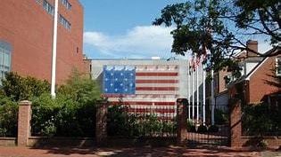

References

[Baltimore County, Maryland Genealogy •
FamilySearch](https://www.familysearch.org/en/wiki/Baltimore_County,_Maryland_Genealogy) 

[Baltimore County, Maryland -
Wikipedia](https://en.wikipedia.org/wiki/Baltimore_County%2C_Maryland) 

{width="7.140207786526684in"
height="4.010416666666667in"}

[Fort McHenry](https://www.nps.gov/fomc/planyourvisit/calendar.htm)

Fort McHenry National Monument and Historic Shrine is located at 2400
East Fort Avenue, Baltimore MD 21230.

Flag Change is Saturday mornings at 10 AM

{width="4.166666666666667in"
height="2.34375in"}

[Junior Ranger](https://www.nps.gov/fomc/planyourvisit/justforkids.htm)

Complete Fort McHenry\'s Junior Ranger activity booklet during your
visit and receive an official Junior Ranger badge and certificate! At
this time, you
can [**download**](https://www.nps.gov/fomc/planyourvisit/upload/FOMC-2017-Version-Jr-Ranger-508-reduced-size-for-web.pdf) the
booklet or request the booklet
by [**email**](https://www.nps.gov/common/utilities/sendmail/sendemail.cfm?o=6D8AD6B8A2C1AEB293BE0190F814BFA45094528659A5AC914F0CE08011C0&r=/fomc/planyourvisit/justforkids.htm) and
mail. Booklets may be available onsite. You can also complete online
Junior Ranger [**books and
activities**](https://www.nps.gov/kids/junior-rangers.htm) from other
parks!  Attend a [**ranger
program**](https://www.nps.gov/fomc/planyourvisit/outdooractivities.htm) or
assist in changing the morning or evening flag. Every year Fort McHenry
hosts the War of 1812 Fife and Drum Camp. Kids ages 11 and up can
register for the day camp and learn how to play the fife or drum. 

{width="6.997030839895013in"
height="3.9270833333333335in"}

[Water Taxi](https://www.baltimorewatertaxi.com/cruise)

Hop on board the most exciting way to navigate the sparkling waters of
the harbor! The Water Taxi is your ticket to a journey filled with
laughter, adventure, and unforgettable scenery. Whether you\'re a
first-time visitor or a seasoned local, there\'s no better way to
explore the many vibrant neighborhoods lining the shoreline. So sit
back, relax, and enjoy the ride -- your next adventure is just a splash
away! Current price is \$20 for adults, \$11 for kids.

{width="6.770833333333333in"
height="3.8020833333333335in"}

[Visitor
Cente](https://www.nps.gov/fomc/planyourvisit/visitorcenter.htm)r

The Visitor and Education Center is located near the main parking lot
and is the best place to start your visit to Fort McHenry. Entrance to
the Visitor and Education Center\'s film and exhibits is
free. [**Admission to the Star
Fort**](https://www.nps.gov/fomc/planyourvisit/fees.htm) can only be
purchased at the front desk of the Visitor and Education Center.

**Hours**

Regular Hours

**9:00 am - 4:45 pm**

Summer Hours

(Saturday of Memorial Day weekend through Labor Day)

**9:00 am - 5:45 pm**

{width="7.114583333333333in"
height="3.9963943569553804in"}

[Federal Hill Historic
District](https://baltimore.org/neighborhoods/federal-hill)

Enjoy the spectacular view of downtown while casually strolling through
Federal Hill Park or another one of the area's green spaces like nearby
Riverside or Swann. During the warmer months, you'll almost always find
a street fair happening in the heart of the neighborhood surrounding the
historic Cross Street Market, a 19th century marketplace with plenty of
modern day eats and drinks. Must-sees in Federal Hill include the
American Visionary Art Museum and the Baltimore Museum of Industry.
Federal Hill is also located right next to Locust Point, where Fort
McHenry calls to history buffs. Art aficionados will appreciate the
number of independent art galleries in this neighborhood, including
School 33 Art Center and Tradestone Gallery.

{width="7.23370406824147in"
height="4.0625in"}

[Haborplace](https://www.harborplace.com/attractions/)

Harborplace is located on the waterfront in the heart of Downtown
Baltimore\'s Inner Harbor. Harborplace features two pavilions located at
Pratt Street and Light Street that surround the Harborplace Amphitheatre
whose terraced steps provide seating for live performances throughout
the year.

{width="6.588716097987752in"
height="3.6979166666666665in"}

[Harbor East](https://www.harboreast.com/events/)

Since 1996, Harbor East has built its reputation as a premier
destination for national employers, successful retailers, and
sophisticated visitors and residents. Once an area known for its ghosted
warehouses dating back to Baltimore's 19th-century industrial boom, we
worked patiently to rebuild this iconic waterfront neighborhood into a
beautiful skyline. The vision was accomplished with integrity,
persistence, and a genuine desire to thoughtfully elevate Baltimore. It
is with these same values we continue our growth.

{width="7.395833333333333in"
height="4.154377734033246in"}

[Fells Point](https://fellspoint.com/places/)

Fell\'s Point is a historic waterfront neighborhood in southeastern
Baltimore, Maryland. It was established around 1763 along the north
shore of the Baltimore Harbor and the Northwest Branch of the Patapsco
River. The area has many antique, music, and other stores, restaurants,
coffee bars, a municipal markethouse with individual stalls, and over
120 pubs. Located 1.5 miles east of Baltimore\'s downtown central
business district and the Jones Falls stream (which splits the city,
running from northern Baltimore County), Fells Point has a maritime past
and the air of a seafaring town. It also has the greatest concentration
of drinking establishments and restaurants in the city.

{width="5.729166666666667in"
height="3.21875in"}

[Pride of Baltimore](https://pride2.org/come-aboard/)

Cross the gangway and come aboard to learn about Baltimore's tall ship,
Pride of Baltimore II. Explore the deck and talk to her captain and
crew. Learn about the history of Baltimore Clippers and Pride II; or
hear from a crew member what it is like to sail a tall ship today. Tours
are open to guests of all ages. Groups are welcome, too.

If you would like to schedule a private tour, please contact us at
410.539.1151. Accessibility is addressed on a case-by-case basis, so
please talk to us ahead of time to be sure we can accommodate your
needs.

Please note that dates and times for deck tours are subject to change
with short notice.

[Star Spangled Banner House](http://www.flaghouse.org/)

The Star-Spangled Banner Flag House is a National Historic Landmark and
historic house museum in Baltimore, Maryland. The Museum preserves the
historic 1793 structure and interprets the life of Mary Young
Pickersgill, a nineteenth-century female entrepreneur and craftswoman of
the flag that inspired the National Anthem.

{width="3.75in"
height="2.1041666666666665in"}

[Lovely Lane UMC & Museum](http://lovelylane.net/home/our-beliefs/)

The Original Lovely Lane Meeting House was built in 1774. Ten years
later, the Methodist Societies hosted the famous Christmas Conference at
Lovely Lane Meeting House, where a new denomination was born: the
Methodist Episcopal Church. John Wesley had reluctantly agreed to the
American Methodists' desire to organize their own church. He sent Thomas
Coke to supervise the process and to consecrate Francis Asbury as
"general superintendent" of the Methodists in America. When Coke and
Asbury met at Barrats Chapel in November 1784, Asbury refused the
appointment unless the preachers elected him. The meeting was scheduled
for the next month, December, at Lovely Lane Meeting House in Baltimore.

2200 St. Paul Street \| Baltimore, MD 21218

{width="5.208333333333333in"
height="3.1770833333333335in"}

[Emma Tea Spot](https://emmasteaspot.com/events)

Emma and Benjamin\'s dream is to reach a wider audience with the same
ethics, reintroducing people to their vital and symbiotic relationship
to their environment. Good, clean living practices increase empathy and
compassion for our own neighbors and forges deeper and more responsible
and meaningful relationships with one another, thereby increasing the
integrity in our own lives.  Through living and serving you this way, we
hope to nurture our community and bring some British hospitality to the
charm of Baltimore City. We are committed to Hamilton and Baltimore and
hope we can complement the local initiatives by providing clean and
sustainable business practices alongside authentic British goods to
elevate the soup, salad and sandwich dining experience. We also aim to
assist those with a similar interest around the city. Come have a Proper
British Experience with us.

5500 HARFORD ROAD HAMILTON, MD 21214

410-444-1718
