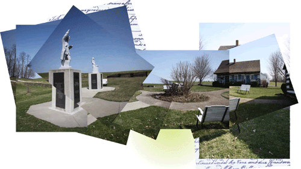

{width="5.208333333333333in"
height="2.9270833333333335in"}

[Strawbridge Shrine](http://www.strawbridgeshrine.org/news--events.html)

The original home (circa 1760) of Robert & Elizabeth Strawbridge. It is
in this modest farmhouse that Methodism in America was first
established. From here, Robert Strawbridge rode the circuit and planted
the seeds of what would become a new denomination. The Strawbridge
Shrine historic buildings and Visitors Center can be made available most
days by scheduling your personal or group visit with the Curator. In
addition, we are open for drop-in visits April through October during
the following regular hours:

- Fridays  10:00 AM - 4:00 PM

- Saturdays  10:00 AM - 4:00 PM

- Sundays  1:00 PM - 4:00 PM

For information, or to arrange your tour, contact us at:

- 443-289-0191 (New phone number as of, January 2023)

- Tours@StrawbridgeShrine.org

2650 Strawbridge Lane New Windsor,  Maryland 21776
