Resources

[Frederick County, Maryland Genealogy •
FamilySearch](https://www.familysearch.org/en/wiki/Frederick_County,_Maryland_Genealogy) 

[Frederick County, Maryland -
Wikipedia](https://en.wikipedia.org/w/index.php?title=Frederick_County,_Maryland&oldid=1222604196) 

[Frederick County Genealogical Society - Surname
Research](https://frecogs.org/surname.php) 

Map

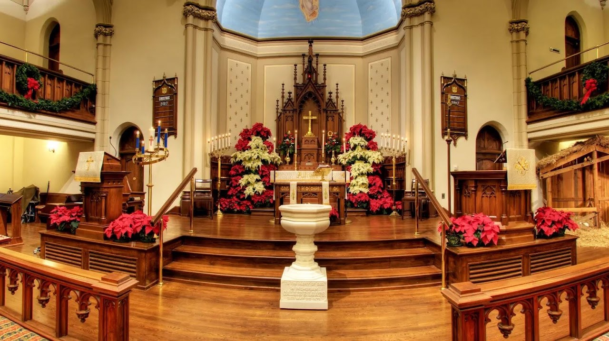{width="7.618055555555555in"
height="4.279204943132108in"}

[Candlelight Tour of Historic Houses of
Worship](https://www.visitfrederick.org/events/annual-events/historic-houses-of-worship-tour/)

4:00 PM

❖ Organ, Piano, and Harp (4--4:30PM)   All Saints' Episcopal Church

❖ Nancy Beith, Piano with Gail Slezak, Piano (4--4:30PM) Frederick
Presbyterian Church

❖ Terry Sparks studio recital; Concordia a capella choir (4--5PM) Grace
United Church of Christ

❖ Evangelical Bells (4--5PM) Evangelical Lutheran Church

❖ Tri State Harp Ensemble led by Sally Lay (4--6PM) Calvary United
Methodist Church

 

4:30 PM

❖ David Duree, Clarinet and Paulela Burchill, Flute (4:30--5PM)
Frederick Presbyterian Church

❖ Carol Sing-Along (4:30--5PM) All Saints' Episcopal Church

 

5:00 PM

❖ Maryland Talent Education String Program (5--5:30PM) All Saints'
Episcopal Church

❖ Janice Jackson, Soprano (5--5:30PM) Frederick Presbyterian Church

❖ One God \~ One Voice Choir (5--6PM) Grace United Church of Christ

❖ The Praise Ensemble (5--6PM) Evangelical Lutheran Church

 

5:30 PM

❖ Jonathan Kurtz, Jazz Piano (5:30--6PM) Frederick Presbyterian Church

❖ All Saints Handbell Choir (5:30--6PM) All Saints' Episcopal Church

 

6:00 PM

❖ All Saints Adult Choir (6--6:30PM) All Saints' Episcopal Church

❖ Spires Brass Quintet (6--6:30PM) Frederick Presbyterian Church

❖ Peal Bells Ringing and Demonstration led by Quilla Roth (6--7PM)
Calvary United Methodist Church

❖ Choir of Evangelical Lutheran (6--7PM) Evangelical Lutheran Church

❖ Nathan Strite, Organ (6--7PM) Grace United Church of Christ

 

6:30 PM

❖ Cambria Van de Vaarst, Harp (6:30--7PM) All Saints' Episcopal Church

❖ Nancy Beith, Piano (6:30--7PM) Frederick Presbyterian Church

❖ One God One Voice Choir (6:30--7:15PM) Centennial Memorial United
Methodist Church

 

7:00 PM

❖ Janice Jackson, Soprano (7--7:30PM) Frederick Presbyterian Church

❖ All Saints Handbell Choir (7--7:30PM) All Saints' Episcopal Church

❖ Trinity Brass Ensemble (7--8PM) Calvary United Methodist Church

❖ Justin Furnia, Piano (7--8PM) Grace United Church of Christ

❖ Frederick Flute Choir (7--8PM) Evangelical Lutheran Church

 

7:15 PM

❖ Christmas Music (7:15--7:45PM) Centennial Memorial United Methodist
Church

 

7:30 PM

❖ All Saints Adult Choir (7:30--8PM) All Saints' Episcopal Church

❖ Spires Brass Quintet (7:30--8PM) Frederick Presbyterian Church

 

7:45 PM

❖ Catoctones, seasonal Christmas repertoire followed by Christmas Carol
Sing-a-Long (7:45--8:30PM) Centennial Memorial United Methodist Church

 

8:00 PM

❖ Lisa Jarosinski, Soprano (8--8:30PM) Frederick Presbyterian Church

❖ Organ, Piano, and Harp (8--8:30PM) All Saints' Episcopal Church

❖ Seasonal Organ and Piano music played by Dr. Adela Peeva (8--9PM)
Calvary United Methodist Church

❖ Singing Christmas Carols (8--9PM) Grace United Church of Christ

❖ Daniel Catalano, Pipe Organ Carol Sing-Along (8--9PM) Evangelical
Lutheran Church

 

 

8:30 PM

❖ Bobby Staples, Organ with Dr. Avery Pettigrew, French Horn (8:30--9PM)
Frederick Presbyterian Church

❖ Carol Sing-Along (8:30--9PM) All Saints' Episcopal Church

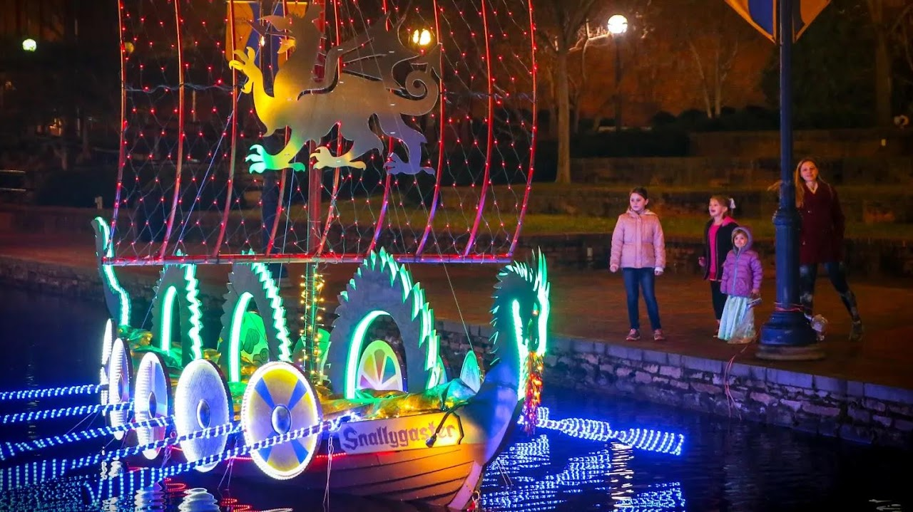{width="7.659722222222222in"
height="4.302609361329834in"}

[Sailing Through The Winter
Solstice](https://www.visitfrederick.org/sailing-into-the-winter-solstice/)

Sailing Through the Winter Solstice display will take place from
November  to March. 

You can view the boats anytime day or night. In fact, you may want to
take a look while it\'s light out and again after it gets dark and the
lights come on. Lights typically turn on at sunset, so this is a great
time to see them both ways. 

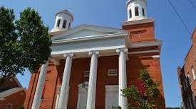{width="2.8645833333333335in"
height="1.6041666666666667in"}

[Evangelical Reformed
UCC](https://erucc.org/visit-us/advent-and-christmastide/)

The beloved Candlelight Tour of Historic Houses of Worship returns this
holiday season in Downtown Frederick. This special open house celebrates
Frederick's tradition of religious diversity, local history, and the
holiday season on Tuesday, December 26, 2023 from 4PM-9PM. This is
Frederick\'s most popular church tour and is a great opportunity to step
inside some of its most beautiful buildings.

15 W. Church St. Frederick, MD 21701 301-662-2762

Sundays, 10:30 -- 11:30 a.m.

On all Sundays except the first Sunday of each month when all are
invited to participate in the Sacrament of Communion, children aged 5 --
5th grade may go to Junior Church after the Thought for the Day during
the worship service. Junior Church, a space to join in creative
spiritual formation activities.

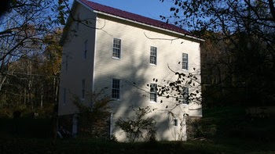{width="3.6458333333333335in"
height="2.0520833333333335in"}

[Hyattstown Mill](https://www.hyattstownmill.org/events/)

The mill at Hyattstown was built in 1798. At the time of the town\'s
founding,the miller was George Wolfe, Sr., who had taken over the mill
when William Richards died, Mr. Wolfe purchased the mill site in 1807
and sold the property to Benjamin Waters and Frederick Baker for
\$5,000. In 1814, Baker operated the mill until 1872 when he sold it to
Ortho Norris and wife, Sarah. They sold the property to William Farrer,
who made substantial improvements to the mill over the next five years.
It was a two-run flour mill and sawmill, with one employee and an output
of 6,000 bushels of meal and 35,000 feet of lumber annually, valued at
\$4,125.00

14920 Hyattstown Mill Rd, Hyattstown, MD 20871 · (301) 830-1142

The Mill Gallery is normally open weekends from 10:00 to 4:00 and other
times by appointment.

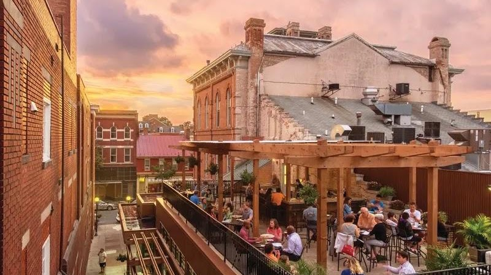{width="6.729166666666667in"
height="3.7767443132108487in"}

[Brewer\'s Alley Restaurant](https://brewers-alley.com/calendar/)

Frederick County\'s original brewpub. Contemporary American regional
cuisine and wood-fired pizza oven complement fresh beer brewed on
premises along with other craft beer. Brewer's Alley's location at **124
North Market Stree**t is steeped in Frederick history. The first
residents of Frederick held a lottery to raise money to build a town
hall and market house on this location in 1765, which was completed in
1769. This structure served its purpose for over 100 years and was
witness to the birth of Frederick as a city. The Market House spanned
the Civil War, including the ransoming of the city by Confederate
General Jubal Early. Also, remembered as the old Frederick Opera House,
this building hosted speeches by presidents and presidential
candidates. [Reservations](https://brewers-alley.com/reservations/). 

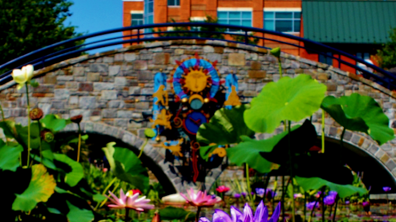{width="6.895833333333333in"
height="3.875in"}

[Church Street Garage](http://www.cityoffrederick.com/FAQ.aspx?QID=60)

17 E Church St, Frederick, MD 21701

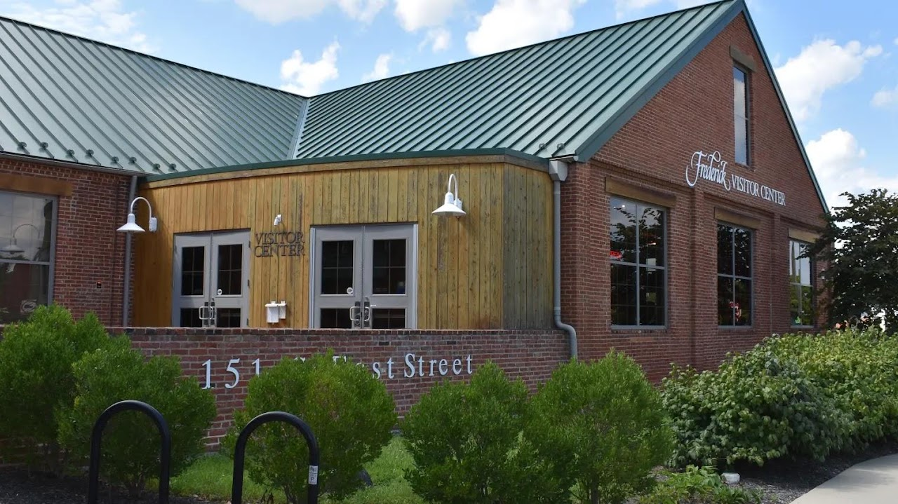{width="7.465277777777778in"
height="4.193386920384952in"}

[Visitor
Center](https://www.visitfrederick.org/plan-your-visit/visitor-center/)

151 S East St. Frederick, MD I 301-600-4047

The Visitor Center is the perfect place to begin your trip to Frederick!
Housed in a [beautifully
renovated](https://www.visitfrederick.org/plan-your-visit/visitor-center/history/) circa-1899
industrial warehouse, the visitor center holds 2,200-square-feet of
interpretive exhibits. A state-of-the-art theater features an
introductory film about Frederick. A wide variety of maps, guides and
information on regional attractions and events are available.

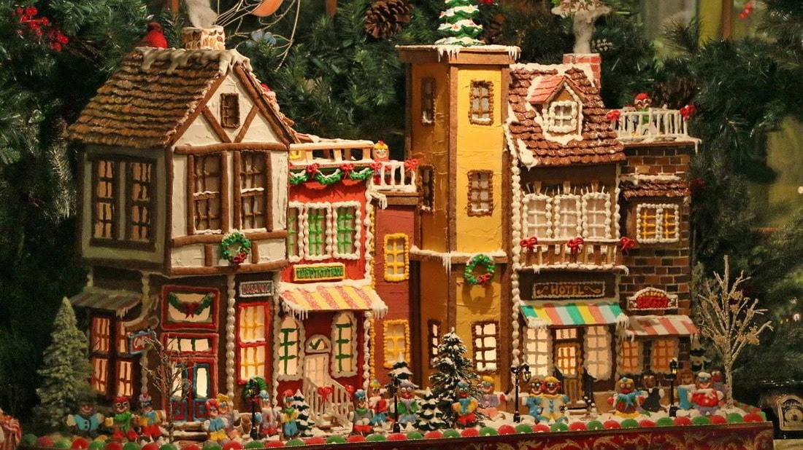{width="7.090277777777778in"
height="3.9834470691163606in"}

[Gladchuk Brothers](https://gladchuks.com/press.html)

Open Tuesday - Saturday only for lunch and dinner

Our ingredients are the freshest and seasonal. Menus change so check
back with us often. We bake daily, and all of our meals are prepared to
order. Soups, sauces, and desserts are all in house made. 

(301)662-7750.

489 West Patrick St., Frederick, Maryland  21701

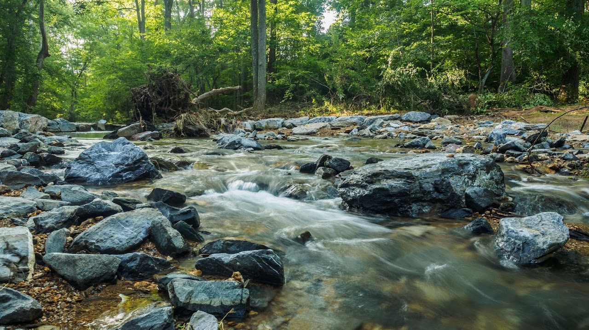{width="7.3125in"
height="4.107568897637795in"}

[Little Bennett Regional
Park](https://montgomeryparks.org/parks-and-trails/little-bennett-regional-park/)

The 3700 acres that is Little Bennett Regional Park used to be
agricultural and mercantile land. The park landscape contains natural
and built features and clues to former communities of people and
occupations whose histories tell a story. As early as the 18th century,
the Little Bennett Valley was the scene of agriculture and small-scale
industries capitalizing on the region's abundant resources of timber,
water, vegetation and vast acreage for farming. Like all of Montgomery
County, Little Bennett land included plantations and industries that
used forced chattel slave labor as the economic engine of their success.
Several grist mills, a sumac mill, a sawmill, a saw and bone mill, and a
whisky manufactory were established at various times along the Little
Bennett Creek. Only the Hyattstown Mill remains as testimony to those
early enterprises. The valley's steep and rocky slopes were not
particularly encouraging as a soil type for farming, but tobacco was
cultivated in this area much later than other areas of the county, even
into the 20th century, when most of the county had shifted to grains.
Around the close of the 19th century, a small rural community was
established in the valley. It was named Kingsley after the King Family,
who were prominent in the area, and was colloquially known as Froggy
Hollow. The last remaining vestige of that settlement is a one-room
schoolhouse now open to the public on a limited basis.

{width="2.6354166666666665in"
height="1.4791666666666667in"}

[Bushwaller\'s Irish
Pub](https://bushwallers.com/bushwallers-full-menu/)

Monday- Thursday 11:30 am - 2:00 am

Friday - Sunday 11:00 am - 2:00 am

Sunday Brunch until 3pm

Due to our limited dining room seating we are a First Come First Serve
Restaurant, we do not take reservations for parties under 6. 

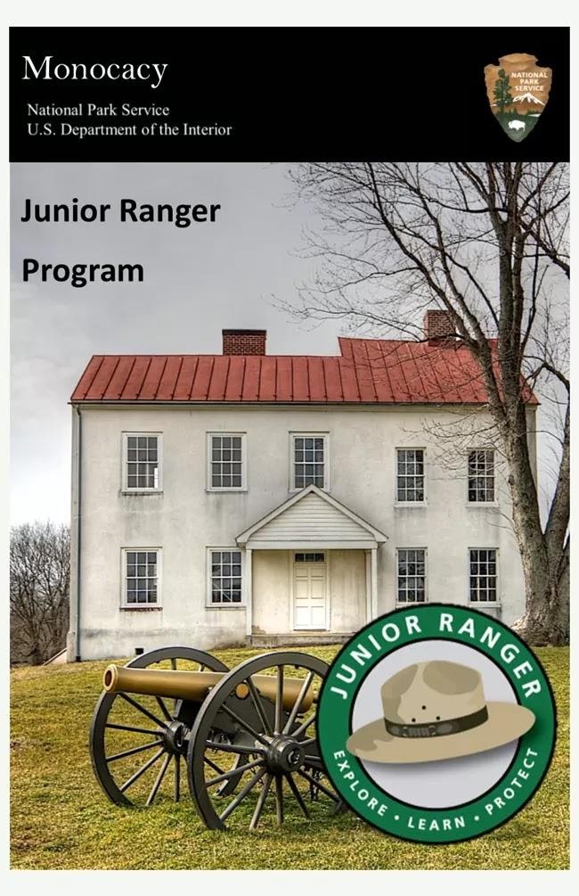{width="6.770833333333333in"
height="10.46875in"}

[Monocacy National
Battlefield](https://www.nps.gov/mono/learn/kidsyouth/beajuniorranger.htm)

5201 Urbana Pike Frederick, MD 21704

The Visitor Center hours are 9:00 a.m. - 5:00 p.m., seven days a week.
The Visitor Center is closed on Thanksgiving Day, Christmas Day, and New
Year\'s Day. 

For additional information, the Visitor Center staff can be reached at
301-662-3515. 

This site is fee-free year-round. No entrance fee or pass is required.

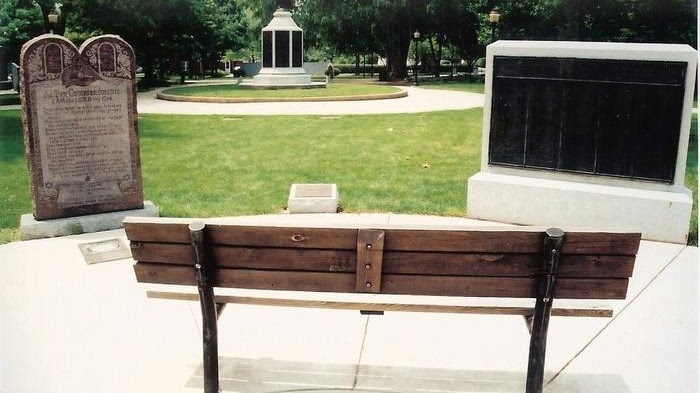{width="7.291666666666667in"
height="4.09375in"}

[Evangelical Reformed
Cemetery](https://www.findagrave.com/cemetery/80973/frederick-evangelical-reformed-cemetery)

The Evangelical Reformed Church and Cemetery were (abandoned) in 1924. A
bronze plaque was erected to establish the burials of the earliest
settlers in Frederick. No stones exist today and many of these
internments were originally at the Trinity Chapel (abandoned). The
plaque in Memorial Grounds Park has been able to add 366 inscriptions
from the two cemeteries. There are 30 more names recorded on a plaque at
the Trinity Chapel cemetery. Now the present site of the Memorial
Grounds Park, 

210 North Bentz St. Frederick, Frederick County, MD.

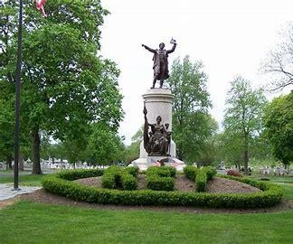

[Francis Scott Key
Monument](https://www.visitfrederick.org/listing/francis-scott-key-monument-in-mt-olivet-cemetery/3295/)

Inside the entrance to Mt. Olivet Cemetery is the Francis Scott Key
monument. The author of "The Star-Spangled Banner" in 1814 which became
our national anthem in 1931, Key was born in 1779 in Frederick County.
In 1800 he established his first law office in Frederick. Key died in
Baltimore at age 63 in 1843. After the Civil War, his body was
reinterred here to Mt. Olivet Cemetery. In the 1890s, money was raised
to build a monument to Key and in 1898 this monument and statue,
sculpted by Italian artist Pompeo Copini, was dedicated. Key, his wife,
and one of their children are buried under this monument and grave. A
brochure near the cemetery's restrooms is available to guide you through
the rest of the cemetery. 

515 S. Market St. Frederick, MD 21701

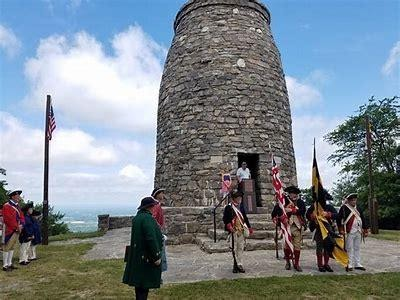{width="4.166666666666667in"
height="3.125in"}

[Washington Monument State
Park](https://dnr.maryland.gov/publiclands/Pages/western/washington.aspx)

Contact: 301-791-4767

6620 Zittlestown Road Middletown MD 21769

Hours: 8 a.m. to Sunset (April to October) & 10 a.m. to Sunset (November
to March)

Located atop South Mountain, Washington Monument State Park is named for
the first completed monument dedicated to the memory of George
Washington. The Washington Monument is a rugged stone tower that was
initially erected by the citizens of Boonsboro in 1827. The monument
makes it an ideal site for spotting migratory birds such as hawks,
eagles and falcons, especially in mid-September. The main office
for [South Mountain State
Battlefield](https://dnr.maryland.gov/publiclands/Pages/western/southmountainbattlefield.aspx) is
located in Washington Monument State Park. Stop by the park office or
museum to learn more about the first major Civil War battle fought in
Maryland. The main parking area, picnic pavilion and museum are
accessible to the mobility impaired. The comfort station, however, is
not. 

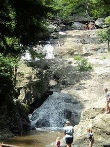{width="2.2604166666666665in"
height="3.03125in"}

[Cunningham Falls State
Park](https://dnr.maryland.gov/publiclands/Pages/western/cunningham.aspx)

The Cunningham Falls State Park is renowned for McAfee Falls, a 78-foot
cascading waterfall that is considered the largest in the State of
Maryland. Visitors are allowed to set up camp in the pre-approved
campgrounds that oversee the beautiful waterfalls at a distance. Fall
asleep to the sound of rushing water and the great nature ambiance
surrounding you. [Reservations](https://parkreservations.maryland.gov/)​

Contact: 301-271-7574​\
[Email Cunningham Falls]{.underline}\
14039 Catoctin Hollow Road Thurmont, MD 21788

Hours: ​8 a.m. to Sunset, April-October\
10 a.m. to Sunset, November-March​

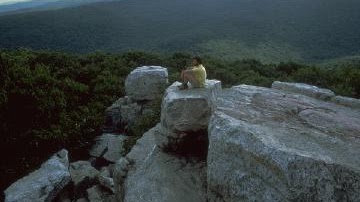{width="3.75in"
height="2.1041666666666665in"}

[Catoctine Mountain National Park](https://www.nps.gov/cato/index.htm)

Nestled within the mountains of Western Maryland, Catoctin Mountain Park
is one of more than 420 national park units in the nation. Whether you
are a first-time visitor or come often, below is information you will
need to know.. Adventure awaits at Catoctin Mountain Park! Nestled in
the Blue Ridge Mountains, this park is the perfect getaway. Hike a
trail, enjoy an epic view, and sleep under the stars. This site is
fee-free year-round. No entrance fee or pass is required.

14707 Park Central Road Thurmont, MD 21788

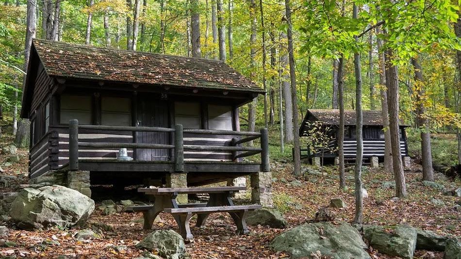{width="6.951388888888889in"
height="3.907412510936133in"}

[Camp Misty Mount](https://www.nps.gov/cato/planyourvisit/lodging.htm)

The cabins at Camp Misty Mount sleep 4-6 people, with a few larger
lodges for families and small groups. 

Cabin 16, Loop: Middle CABIN ELECTRIC 6 people max, 2 vehicles max,
Overnight. \$140 per night

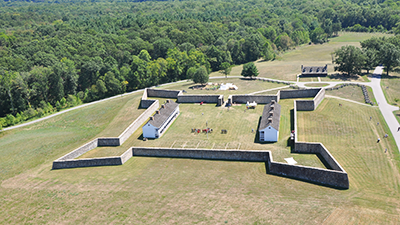{width="4.166666666666667in"
height="2.34375in"}

[Fort Frederick State
Park](https://dnr.maryland.gov/publiclands/Pages/western/fortfrederick.aspx)

Open Thursday to Monday from Memorial Day to Labor Day and on the
weekends in the spring and fall, when staff and volunteers dressed in
period clothing occupy the fort, demonstrating daily life during
the **French and Indian War**.

The 585-acre park borders the Potomac River and the Chesapeake and Ohio
Canal National Historical Park passes through the park. The park also
features a boat launch, flat water
canoeing, [campsites](https://dnr.maryland.gov/publiclands/Pages/western/FortFrederick/Camping.aspx), [camp
store](https://dnr.maryland.gov/publiclands/Pages/western/FortFrederick/Sutler-Shop.aspx), [hiking
trails](https://dnr.maryland.gov/publiclands/Pages/western/FortFrederick/Hiking-FFSP.aspx),
a [picnic
area](https://dnr.maryland.gov/publiclands/Pages/western/FortFrederick/Picnicking.aspx) with
large pavilion and a playground. 

11100 Fort Frederick Road Big Pool MD 21711​ 

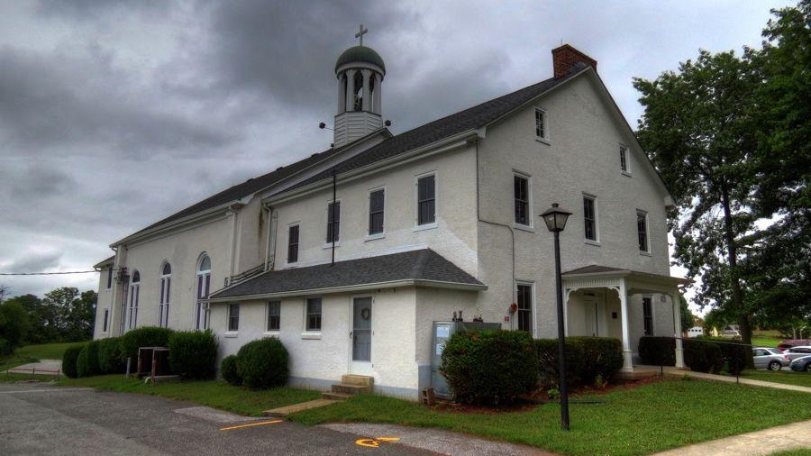{width="9.375in"
height="5.270833333333333in"}

[Graceham Moravian
Church](https://www.gracehammoravian.org/new/index.php/about-us/your-template)

[39°36′59″N
77°22′43″W](https://geohack.toolforge.org/geohack.php?pagename=Graceham_Moravian_Church_and_Parsonage&params=39_36_59_N_77_22_43_W_type:landmark_region:US-MD) 

8231 Rocky Ridge
Road, [Graceham](https://en.wikipedia.org/wiki/Graceham,_Maryland) [Frederick
County,
Maryland](https://en.wikipedia.org/wiki/Frederick_County,_Maryland) 

On Sunday mornings during the school year we offer Sunday school for all
ages beginning at 9:15am and our worship service is from 10:30am -
11:30am.

Our Sunday School is suspended during the summer months and our worship
service takes an hour earlier beginning at 9:15am.

**Graceham Moravian Church and Parsonage** is a historic church building
and [parsonage](https://en.wikipedia.org/wiki/Parsonage). It is a
two-story [Flemish
bond](https://en.wikipedia.org/wiki/Flemish_bond) brick church built in
1822, and covered with white stucco because of deteriorated masonry. The
church was built as an addition to the adjacent meeting house and
parsonage built in 1797. This building and the church\'s cemetery having
uniform flat gravestones (called God\'s Acre by the Moravians)
represents Maryland\'s only remaining 18th
century [Moravian](https://en.wikipedia.org/wiki/Moravian_Church) settlement.   
