# Kent Island, Maryland

## Overview
[Paste your converted Kent Island overview text from Pandoc here]

## Early Settlers & Genealogy
* **Kent Island Surnames**: [Surname Index PDF](https://kentislandheritagesociety.org/wp-content/uploads/2018/05/Surname-List-update.pdf)

## Historical Events & Resources
[Paste the remaining content from your Kent Island document here]

---

*Last updated: August 2026*

Every Father\'s Day, Christ Church (Episcopal) carries on a wonderful
tradition where the Bishop gives a special blessing to all the fathers.
The history here runs incredibly deep. Founded by our ancestors Robert
Hewitt, Matthew Rodham, and Capt. Philpott, Christ Church stands today
as the **oldest church in Maryland** and the **3rd oldest English church
in the Western Hemisphere**. It all dates back to August 1631, when
William Claiborne's party founded Kent Island---the very first
settlement in what would eventually become the state of Maryland. Such a
beautiful legacy to reflect on today!

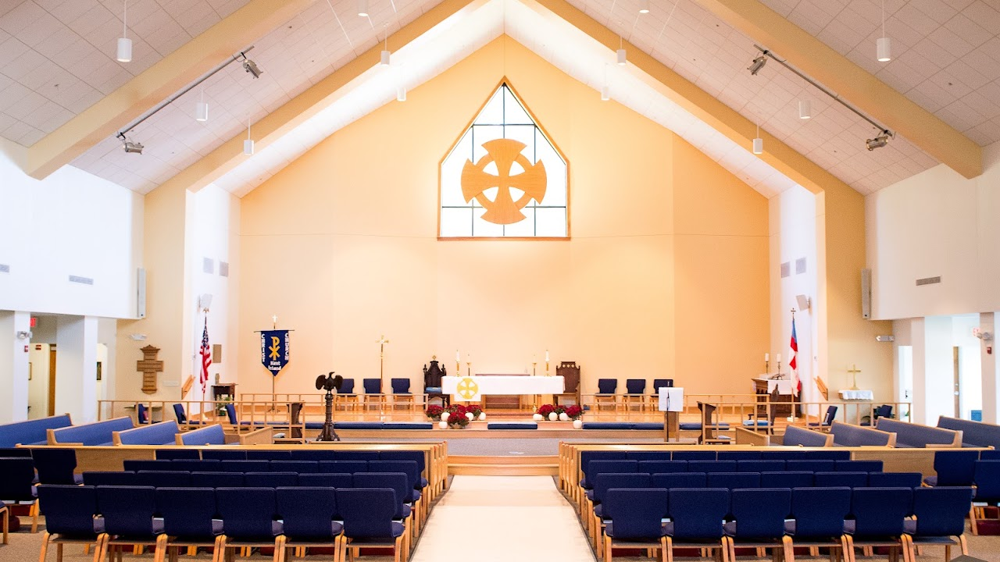{width="7.5in" height="4.21875in"}

[Christ Church](https://www.ccpki.org/connect/calendar/)

The Christ Episcopal Church of Kent Island is recognized as the state\'s
oldest Christian congregation. It was founded in 1632 by the Reverend
Richard James, one year after Kent Island was founded by William
Claiborne, and two years before settlers arrived at St. Clement\'s
Island. 

830 Romancoke Road Stevensville, MD  21666   **NRHP
reference [No.]{.underline}** [79003268](https://npgallery.nps.gov/AssetDetail/NRIS/79003268)

**9:30 a.m. Holy Eucharist, Rite II** 

Rev. Frank Crumbaugh, Interim Rector, rector@ccpki.org 

Brenda Faulkner, Parish Administrator, <office@ccpki.org>

**Office**:  410-643-5921 or office@ccpki.org

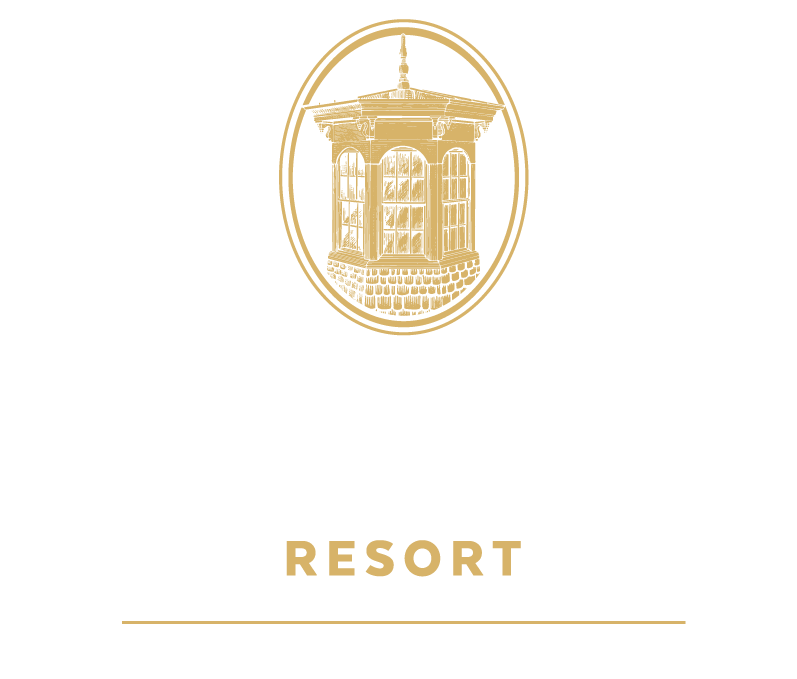{width="7.5in"
height="6.389583333333333in"}

[Kent Island Resort](https://www.kentislandresort.com/dining-menus-2/)

Historic Kent Island Resort is the epitome of country house charm and
contemporary new-world sophistication, on the shores of Chesapeake Bay.
Sip champagne, eat locally sourced seasonal dishes, at 18TWENTY, or
enjoy 220 acres of serene parklands with hiking trails and cycling, and
nearly 2 miles of waterfront for kayaking and boating. An in ground
swimming pool is open seasonally for days spent relaxing in the sun on
this truly exquisite property. Exemplary service and beautifully
appointed rooms or suites with unique character and charm await. We
invite you to fall in love with Kent Island Resort -- one hour from
Washington.

500 Kent Manor Drive, Stevensville, MD 21666

\(410\) 643-5757             events@kentislandresort.com

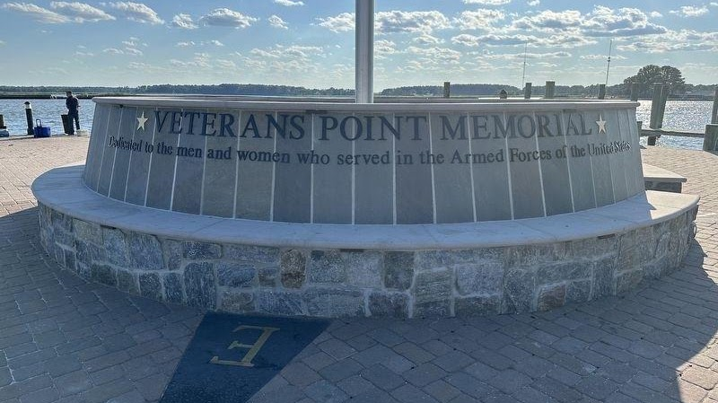{width="7.5in"
height="4.209722222222222in"}

[Veterans Point Memorial](https://www.hmdb.org/copyright.asp)

321 Wells Cove Rd, Grasonville, MD 21638

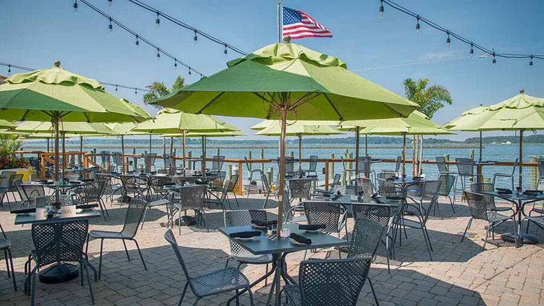{width="7.5in"
height="4.216666666666667in"}

[Bridges
Restaurant](https://bridgesrestaurant.net/bridges-restaurant-named-in-100-most-scenic-restaurants-in-america/)

Named in 100 Most Scenic Restaurants in America. Food & Wine Magazine:
Open Table Diners Have Spoken. 10 Million Dining Guests and 25,000
Restaurants Surveyed.

321 Wells Cove Rd, Grasonville, MD 21638, USA

410.827.0282

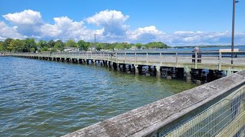{width="4.25in"
height="2.3854166666666665in"}

[Romancoke
Pier](https://www.qac.org/Facilities/Facility/Details/Romancoke-Pier-128)

Romancoke Wharf County Park, 9700 Romancoke Rd, Stevensville, MD 21666

{width="1.5625in" height="1.5625in"}

[Kent Island Heritage
Society](https://kentislandheritagesociety.org/kent-island-surnames/)

The Kent Island Heritage Society was founded in 1975 for the purpose of
discovering, identifying, restoring and preserving the heritage of Kent
Island in Maryland. It works diligently to facilitate the processes by
which both its youth and mature history enthusiasts can acquire an
appreciation of Kent Island\'s place in the history of Maryland and of
our nation.

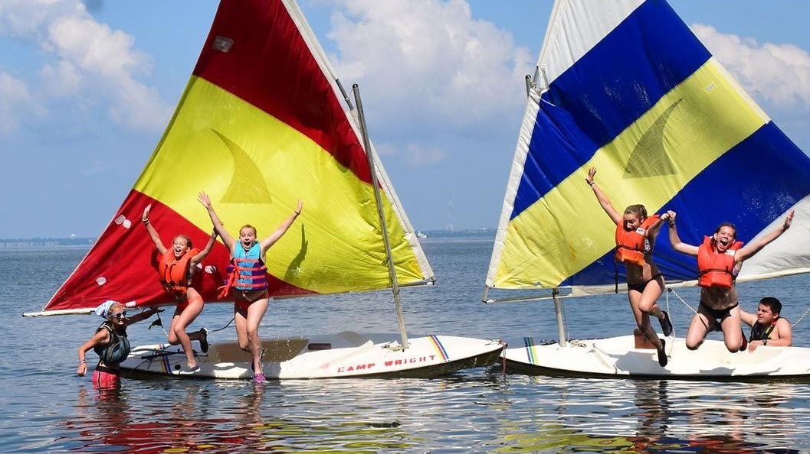{width="7.5in"
height="4.214583333333334in"}

[Camp Wright](https://www.campwright.com/about-us)

As a ministry of
the [Episcopal ](https://www.firstfamilies.us/faith/episcopalian)Diocese
of Easton, Camp Wright provides Day and Resident camp programs for over
1,475 campers each summer. Our programs include a variety of experiences
and activities to encourage campers\' social, physical, mental and
spiritual growth. We pride ourselves on fostering strong connections for
all participants in our programs. Campers, staff, and others are
encouraged to connect deeply with God, with others, with themselves and
the  beautiful natural world around them.  Our beautiful 140 acre
facility on Kent Island remains a peaceful place apart from a busy world
all while being convenient to Baltimore, Washington, DC, Easton,
Salisbury and surrounding areas.  Our rustic nature is important to our
program, no cell phones, no tablets, limited electricity and tons of
Chesapeake Bay Breezes.  

CAMP WRIGHT\| 400 CAMP WRIGHT LN, STEVENSVILLE, MD 21666 \| p: (410)
643-4171 \| f: (410) 643-8421 

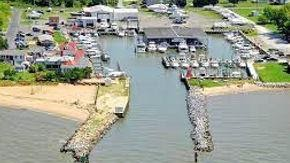{width="3.0208333333333335in"
height="1.6979166666666667in"}

[Kent Island Boat
Charters](https://www.kentislandboatcharters.com/book-online)

38\' Statement Marine. Comfortable Seating: Upfront, Twin seats in front
of the helm, and wrap around bow cushions to take in the Chesapeake.  In
back, enjoy the view from the twin reclining lounge seats or be embraced
by the lush bucket seats. Bolsters cushion the side rails. 

Other Amenities:  Upgraded JBL sound system with XM radio or stream your
own music. Enclosed porcelain toliet w/sink for hand washing.  Lots of
Cooler space, pre-stocked with ice, water, and sodas. Or bring your own
drinks! 

We are a Smoke Free, Pet Free Vessel.  We are NOT a fishing charter.

We can accommodate up to 6 passengers per cruise at this time. We are
unable to make exceptions per Coast Guard regulations. Life jackets
available for all passengers, including children.

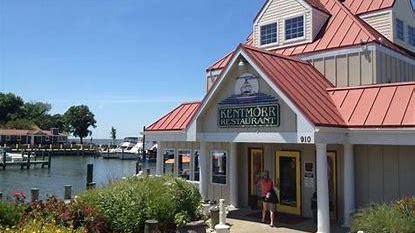{width="4.322916666666667in"
height="2.4270833333333335in"}

[Kentmorr
Restaurant](https://www.visitmaryland.org/listing/american/kentmorr-restaurant-and-crabhouse)

910 Kentmorr Rd, Stevensville, MD 21666

\(410\) 643-2263

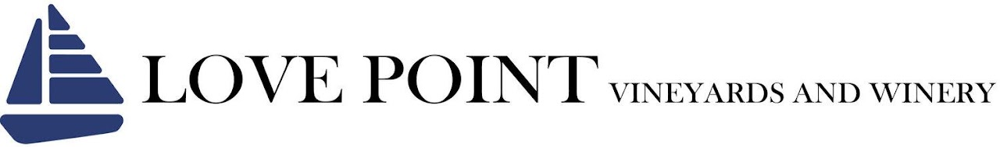{width="7.5in"
height="1.1076388888888888in"}

[Love Point Winery](https://lovepointvineyards.com/events)

Join us Thursday through Sunday from 12:00PM - 5:00PM. Walk-ins are
welcome. No reservations required. Our sun-filled tasting room, outdoor
deck and patio are first come, first served with ample seating and
picnic space available on the lawn.

305 River Shore Lane Stevensville, MD 21666    (443) 786-2765 

[Sunset Wine Cruise Aboard The
Marylander](https://lovepointvineyards.com/events/https/squarelink/u/yhbfldj0)

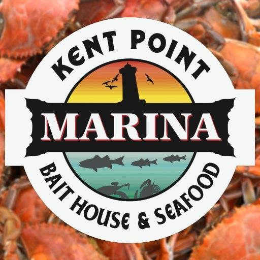{width="5.333333333333333in"
height="5.333333333333333in"}

[Kent Point Marina](https://www.majorcrabs.com/)

107 Short Rd, Stevensville, MD, United States, Maryland

\(410\) 753-2330

<kentpointmarina@gmail.com>

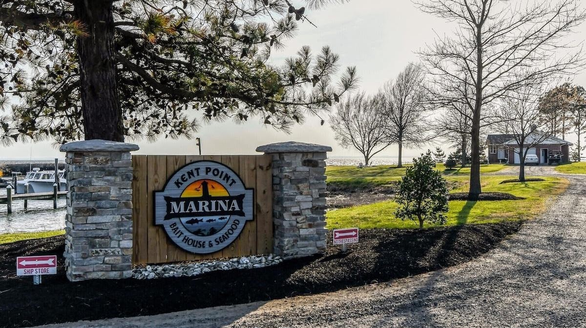{width="7.5in" height="4.2125in"}

[House for Rent](https://t.vrbo.io/tCQ94aCgeUb)

3 Bedroom, 3 baths with private beach

**Property # **1215566

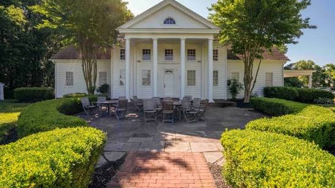{width="5.697916666666667in"
height="3.1979166666666665in"}

[**Matapeake
Beach**](https://www.qac.org/1021/Matapeake-Clubhouse-Beach)

[1112 Romancoke Rd, Stevensville, MD
21666](https://maps.google.com/maps?vet=10CAAQoqAOahcKEwjI-7r29ouVAxUAAAAAHQAAAAAQIw..i&sca_esv=ec2bff8bd1e2ef21&udm=1&pvq=CgovbS8wM2NjNWpj&lqi=ChV0cmFpbHMgb24ga2VudCBpc2xhbmRIi6zWNVodEAAYAhgDIhV0cmFpbHMgb24ga2VudCBpc2xhbmSSAQRwYXJrmgEkQ2hkRFNVaE5NRzluUzBWSlEwRm5TVVJ3ZDA5RFQydG5SUkFC4AEA-gEFCPcMEDg&fvr=1&cs=0&um=1&ie=UTF-8&fb=1&gl=us&sa=X&ftid=0x89b81b921e9e5d11:0xb4ea76f4a9899501)

Yes, there is a lovely spot where you may take your dog for a swim! A
winding trail through the woods ends at the Dog Beach, on the sandy
banks of Chesapeake Bay. Parking is located at the Matapeake Clubhouse
and Public Beach lot; however, pets are not allowed at the clubhouse,
its lawn, or the public beach. The pet trail begins at the fence that
borders the rear of the clubhouse. Enjoy your visit and please bring
along a plastic bag to clean up after your pet to ensure that this park
stays open and available to dog lovers, while not posing a public health
issue for the families using the public beach. 
