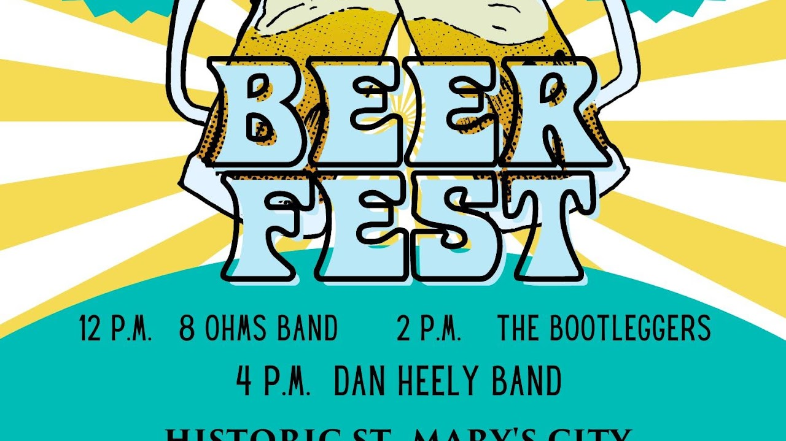
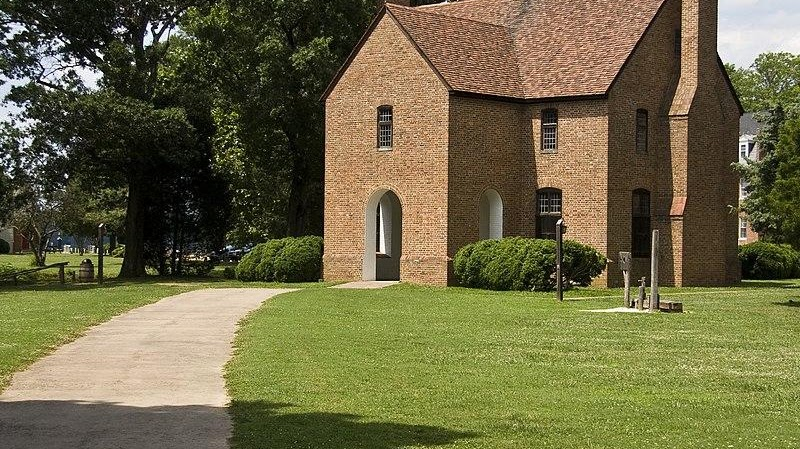

{width="7.104166666666667in"
height="3.9905435258092736in"}

Beer Fest

Join HSMC Saturday, June 24, 2023, from noon to 6 p.m. for live music,
food samples from local cuisine, and various regional craft brews. This
is a fun, family-friendly event. Enjoy a beer while supporting further
education and research at Historic St. Mary's City. The festivities and
live music begin at noon with local food and BEER!

{width="7.333333333333333in"
height="4.119270559930008in"}

Militia Muster

The St. Maries Citty Militia, our host militia, is a volunteer group of
men, women, and children who re-create a colonial Maryland "armed band"
at Maryland's first capital.  This living history encampment features
17th-century re-enactment units from nearby and far away.  Enjoy the
camp activities of cooking, gossiping, trades, games, etc. Free
admission includes grounds and
activities. [Info](https://www.hsmcdigshistory.org/events/militia-muster/)

47414 Old State House Road

St. Mary\'s City , 20686

{width="7.260416666666667in"
height="4.074909230096238in"}

Maryland First Capital

Former Inn Elizabeth Hewitt Lee
