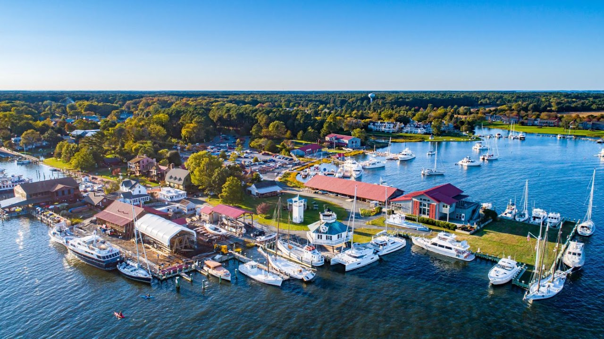
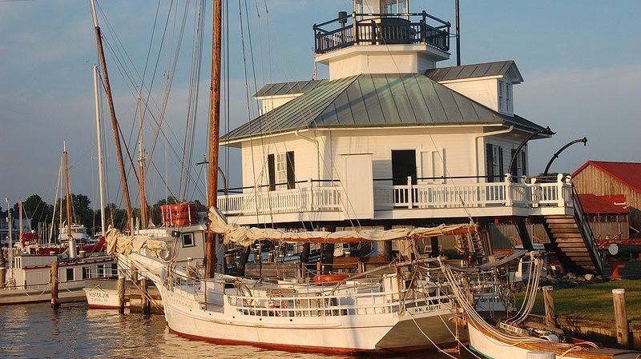
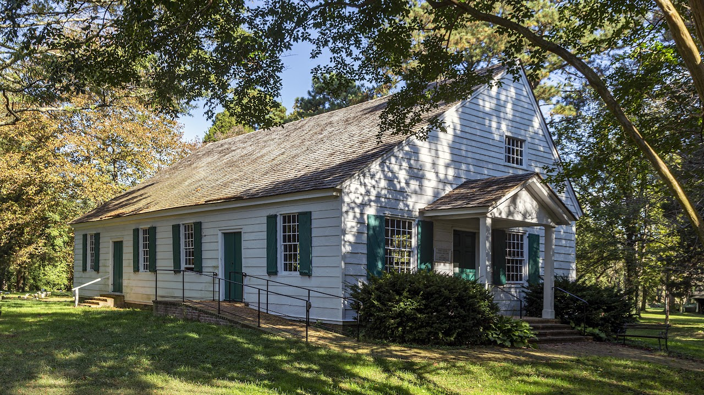
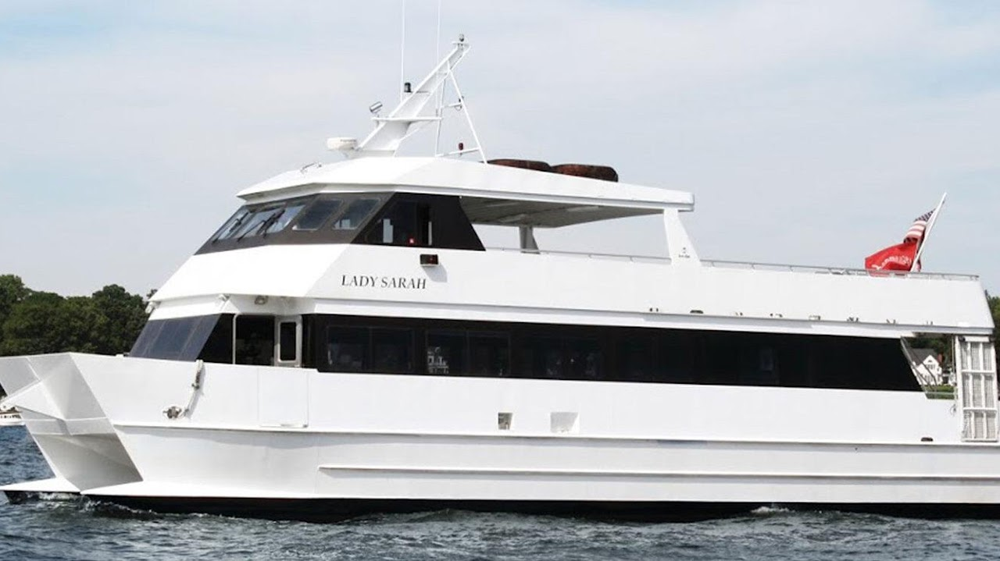
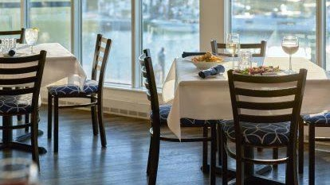
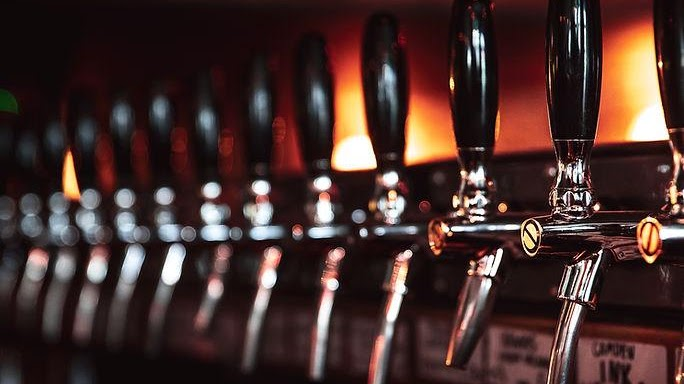

# St. Michaels, Maryland

## Overview
St. Michaels is a historic coastal town located on Maryland's Eastern Shore in Talbot County. Known as "the town that fooled the British" during the War of 1812, St. Michaels features rich maritime heritage, historic 19th-century architecture, premier crabbing and dining, and scenic Chesapeake Bay access.

---

## Genealogy & Historical Resources
* **Town History & Tourism:** [St. Michaels Tourism Information](https://www.stmichaelsmd.com/)
* **Wikipedia Page:** [Saint Michaels, Maryland - Wikipedia](https://en.wikipedia.org/wiki/Saint_Michaels%2C_Maryland)
* **Local History Museum:** [St. Michaels Museum](https://www.stmichaelsmuseum.org/)
* **County Genealogy:** [FamilySearch - Talbot County, Maryland Genealogy](https://www.familysearch.org/en/wiki/Talbot_County,_Maryland_Genealogy)
* **Dining Directory:** [OpenTable - Best Restaurants Near St. Michaels Historic District](https://www.opentable.com/landmark/restaurants-near-saint-michaels-historic-district)

---

## Maritime Museums & Historic Sites

### Chesapeake Bay Maritime Museum (CBMM)
A 18-acre waterfront museum dedicated to preserving and exploring the history, environment, and culture of the Chesapeake Bay region.

* **Address:** 213 North Talbot Street, St. Michaels, MD 21663
* **Phone:** (410) 745-2916
* **Email:** `havefun@cbmm.org`
* **Website:** [Chesapeake Bay Maritime Museum](https://cbmm.org/)

### 1879 Hooper Strait Lighthouse
Located on the grounds of the Chesapeake Bay Maritime Museum, this iconic screw-pile lighthouse originally guided vessels through Hooper Strait before being relocated to St. Michaels for preservation.

* **Address:** 213 N. Talbot St (CBMM Grounds), St. Michaels, MD 21663
* **Phone:** (410) 745-2916

### Third Haven Friends Meeting
Founded following a visit by George Fox, founder of the Religious Society of Friends (Quakers), in 1673. Fox sent books from England to establish the Meeting's library, widely considered the earliest public library in Talbot County and the Province of Maryland.

* **Address:** 405 S. Washington St., Easton, MD 21601
* **Phone:** (410) 822-0293
* **Email:** `3rdhaven@gmail.com`
* **Website:** [Third Haven Calendar & Info](https://thirdhaven.org/calendar.php)

---

## Tours, Cruises & Lodging

| Destination / Service | Description & Highlights | Contact & Location |
| :--- | :--- | :--- |
| **[Watermark Day Cruise to St. Michaels](https://watermarkjourney.com/events/day-on-the-bay-to-st-michaels/)** | Cruise across Chesapeake Bay from Annapolis to St. Michaels. Includes 3 hours ashore for seafood, shopping, and historical sights, plus admission to the Chesapeake Bay Maritime Museum. | **Hours:** 10:00 AM – 5:30 PM **Rates:** $118 Adult / $45 Child |
| **[St. Michaels Harbour Inn, Marina & Spa](https://www.harbourinn.com/harrisons-harbour-lights)** | Waterfront lodging, full-service marina, spa treatments, and harbor views. | 101 N. Harbor Rd, St. Michaels, MD 21663 Phone: (410) 745-9001 Ext. 3 Email: `rooms@harbourinn.com` Map: [Google Maps](https://maps.app.goo.gl/QG24pfzEosueN1rG8) |
| **[Talbot Street Tavern](https://www.opentable.com/r/talbot-st-tavern-saint-michaels)** | Popular local tavern serving regional fare, seafood, and cocktails in the heart of the historic district. | 209 S. Talbot St, St. Michaels, MD 21663 Phone: (410) 745-8005 Email: `info@talbotsttavern.com` **Hours:** Mon–Wed 12pm–11pm, Thu 12pm–12am, Fri–Sat 12pm–1am, Sun 12pm–12am |
| **[St. Michaels Water Taxi](https://www.smharborshuttle.com/watertaxi)** | Local harbor shuttle service providing water transportation around St. Michaels harbor and nearby waterways. | Phone: (410) 819-9606 |

*Watermark Day Cruise across the Chesapeake Bay*

*St. Michaels Harbour Inn, Marina & Spa*

*Talbot Street Tavern*

---

*Last updated: August 2026*
