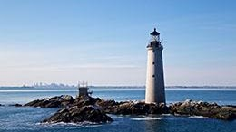
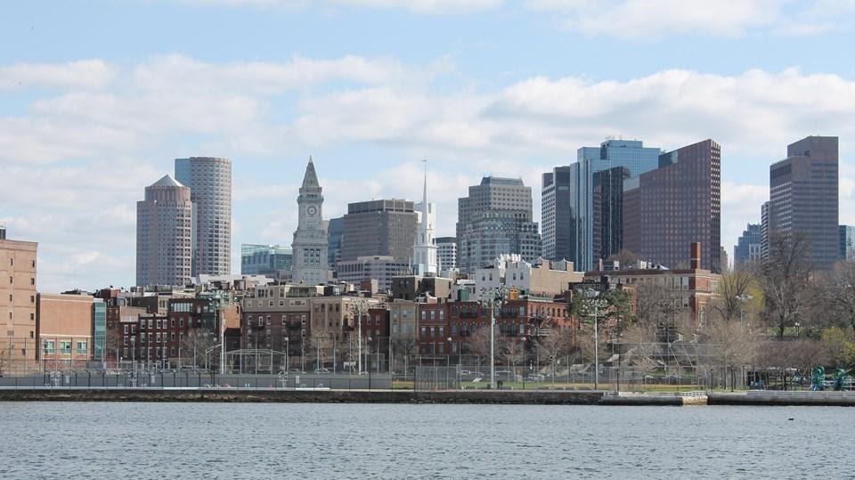
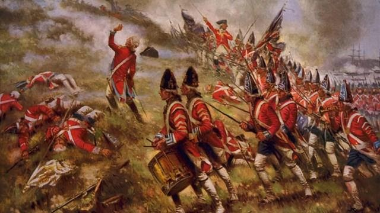

{width="2.7083333333333335in"
height="1.5208333333333333in"}

[Boston Harbor
Islands](https://www.nps.gov/boha/learn/kidsyouth/beajuniorranger.htm)

34 islands form a partnership that protect vital natural resources and
preserve a cultural history that spans millennia 

{width="7.5in"
height="4.211111111111111in"}

[Boston National Historical
Park](https://www.nps.gov/bost/planyourvisit/index.htm)

This 43 acre historical park encompasses portions of Downtown Boston,
Charlestown, and South Boston. In addition to managing its properties
that are a part of the park, the Park operates two visitor centers
at [**Faneuil
Hall**](https://www.nps.gov/bost/historyculture/fh.htm) and in
the [**Charlestown Navy
Yard**](https://www.nps.gov/bost/historyculture/cny.htm). The park also
works and cooperates with many different partner organizations which
comprise the Freedom Trail. There are many different ways to explore
Boston\'s past. At our visitor centers you can collect free maps and
information about Boston and the Park. Here you can also participate in
any scheduled free [**Ranger-Guided Talks and
Tours**](https://www.nps.gov/bost/planyourvisit/guidedtours.htm). 

{width="6.666666666666667in"
height="3.75in"}

[Bunker Hill](https://www.nps.gov/bost/learn/historyculture/bhm.htm)

The Bunker Hill Monument, Lodge, and Museum are National Park Service
sites.

Learn about the history of the site at the [**Bunker Hill
Museum**](https://www.nps.gov/places/bunker-hill-museum.htm). Here, park
staff are available to answer questions and there are restrooms open to
the public. Additionally, explore views from the top of the monument
through [**360 degree Live
Webcams**](https://www.nps.gov/bost/learn/views-of-the-revolution-360-monument-webcams.htm).
For more information to help you prepare for your visit to the park,
see [**Know Before You
Go**](https://www.nps.gov/bost/bost-know-before-you-go.htm).

{width="7.5in"
height="4.2131944444444445in"}

[Junior
Ranger](https://www.nps.gov/boha/learn/kidsyouth/beajuniorranger.htm)

[Explore Spectacle Island through the activities in this
book.](https://www.nps.gov/boha/learn/kidsyouth/upload/Spectacle-Island-Junior-Ranger-Activity-Booklet_508.pdf) 

[Explore Georges Island through the activities in this
book.](https://www.nps.gov/boha/learn/kidsyouth/upload/Georges-Island-Junior-Ranger-Booklet_508.pdf) 

[Explore Peddocks Island through the activities in this
book. ](https://www.nps.gov/boha/learn/kidsyouth/upload/Peddocks-Island-Junior-Ranger-Booklet_508.pdf)

[Explore Lovells, Grape, and/or Bumpkin Island through the activities in
this
book. ](https://www.nps.gov/boha/learn/kidsyouth/upload/Camping-Islands-Junior-Ranger-Booklet_508.pdf)
