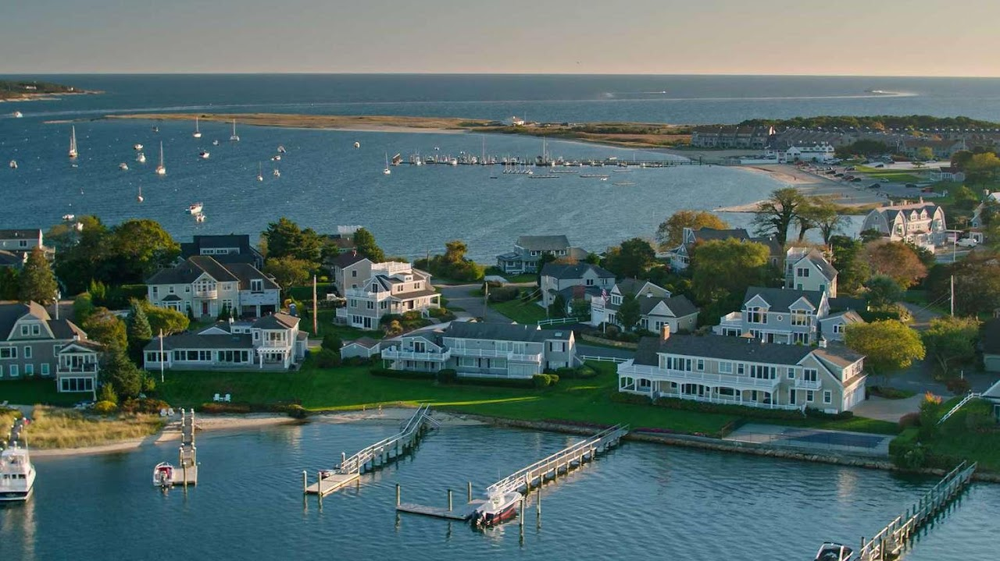
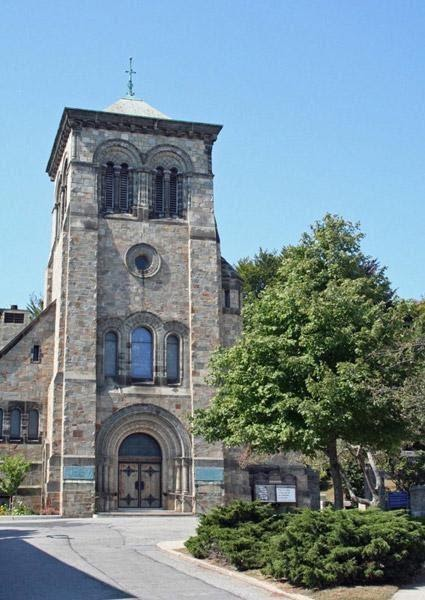
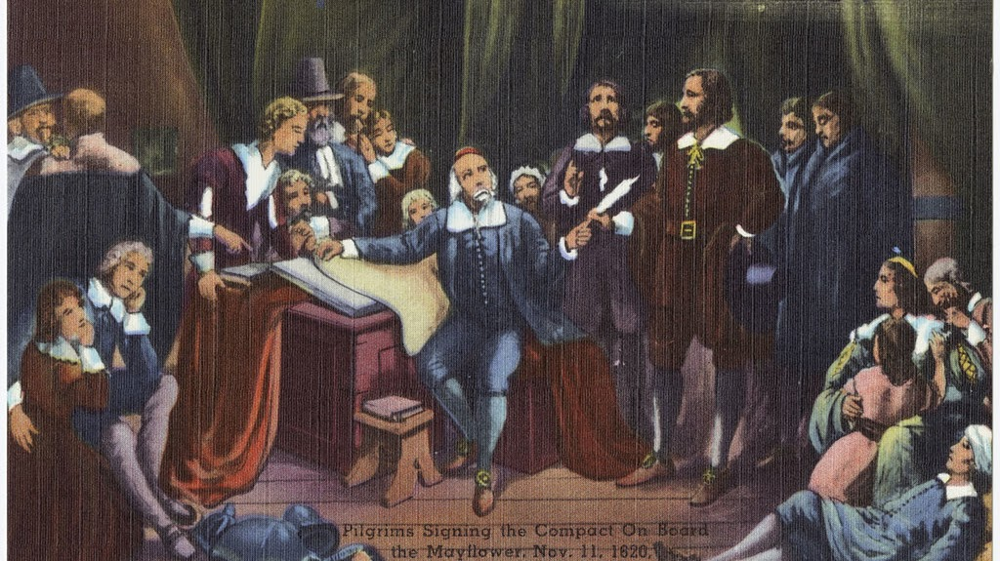
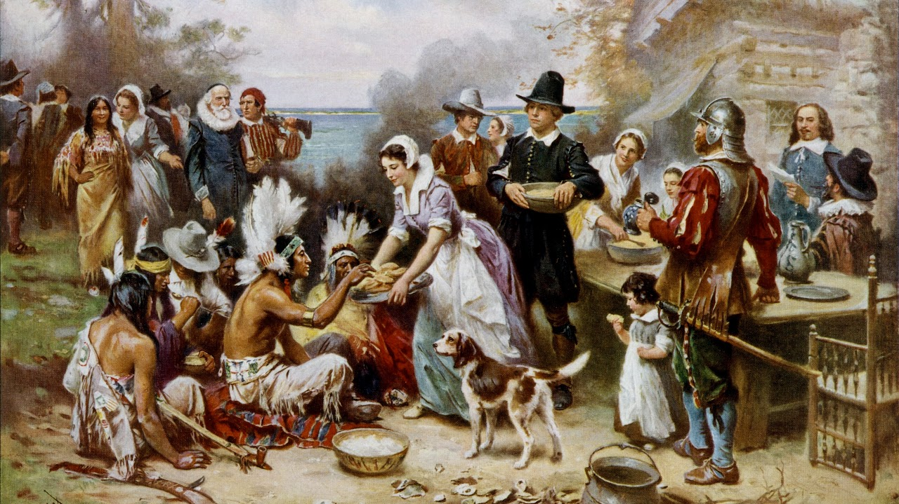
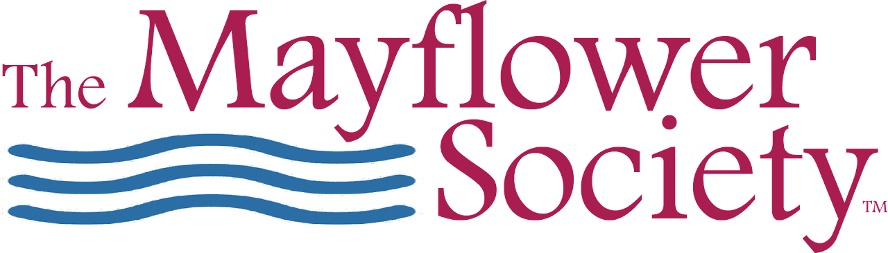

{width="7.5in"
height="4.2131944444444445in"}

[Cape Cod National
Seashore](https://www.nps.gov/caco/planyourvisit/hours.htm)

Cape Cod National Seashore has an abundance of natural and cultural
resource spread throughout its 44,000 acres.

600 US-6, Provincetown, MA 02657

{width="4.427083333333333in"
height="6.25in"}

First Parish Plymouth

First Parish Church in Plymouth is a historic Unitarian church at the
base of Burial Hill on the town square off Leyden Street in Plymouth,
Massachusetts. The congregation was founded in 1620 by the Pilgrims in
Plymouth. The current building was constructed in 1899. 

{width="7.5in"
height="4.211111111111111in"}

Mayflower Pilgrims

The Pilgrims, also known as the Pilgrim Fathers, were the English
settlers who traveled to America on the Mayflower and established the
Plymouth Colony in Plymouth, Massachusetts (John Smith had named this
territory New Plymouth in 1616, coincidentally sharing the name of the
Pilgrims\' final departure port of Plymouth, Devon.). The Pilgrims\'
leadership came from the religious congregations of Brownists, or
Separatist Puritans, who had fled religious persecution in England for
the tolerance of 17th-century Holland in the Netherlands. 

{width="7.5in"
height="4.2131944444444445in"}

Thanksgiving

Thanksgiving is a federal holiday in the United States celebrated on the
fourth Thursday of November. It is sometimes called American
Thanksgiving (outside the United States) to distinguish it from the
Canadian holiday of the same name and related celebrations in other
regions. It originated as a day of thanksgiving and harvest festival,
with the theme of the holiday revolving around giving thanks and the
centerpiece of Thanksgiving celebrations remaining a Thanksgiving
dinner. The dinner traditionally consists of foods and dishes indigenous
to the Americas, namely turkey, potatoes (usually mashed or sweet),
stuffing, squash, corn (maize), green beans, cranberries (typically in
sauce form), and pumpkin pie. Other Thanksgiving customs include
charitable organizations offering Thanksgiving dinner for the poor,
attending religious services, and watching television events such as
Macy\'s Thanksgiving Day Parade and NFL football games. 

{width="7.5in"
height="2.1444444444444444in"}

[General Society of Mayflower
Descendants](https://themayflowersociety.org/genealogy/patriots-to-passengers/)

The General Society of Mayflower Descendants is committed to research on
the lineal descent of the Mayflower Pilgrims and education about the
Pilgrims who traveled aboard the Mayflower in 1620. The Society provides
education and understanding of why the Mayflower Pilgrims were
important, how they shaped western civilization, and what their 1620
voyage means today and its impact on the world.  
