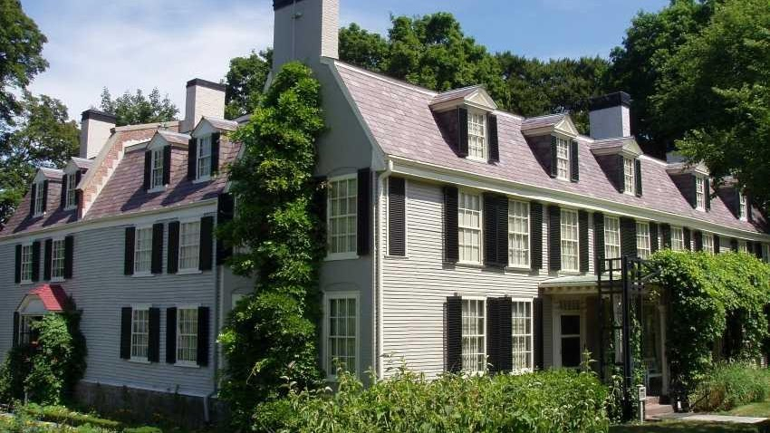
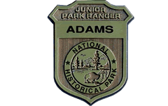
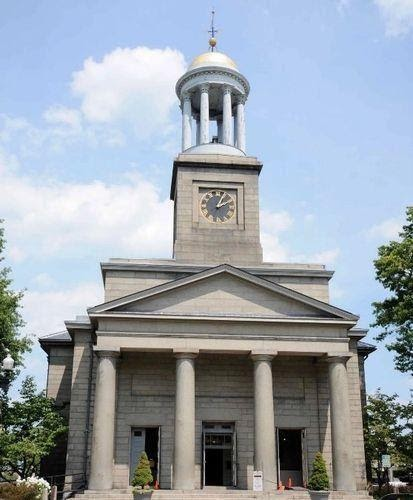

{width="6.895833333333333in"
height="3.877892607174103in"}

[Adams National Historic
Park](https://www.nps.gov/adam/planyourvisit/maps.htm)

{width="2.5in"
height="1.5833333333333333in"}

[Adams Junior
Ranger](https://www.nps.gov/adam/learn/kidsyouth/beajuniorranger.htm)

[Junior Ranger Booklet for Ages 6 to
8](https://www.nps.gov/adam/learn/kidsyouth/upload/Adams-Junior-Ranger-Booklet-Ages-6-to-8.pdf)

[Junior Ranger Booklet for Ages 9 and
Up](https://www.nps.gov/adam/learn/kidsyouth/upload/Adams-Junior-Ranger-Booklet-ages-9.pdf)

If you\'d like to complete the Junior Ranger booklet remotely, be sure
to [**check out our virtual
tour**](https://artsandculture.google.com/partner/adams-national-historical-park). 

{width="4.302083333333333in"
height="5.208333333333333in"}

[United First Parish Church](https://ufpc.org/presidential-wreathlaying)

**Honoring
the [Adams](https://www.firstfamilies.us/ancestors/england/adams) Presidents
as a part of a national wreath-laying tradition. **Twice each year the
President of the United States sends a wreath to the  United First
Parish Church to be placed on the tomb of the Adams Presidents.  This
national tradition started during the administration  of President
Lyndon Johnson in 1967. Each year,  wreaths of red, white  and blue
flowers are sent to the burial places of all deceased  presidents on the
anniversary of their birthday**. **The  United First Parish Church,
Church of the Presidents is the proud keeper of this important annual
recognition of our Presidential  heritage.  Admission  to the
wreath-laying ceremony, the Adams Crypt and Church Sanctuary are  free.
Donations to support the History and Visitors Program are greatly 
appreciated. United First Parish Church is located at 1306 Hancock
Street, Quincy, MA 02169.

  

**For more information about the ceremonies, please
email [office@ufpc.org]{.underline} or call 617-773-1290.  **
