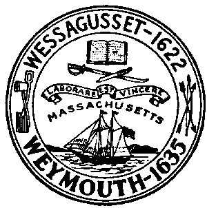

{width="3.125in"
height="3.1458333333333335in"}

[Weymouth](https://historyofmassachusetts.org/weymouth-mass-history/)

Weymouth is the second oldest town in Massachusetts. It was first
inhabited by natives from the Massachusetts tribe before being settled
by English colonists and then abandoned in the early 1620s. It was
eventually absorbed into the Massachusetts Bay Colony.

1674: The
Matthew [Pratt](https://www.firstfamilies.us/ancestors/england/pratt) II
House is built on Green Street.

1676: On April 19, Weymouth is attacked again during King Philip's War
when natives burn down seven houses in Weymouth and kill Sergeant
Thomas [Pratt](https://www.firstfamilies.us/ancestors/england/pratt) while
en route to attack Plymouth.
