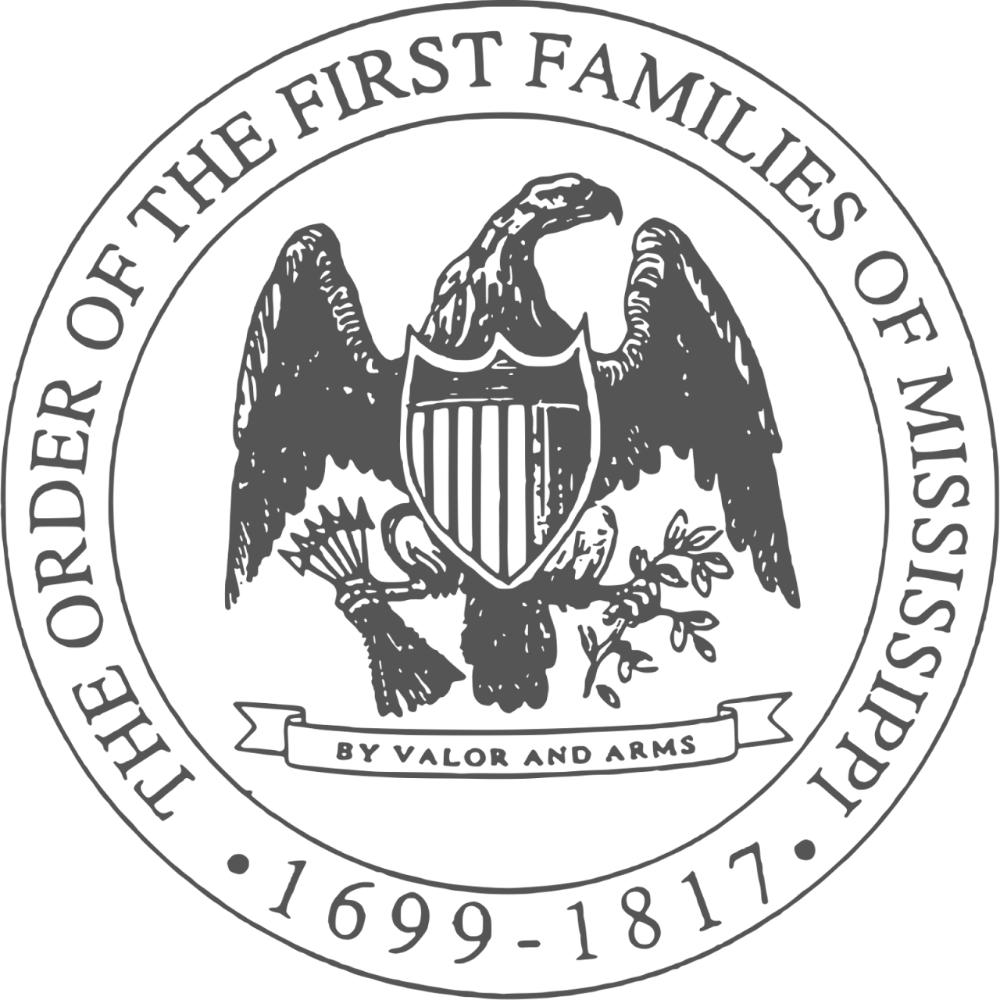

[Order of the First Families of
Mississippi](https://offms.org/history-of-the-order/ancestor-roster/)

OFFM is committed to genealogical documentation, historical education,
and recognition of the achievements of our state, not only from the
colonial period of 1699 through 1817 
