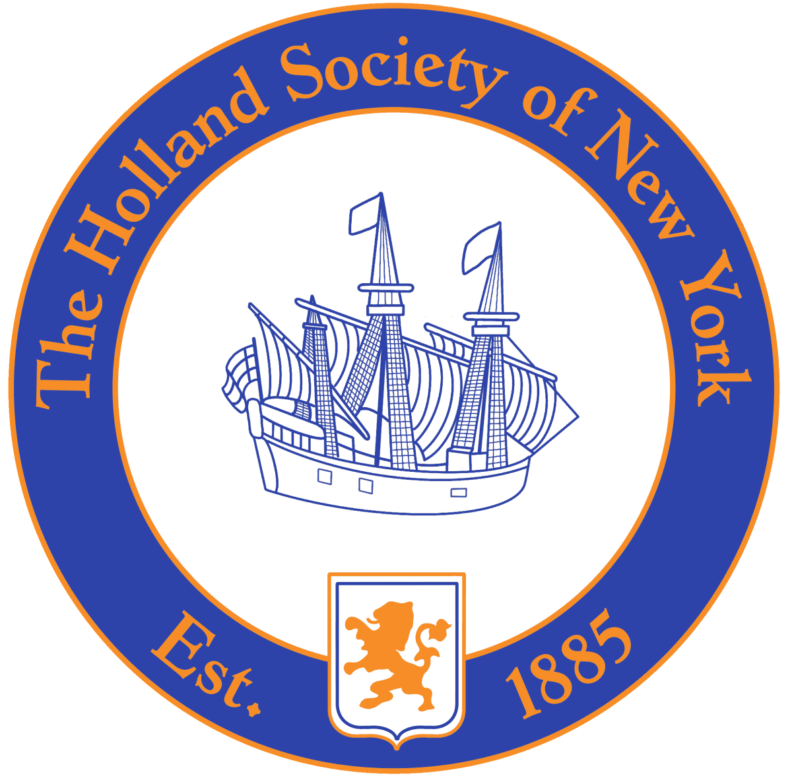
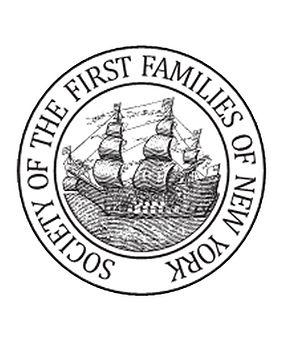

[Holland Society of New York](https://hollandsociety.org/join/)

Dutch native or Dutch resident of New Netherland or the American
colonies (now a part of the United States) prior to or during the
year **1675** 

{width="2.9791666666666665in"
height="3.6666666666666665in"}

[Society of the First Families of New York]{.underline} 

Any individual at least eighteen years old, who is determined by the
Society to be eligible based on proven lineal descent from an ancestor
of the Founding Families of the State of New York, who was a resident of
colonial New York, or its current borders, on or before **November 24,
1783**. 

{width="7.5in"
height="1.2659722222222223in"}

[Society of Daughters of Holland
Dames](https://hollanddames.org/ancestors/)

Eligibility for Membership may be through any one of three avenues, or
all three, if desired.  Any woman shall be eligible who has reached the
age of eighteen and is lineally descended from a person, male or female,
(i) who was born, prior to the Treaty of Westminster, 1674\*, either in
the Netherlands or in New Netherland of Dutch parentage; OR (ii), whose
ancestor resided in New Netherland prior to the Treaty of Westminster,
1674 

{width="2.0833333333333335in"
height="2.0833333333333335in"}

[Dutch Colonial
Society](http://www.dutchcolonialsociety.org/ancestors.htm)

Proven direct descent from a Dutch settler born in the Netherlands, and
who immigrated, no later than **19 April 1775**, to any settlement in
what is now the United States. Also eligible are direct descendants of
selected non-Dutch ancestors who resided in New Netherland prior to the
Treaty of Westminster, 1674, or settled in what is now the United States
no later than 19 April 1775, AND who have proven significant service to
Dutch heritage in business, cultural, military, religious or political
affairs either in the Netherlands and/or the United States. 
