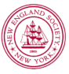

{width="0.9166666666666666in"
height="0.9791666666666666in"}

[New England Society In The City Of New
York](https://nesnyc.org/founders-day/)

The New England Society in the City of New York (NES) is one of the
oldest social and charitable organizations in the United States, and was
founded in 1805 to promote \"friendship, charity and mutual assistance\"
among and on behalf of New Englanders living in New York.

NES celebrates the New England spirit and heritage through its
philanthropic outreach, social events and cultural activities. Our
charitable focus is education. The NES Scholarship Program assists New
York City students at New England colleges and universities. Another
signature program is the annual New England Society Book Awards, which
recognize books of merit that honor New England and its culture.
