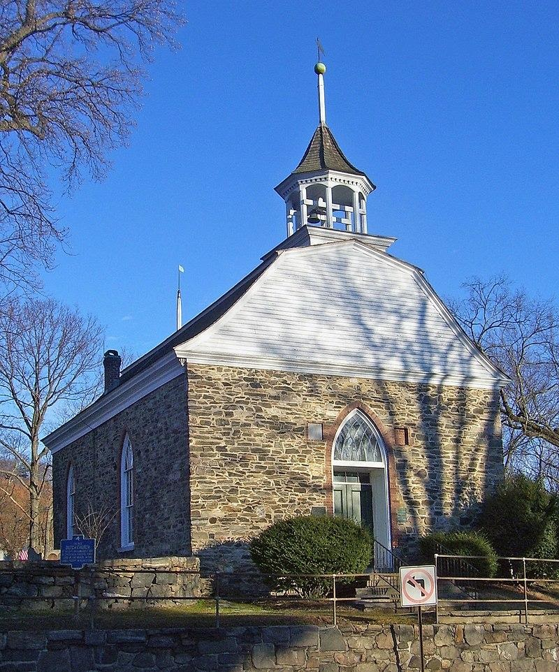

[Old Dutch
Church](https://en.wikipedia.org/wiki/Old_Dutch_Church_of_Sleepy_Hollow)

The Old Dutch Church of Sleepy Hollow , listed on the National Register
of Historic Places as Dutch Reformed Church (Sleepy Hollow), is a
17th-century stone church located on Albany Post Road (U.S. Route 9) in
Sleepy Hollow, New York, United States. It and its three-acre (1.2 ha)
churchyard feature prominently in Washington Irving\'s 1820 short story
\"The Legend of Sleepy Hollow\". The churchyard is often confused with
the contiguous but separate Sleepy Hollow Cemetery. It is the second
oldest extant church and the 15th oldest extant building in the state of
New York, renovated after an 1837 fire. Some of those renovations were
reversed 60 years later, and further work was done in 1960. It was
listed on the Register in 1966, among the earliest properties so
recognized. It had already been designated a National Historic Landmark
in 1961. It is still the property of the Reformed Church of the
Tarrytowns, which holds summer services there, as well as on special
occasions such as Christmas Eve.

From mid-June til after Labor Day we worship at the Old Dutch Church of
Sleepy Hollow at 10:00 a.m. Sundays.

\(914\) 631-4497

Email us here

42 N. Broadway, Tarrytown, N.Y. 10591 
