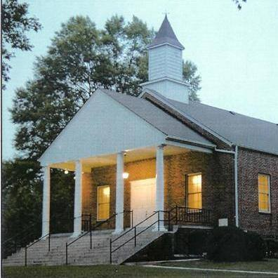

[Cane Creek Friends Meeting](https://canecreekfriends.org/?page_id=31)

Cane Creek was established 1751. A delegation of Friends led by Abigail
Pike and Rachel Wright rode horseback to Perquimans County to request
permission to start the meeting. It was granted. The Perquimans Ministry
and Counsel recorded Abigail Pike as a minister for Cane Creek. Friends
have always recognized women as ministers and missionaries. Leadership
is expected by all members. A minister's roll is to encourage. Cane
Creek held its first session of Monthly Meeting 10 month 7, 1751. The
first Cane Creek Meetinghouse was not on the present site. It was about
2 miles east. William Marshall donated the land for the 1764
Meetinghouse to be built. 

719 W Greensboro Chapel Hill Rd, Snow Camp, NC, United States, North
Carolina
