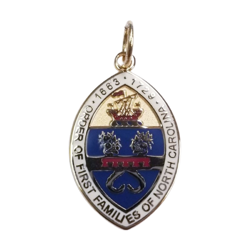

<header class="wrapper bg-light">
  
</header>

[Order of First Families of North
Carolina](https://www.offnc.org/ancestors.html)

The Order of First Families of North Carolina is composed of, and
limited to, individuals lineally descended from a person who was a
resident/colonist on or before the 12th day of July, Anno Domini, 1729,
in that part of the PROVINCE OF CAROLINA which later became the STATE OF
NORTH CAROLINA. 
