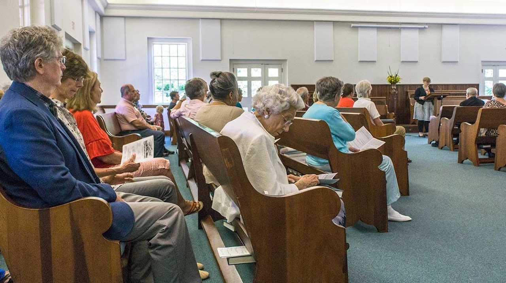
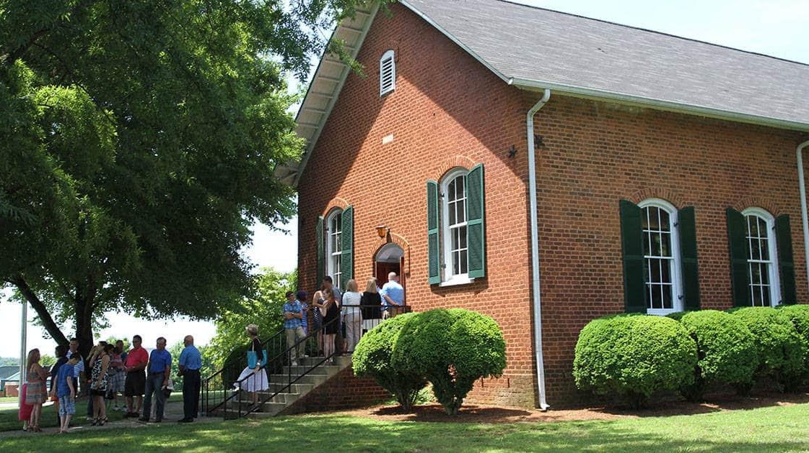
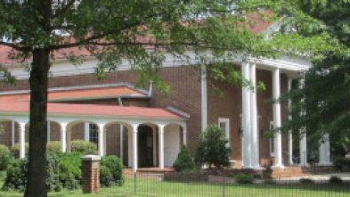
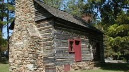
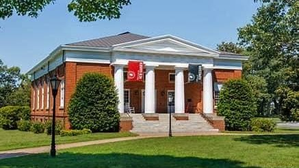

{width="7.5in"
height="4.2131944444444445in"}

[New Garden Friends Meeting](https://ngfm.org/about/)

Friends first gathered here in the mid-1700s to worship outdoors on
First Day (Sunday) while seated on fallen trees. In 1754, New Garden
Friends Meeting was established as a Monthly Meeting (the Quaker term
for a regular congregation).

801 New Garden Road Greensboro, N.C. 27410     336-292-5487

{width="7.5in"
height="4.215277777777778in"}

[Deep River Friends Meeting](https://www.deepriverfriends.com/visit/)

Deep River Friends Meeting, established in 1754, is a Quaker church in
High Point, N.C. We gather for worship on Sundays at 11 a.m. In a world
of greed, endless hurry and violence, we believe there is a better way
of life. This is made possible by Jesus Christ who shows us the infinite
love and mercy of God, and who accompanies us day-by-day, helping us
find goodness among the difficult choices that constantly confront us.

5300 West Wendover Avenue, High Point, NC 27265

P: 336-454-1928 \| E: <office@deepriverfriends.com>

{width="4.09375in"
height="2.3020833333333335in"}

[Springfield Friends
Meeting](https://en.wikipedia.org/wiki/Springfield_Friends_Meeting)

Friends were slower to settle in the Piedmont. Cane Creek Meeting was
started in 1751, and New Garden followed in 1754. In the mid-1700's,
Quakers began settling in South Carolina. However, the economy there was
deeply involved with slavery. Quakers started leaving South Carolina in
the 1770's, moving up to North Carolina. Many members of Bush River
Friends (near Camden, SC) helped to start a new meeting at Springfield.
Early Friends from South Carolina who helped to start Springfield
include members of the English, Kersey, Mendenhall, Piggins, Ricks and
Tomlinson families.

Another early group of settlers came from the island of Nantucket off
the coast of Massachusetts. Many Quakers there had made a living from
whaling, but the island was overcrowded and whales were becoming scarce
near the coast. Many Quaker families moved to New Garden before coming
down to Springfield. Prominent family names from Nantucket are Coffin,
Macy and Petty.

A third stream of early settlers came here from the Philadelphia area,
which was founded in 1681 by William Penn as a refuge for Friends and
others who were suffering from religious persecution back in the Old
World. They came to Pennsylvania and prospered, but again, the colony
was getting crowded. So, many Friends headed down to North Carolina,
where they found other Quakers, often with family connections. Land here
was inexpensive and there was plenty of room for families to buy large
farms. By the time of the American Revolution, there were almost 15,000
Quakers in North Carolina. Family names of Springfield settlers from
Pennsylvania include Anderson, Beals, Blair, Carter, Clark, Frazier,
Haworth, Hiatt, Hoggatt, Hunt, Millikan and Piggott (often spelled in
later years as Pickett).

{width="2.6979166666666665in"
height="1.5208333333333333in"}

[High Point Museum](https://www.highpointnc.gov/874/Historical-Park)

The Hoggatt House is a rare example of houses built by the early
settlers of the Piedmont back-country. Originally a single room log
cabin with a large stone fireplace, the house was built around 1801 and
enlarged with a second room around 1824. It was moved to the Historical
Park in 1973 from its original location at the corner of Phillips Avenue
and Rotary Drive in High Point.  The Hoggatt House was restored after a
fire caused by a lightning strike in December 2004. Visit the Park Staff
here to learn about the everyday lives and activities of settlers in the
early 1800s. To learn more about the Hoggatt House's history,
architecture and restoration, [see a
presentation](http://www.slideshare.net/tfloflin/hoggatt-house?ref=http://highpointmuseum.org/historical-park/) by
Salem College student Victoria Chaffers.

1859 East Lexington Avenue High Point, NC 27262

Phone: 336-885-1859

{width="4.552083333333333in"
height="2.5625in"}

[Guilford College](https://en.wikipedia.org/wiki/Guilford_College)

Guilford College is a private liberal arts college in Greensboro, North
Carolina. Guilford has both traditional students and students who attend
its Center for Continuing Education (CCE). Founded in 1837 by members of
the Religious Society of Friends (Quakers), Guilford\'s program
offerings include such majors as Peace and Conflict Studies and
Community and Justice Studies, both rooted in the college\'s history as
a Quaker institution. Its campus has been considered a National Historic
District by the United States Department of the Interior since 1990

5800 West Friendly Avenue Greensboro NC 27410

336.316.2000

admission@guilford.edu
