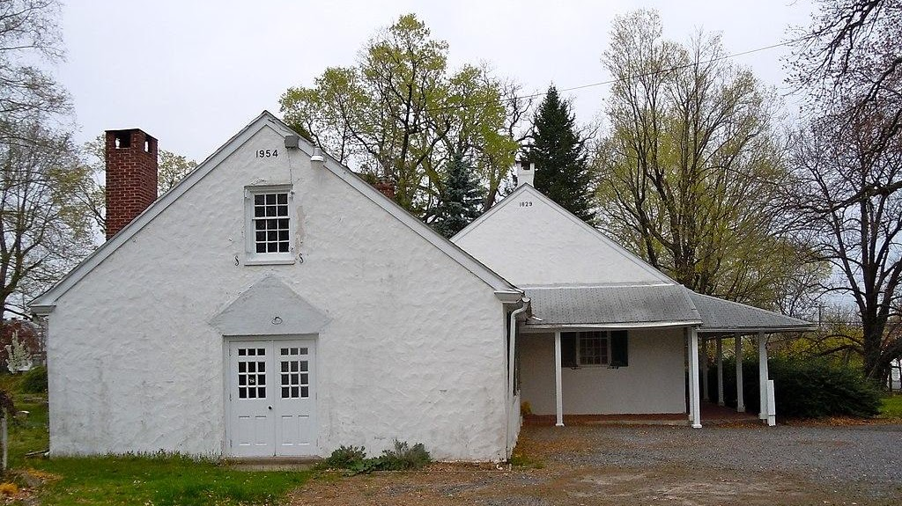

{width="7.5in"
height="4.211111111111111in"}

[Chester Friends
Meetinghouse](https://en.wikipedia.org/wiki/Chester_Friends_Meetinghouse)

The first recorded meeting of Friends in the province of Pennsylvania
was in Chester at the house of Robert Wade in 1675. William Edmundson,
the founder of Quakerism in Ireland was present at the first meeting. In
1682, the Chester Friends agreed to hold their meeting at the Chester
Court House, also known at the time as the House of Defense. On January
7, 1687, a lot was purchased on the west side of present-day Edgemont
Avenue and construction began on the meetinghouse. The first Chester
Friends Meetinghouse was completed in 1693. William Penn was known to
speak at the original Chester Friends meetinghouse.

520 East 24th Street in Chester, Delaware County, Pennsylvania, United
States
