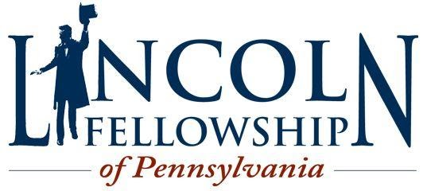

[Lincoln Fellowship of
Pennsylvania](https://lincolnfellowship.wildapricot.org/)

[GETTYSBURG COLLEGE'S MAJESTIC
THEATER](https://www.gettysburgmajestic.org/), 25 Carlisle Street,
Gettysburg, PA.

Susan Eisenhower, J'Nai Bridges, Graham Sibley, Harold Holzer, and Doris
Kearns Goodwin to appear at Dedication Day Events in Gettysburg
Sunday, **Nov 19**. (Gettysburg, PA)

The[ Lincoln Fellowship of
Pennsylvania](http://www.lincolnfellowship.org/) is honored to invite
the public to the Majestic Theater on November 19th, 2023 for a special
Dedication Day ceremony commemorating the 60th anniversary of the
historic 1963 ceremony that marked the centennial of Lincoln's
Gettysburg Address. The venue change is due to a potential U. S.
government shutdown. The Majestic Theater is located at 25 Carlisle St.,
Gettysburg; doors will open to the public at **9:30 a.m**. The ceremony
is free, however seats are limited, no tickets required. NO FIREARMS OR
WEAPONS OF ANY KIND, REPLICA OR NOT, WILL BE ALLOWED IN THE THEATER.

Parking for the event can be found in Race Horse Alley Parking Garage
immediately behind the theater, and limited street parking at parking
meters on surrounding streets. Please be prepared to wait outdoors prior
to entrance to the theater. For more information, visit
[www.lincolnfellowship.org](http://www.lincolnfellowship.org). 

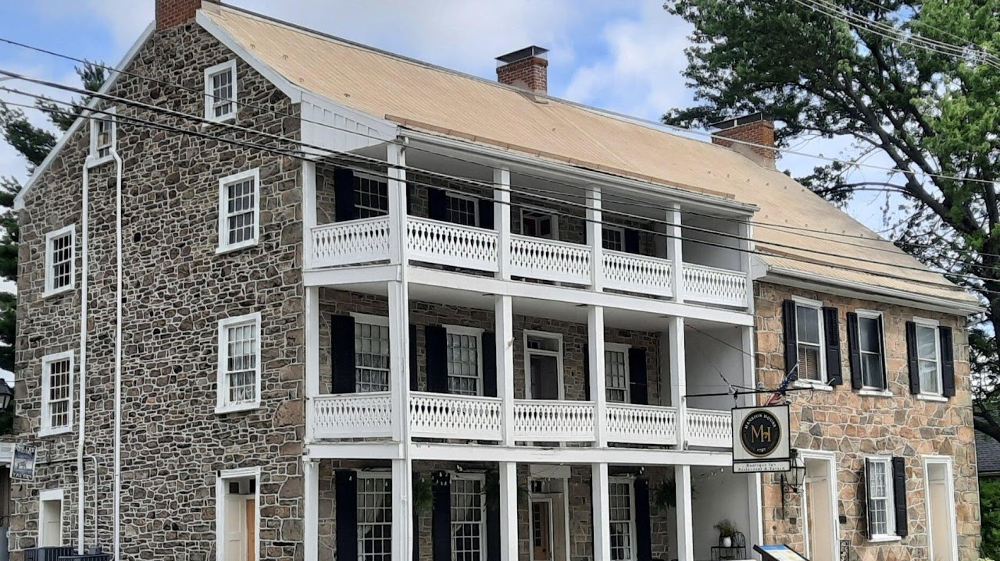{width="7.5in"
height="4.2131944444444445in"}

[Mansion House 1757](https://www.mansionhouse1757.com/events)

Oldest Pub in Pennsylvania,  Served General Robert E. Lee after the
Battle of Gettysburg

[Address](https://www.google.com/search?sxsrf=AB5stBhWxTZvKduzm89CIuM7OqLJp-pMzQ:1690138784112&q=fairfield+inn+fairfield,+pennsylvania+address&ludocid=11534650582077608237&sa=X&sqi=2&ved=2ahUKEwi4guTOwaWAAxW8FlkFHe2LBrUQ6BN6BAhOEAI):
15 W Main St, Fairfield, PA 17320

[Phone](https://www.google.com/search?sxsrf=AB5stBhWxTZvKduzm89CIuM7OqLJp-pMzQ:1690138784112&q=fairfield+inn+fairfield,+pennsylvania+phone&ludocid=11534650582077608237&sa=X&sqi=2&ved=2ahUKEwi4guTOwaWAAxW8FlkFHe2LBrUQ6BN6BAhKEAI): [(717)
642-5410](https://www.google.com/search?q=mansion+house+1757&oq=Mansion+House+1757&gs_lcrp=EgZjaHJvbWUqCggAEAAY4wIYgAQyCggAEAAY4wIYgAQyEAgBEC4YrwEYxwEYgAQYmAUyCggCEAAYhgMYigUyCggDEAAYhgMYigUyCggEEAAYhgMYigUyBggFEEUYPNIBBzQ4OGowajeoAgCwAgA&sourceid=chrome&ie=UTF-8)

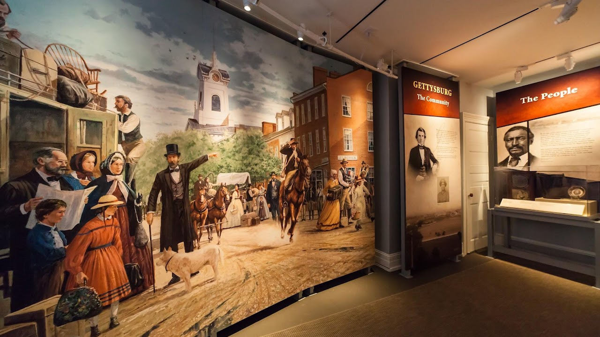{width="7.5in"
height="4.2131944444444445in"}

[Seminary Ridge Museum](https://www.seminaryridgemuseum.org/events)

Gettysburg Address 160th Anniversary on the Ridge - Indoor
Presentation **3:30 PM  4:30 PM**

717-339-1300

info@seminaryridgemuseum.org

111 Seminary Ridge Gettysburg, PA 17325

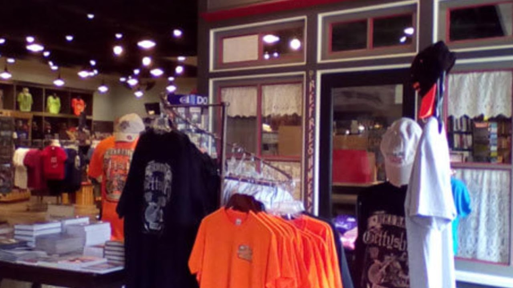{width="7.5in"
height="4.2131944444444445in"}

[Gettysburg Heritage
Center](https://gettysburgmuseumstore.com/collections/tours)

297 Steinwehr Ave. Gettysburg, PA 17325

Sunday - Thursday, 9am - 5pm

Friday & Saturday, 9am - 5pm

717-334-6245

<info@GettysburgMuseum.com>

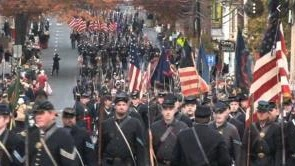{width="3.0729166666666665in"
height="1.7291666666666667in"}

[Remembrance Day
Parade](https://www.visitcumberlandvalley.com/event/remembrance-day-parade/51357/)

Third Saturday in November at 1 PM

Join in honoring the soldiers and civilians of the American Civil War in
this special annual parade. The parade lines up on Middle Street,
proceeds to Baltimore Street and then turns onto Steinwehr Avenue. The
annual event is sponsored by the Sons of Veterans Reserve, the Military
Department of the [Sons of the Union Veterans of the Civil
War](https://suvcw.org/2023-parade-flyer). Check out [Facebook
Page](https://www.facebook.com/profile.php?id=100067011077855).  For
further information contact Major David Hann, [Provost Marshal
SVR](https://sites.google.com/site/remembrancedayparade/gettysburg-remembrance-day-parade).
Cell 609-816-2012 or <majorsvrprovost@gmail.com>.  Also see [Gettysburg
Community](https://www.gettysburgpa.gov/community-events/events/112156) page; [destination
Gettysburg](https://destinationgettysburg.com/event/details/remembrance-day-parade-and-ceremonies/); 

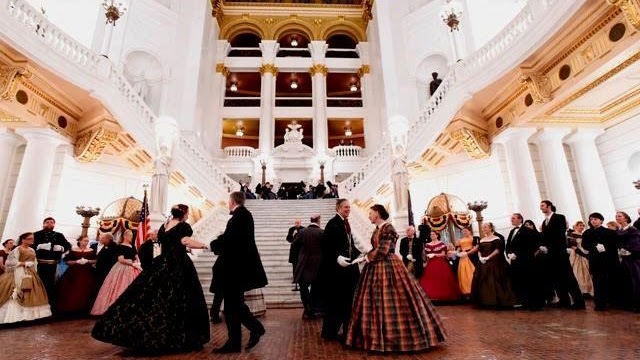{width="6.666666666666667in"
height="3.75in"}

National Civil War Ball

Cap off a day of ceremonies by attending the original and official ball
of Remembrance Day. Members of Civil War hereditary groups, both Union
and Confederate, all military and civilian re-enactors, and supporters
of Civil War preservation are welcome to join in the festivities. Period
dress is encouraged by not required. However, proper attire is
requested. Authentic Civil War music is played by the Philadelphia
Brigade Band. Dancing is led by the Victorian Dance Ensemble. No dance
experience is required. All dances are demonstrated and friendly
instructors are on the floor to assist dancers. Make check payable to "
SVR Ball" and mail  in advance to: Col. Steve Michaels, SVR, 6623 S.
North Cape Rd., Franklin, WI 53132. Call 414-712-4655 or email
lt.col.sm@gmail.com. Include your email and self-addressed stamped
envelope with your check.

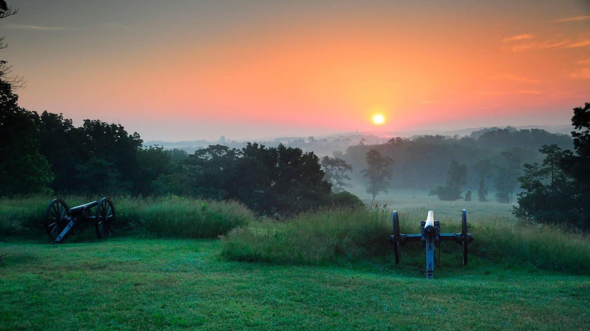{width="7.5in"
height="4.2131944444444445in"}

[Gettysburg National Park](https://www.nps.gov/gett/index.htm)

Nearly a million visitors a year come to Gettysburg National Military
Park, where battlefields and memorials cover some 6,000 acres of rolling
land just five miles north of the Mason-Dixon line. The site of one of
the most consequential battles and most influential speeches in American
history, Gettysburg shaped the country as we see it today.

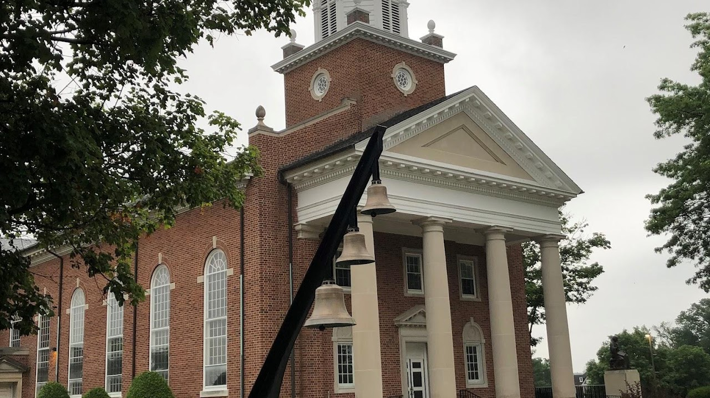{width="7.5in"
height="4.2131944444444445in"}

[Lutheran Seminary &
Church](https://www.unitedlutheranseminary.edu/about/campuses/gettysburg)

Church of the Abiding Presence, Gettysburg campus

Divine Service Sunday Morning

<https://goo.gl/maps/xK3Yaj61g39AAbZL8>

The seminary was the oldest continuing Lutheran seminary in the United
States!

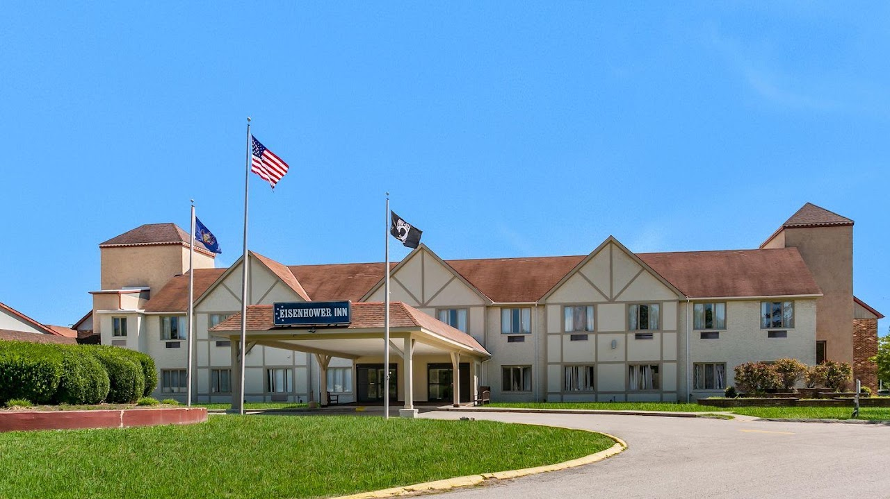{width="7.5in"
height="4.2131944444444445in"}

Eisenhower Hotel & Conference Center

EISENHOWER HOTEL & CONFERENCE CENTER

2634 EMMITSBURG ROAD, GETTYSBURG, PENNSYLVANIA 17325, UNITED STATES

PHONE #717-334-8121 \| <SALES@EISENHOWERCOMPLEX.COM>

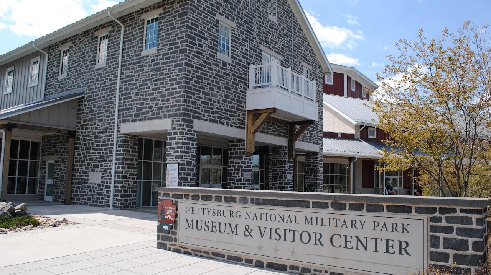{width="7.5in"
height="4.2131944444444445in"}

[Visitor
Center](https://www.gettysburgfoundation.org/about-us/shop-dine)

1195 Baltimore Pike Gettysburg, PA 17325 717-334-2436 877-874-2478

Gettysburg offers a lot to do for everyone. Check out our suggested
itineraries, tailored for different interests and time allotted:

[Quick Raid (Half Day)\
](https://www.gettysburgfoundation.org/plan-your-visit/sample-itineraries?itineraryid=1)[First-Time
Visitor - 2 Day\
](https://www.gettysburgfoundation.org/plan-your-visit/sample-itineraries?itineraryid=2)[First-Time
Visitor - 1 Day\
](https://www.gettysburgfoundation.org/plan-your-visit/sample-itineraries?itineraryid=5)[Returning
Visitor - 1 Day\
](https://www.gettysburgfoundation.org/plan-your-visit/sample-itineraries?itineraryid=6)[Returning
Visitor - 2 Day\
](https://www.gettysburgfoundation.org/plan-your-visit/sample-itineraries?itineraryid=7)[Paths
of Presidents\
](https://www.gettysburgfoundation.org/plan-your-visit/sample-itineraries?itineraryid=9)[Full
Campaign](https://www.gettysburgfoundation.org/plan-your-visit/sample-itineraries?itineraryid=10)

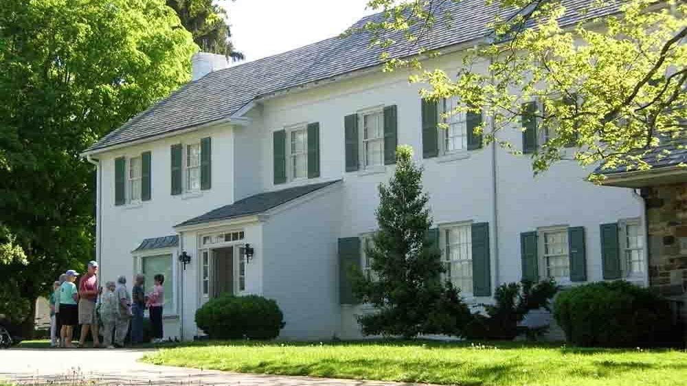{width="7.5in"
height="4.215277777777778in"}

[Eisenhower National Historic
Site](https://www.gettysburgfoundation.org/exhibits-tours-events/historic-sites/eisenhower-national-historic-site)

The home and farm of our 34th President, the Eisenhower National
Historic Site provides a warm and personal look at the home life of
Dwight and Mamie Eisenhower.

Renovated in the early 1950s, the home served as a weekend getaway for
the President and a meeting place for world leaders. Retiring to the
farm in 1961, the Eisenhowers gifted the property to the federal
government in 1967. The farm was designated as a National Historic Site
in 1969.

Today, the site offers hospitality to guests through Ranger talks and
self-guided tours of the home (when open seasonally) and property
including its gardens, teahouse, skeet range, putting green and Angus
cattle barns.
