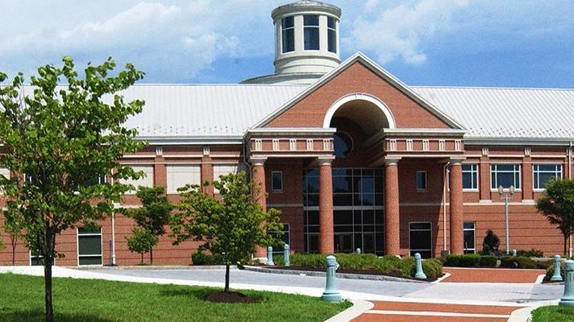

{width="7.416666666666667in"
height="4.166666666666667in"}

National Civil War Museum

The National Civil War Museum is one of the largest museums in the world
dedicated solely to the American Civil war. The Museum seeks to tell the
whole story of this most troubled chapter in American history while
focusing on the issues, the people and the lives that were affected. The
causes and ramifications of this conflict that divide a Nation are
investigated; both Northern and Southern viewpoints are presented;
military as well as civilian perspectives are highlighted.
