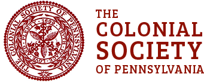

[Genealogical Society of
Pennsylvania](https://genpa.org/first-families-of-pennsylvania/)

Colony and Commonwealth: **1638--1790** 

[Colonial Society of
Pennsylvania](https://colonialsocietypa.org/wp-content/uploads/2021/12/CSPA-Centenial-Register-Roll-of-Ancestors.pdf)

The Colonial Society of Pennsylvania celebrates anniversaries of events
connected to the settlement of Pennsylvania which occurred prior to
1700, as well as the collection, preservation, and publishing of records
and documents related to the early history of our Commonwealth.

[Welcome Society](https://www.welcomesociety.org/ancestors.html)

The purposes of the society are given in its 1906 charter (Listed
Above).  Though it is not specifically stated in the charter, the
Society was founded as nonprofit and educational. Originally, the
membership was limited to the descendants (male or female) of those who
were passengers on the Welcome.  Presently, membership is composed of
descendants of those ancestors who traveled with fellow Quakers to
America during the course of the year of 1682.  This includes 22 ships
and 23 crossings of the Atlantic. 
