Resources

[Discover Lancaster \| Pennsylvania Dutch Country \| Amish Attractions,
Shopping, Dining](https://www.discoverlancaster.com/) 

[Lancaster County, Pennsylvania -
Wikipedia](https://en.wikipedia.org/wiki/Lancaster_County%2C_Pennsylvania) 

[Lancaster County, Pennsylvania Genealogy •
FamilySearch](https://www.familysearch.org/en/wiki/Lancaster_County,_Pennsylvania_Genealogy) 

[Lancaster County -- Genealogical Society of
Pennsylvania](https://genpa.org/public-collections/pennsylvania-county-pages/lancaster-county/) 

[Visiting the Archives \| Lancaster County, PA - Official
Website](https://www.co.lancaster.pa.us/1196/Visiting-the-Archives) 

[Lancaster County PAGenWeb -
Resources](http://www.pagenweb.org/~lancaster/resources.html) 

[Events Archive -
LancasterHistory](https://www.lancasterhistory.org/events/) 

Map

{width="7.5in"
height="2.9270833333333335in"}

[Renaissance Faire](http://www.parenfaire.com/faire.html)

Gates Open at 11AM Each Public Faire Date • Faire site closes at 8PM.
Merchants, food and beverages begin closing at 7PM. Ticket Pricing for
August 19 till last weekend in October.  General Admission: \$32.95
Children (5-11): \$16.95 Children 4 and Under Free, No Ticket Required

After 4PM Sunset Ticket Pricing for August 19 - till last weekend in
October. Tickets go on sale the day of at 3 PM. General Admission:
\$19.95 Children (5-11): \$7.95 Children 4 and Under Free, No Ticket
Required

 Location: 2775 Lebanon Rd. Manheim, PA 17545

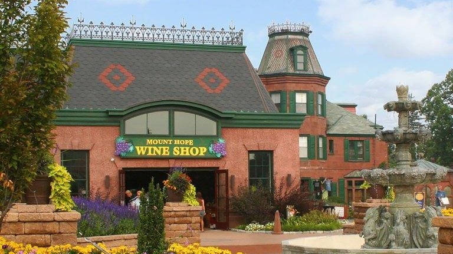{width="6.552203630796151in"
height="3.6770833333333335in"}

[Mount Hope](https://mounthope.estate/?v=7516fd43adaa)

PA's original winery, brewery, cidery and distillery is the premiere
destination for all who appreciate hand-crafted beverages, food and
historic properties. Craft Memories at Mount Hope.

WED-SUN: 11AM-6PM \*Plus Extended Hours During Events\*

2775 Lebanon Road Manheim, PA 17545

717.665.7021

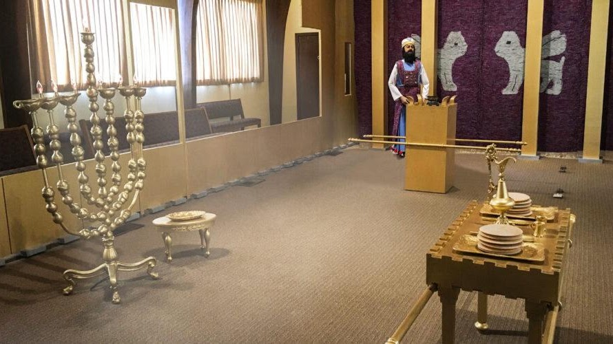{width="6.934583333333333in"
height="3.8958333333333335in"}

[Lancaster Mennonite Historical
Society](https://mennonitelife.org/events/)

Our friendly team will help you find experiences that meet your
curiosity about Mennonites. The Visitors Center also hosts our Biblical
Tabernacle experience. Your visit to what was formerly known as
Lancaster Mennonite Historical Society and the Mennonite Information
Center starts here.

215 Millstream Road, Lancaster, PA 17602-1499 United States
T:717-393-9745

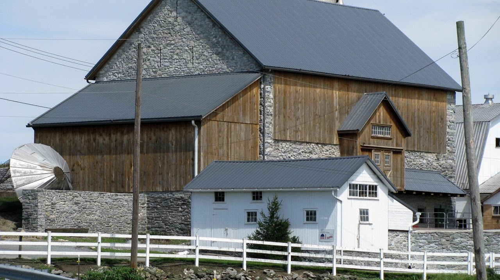{width="7.5in"
height="4.2131944444444445in"}

[Mennonite Guest
Homes](https://mennonitelife.org/visit/visitors-center/)

Take your Lancaster County Mennonite experience to the next level by
staying with Mennonites eager to host you and make your stay all you'd
hoped it would be.

**Contact guest homes directly to arrange a stay.**

This list is for your convenience; Mennonite Life appreciates these
small business Mennonite hosts but makes no specific endorsements
regarding their services.

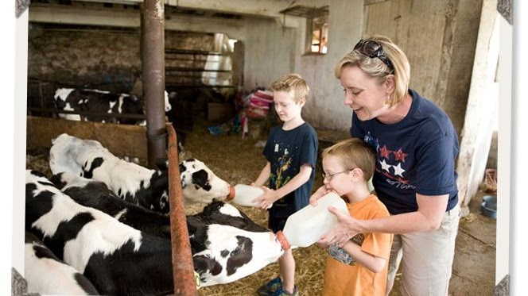{width="6.916666666666667in"
height="3.8854166666666665in"}

[Verdant View Farm](https://verdantview.com/farm-tours/)

Operated by 4th generation farmers at Verdant View Farm, the educational
tours are suitable for adults and children. Join a guided tour and/or
learn a new skill in a farm workshop. TOURS OFFERED MON-SAT DURING THE
SUMMER MONTHS. 

429 Strasburg Rd. Paradise, PA 17562

717-687-7353 reservations@verdantview.com

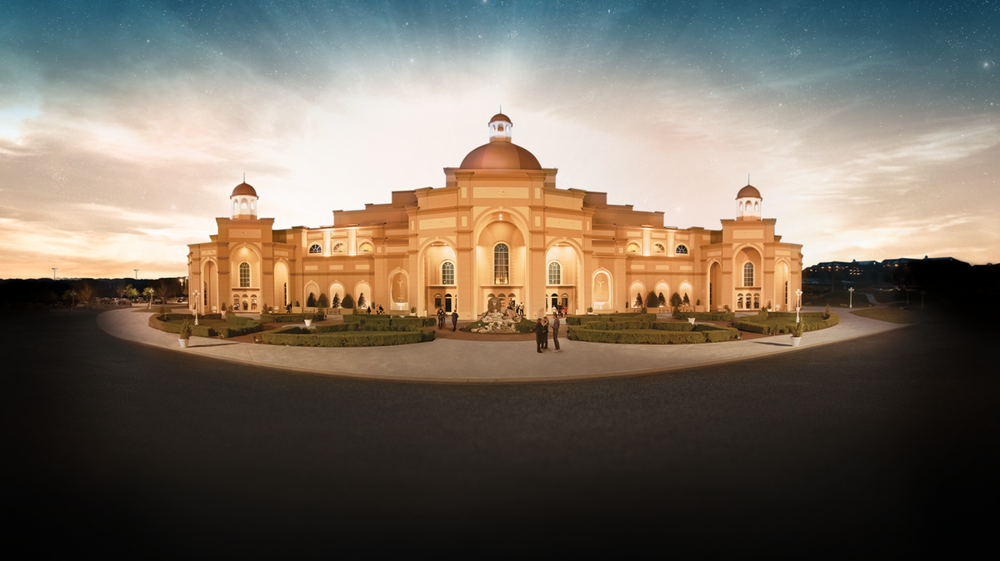{width="7.195845363079615in"
height="4.041666666666667in"}

[Sight & Sound
Theatre](https://www.sight-sound.com/ticketing/shows/title?location=STRASBURG_PA)

Growing up on a dairy farm in rural Lancaster County, our founder Glenn
Eshelman was so inspired by the beauty of the world around him that he
began painting landscapes as a boy. As he grew up, Glenn continued to
pursue his artistic interests, eventually buying a camera to take
reference photos for his paintings. Photography quickly became his
passion. After marrying his wife, Shirley, Glenn sold his artwork out of
the trunk of his car to make ends meet. But in 1964, his side show
became the main act. After presenting his scenic photography at a local
church using a slide projector, a turntable for musical underscore and a
microphone for narration, the audience response was overwhelming. This
first unofficial "Sight & Sound" show became a humble success.

300 Hartman Bridge Road Ronks, PA 17572

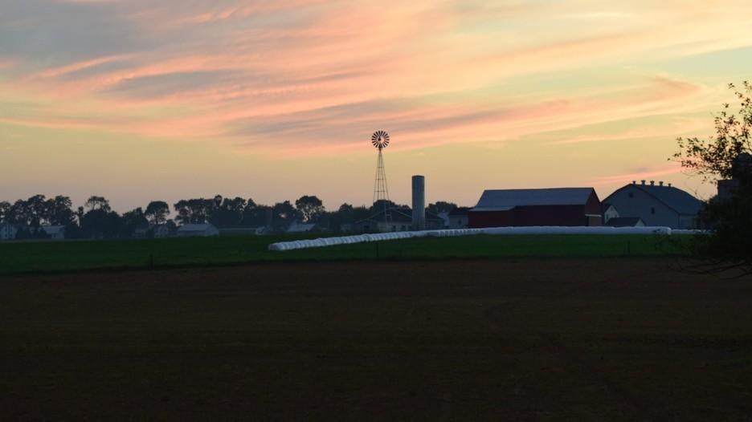{width="7.154943132108486in"
height="4.020833333333333in"}

[Sunset Dinner
Tours](https://www.amishfarmandhouse.com/event/sunset-dinner-tour-on-an-amish-farm-12/)

The experience starts with a visit to see the animals on our 15-acre
farm and a house tour through our historic 1805 farmhouse. Then you'll
board our small bus at 5:00pm and meander the back roads of Amish
country. Along the way, you'll pass beautiful Amish homes, farms, and
schools. We'll stop at our Amish friend's house where you'll enjoy a
traditional Amish dinner in their home which is surrounded by miles of
countryside. As the evening winds down, enjoy traditional desserts and
engaging conversation with the Amish family.

Please Note: If you would like to take the house tour, please arrive by
3:45pm.

Due to the unique nature of this tour, pets are not permitted on the
Sunset Dinner Tour. Pets are welcome on all of our other tour options.

Unfortunately, this tour is not handicap accessible. We apologize for
any inconvenience.

To learn more, visit our [Sunset Dinner Tour
Page](https://www.amishfarmandhouse.com/sunset-dinner-on-an-amish-farm/).

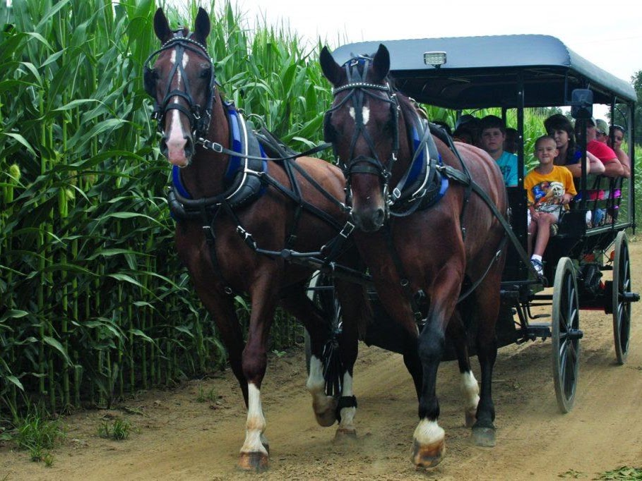{width="7.2195745844269466in"
height="5.416666666666667in"}

[AAA Buggy Rides​](https://aaabuggyrides.com/buggy-rides/)

Monday -- Saturday 9:00AM -- 5:00PM

3461 Old Philadelphia Pike Ronks, PA 17572\
([Directions](https://aaabuggyrides.com/directions-contact/))

Phone: [(717) 989-2829\]{.underline}
Email: [info@aaabuggyrides.com]{.underline}

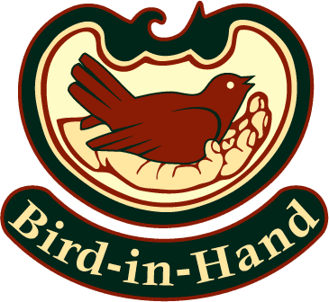{width="3.8020833333333335in"
height="3.5in"}

[Bird-in-Hand](https://bird-in-hand.com/restaurant-smorgasbord/)

If you crave Amish fare, home cooking, [Dutch comfort
food](https://bird-in-hand.com/blog/post_categories/pa-dutch-food/),
farm-fresh goodness, and friendly service, the **Bird-in-Hand Family
Restaurant & Smorgasbord in Lancaster County, Pennsylvania**, will
satisfy your appetite. Sample your favorite scratch-made dishes and
classic recipes from our all-you-can-eat **family buffet**. Visit our
sumptuous **soup-and-salad bar** -- and be sure to save room for our
dessert buffet. Prefer menu dining and table service instead of the
Amish-style buffet? Select made-to-order dishes from our varied menu. It
offers[ something for
everyone](https://bird-in-hand.com/restaurant-smorgasbord/modified-lunch-dinner-menu/). 

- 2760 Old Philadelphia Pike Bird-in-Hand, PA 17505

- \(717\) 768-1500   SmuckerFamily@Bird-in-Hand.com

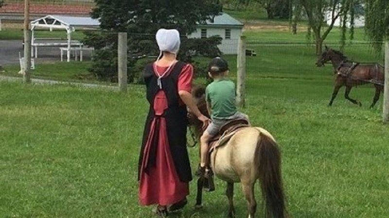{width="6.541666666666667in"
height="3.6715102799650046in"}

[Miniature horse Farm](https://www.lancasterminihorses.com/activities)

Free Admission

 Monday thru Saturday from 9:00am till 5:00pm

264 Paradise Ln. Ronks PA 17572

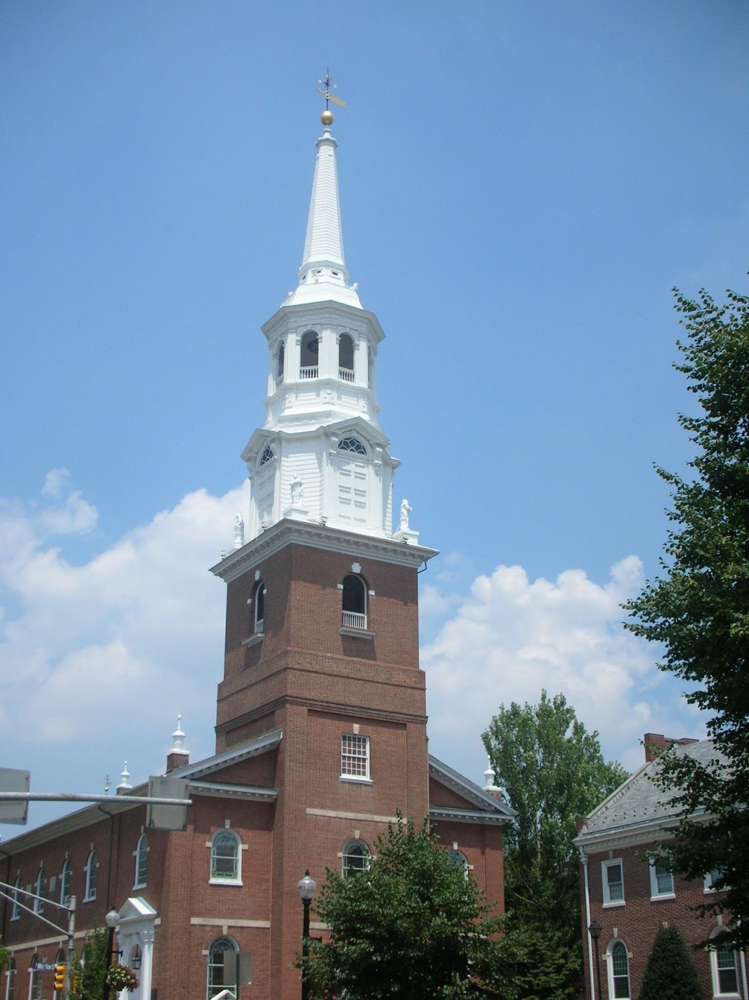{width="7.498611111111111in"
height="10.0in"}

[Holy Trinity Lutheran
Church](https://en.wikipedia.org/wiki/Holy_Trinity_Lutheran_Church_%28Lancaster,_Pennsylvania%29)

Holy Trinity Lutheran Church is an historic, American Lutheran church
that is located at 31 South Duke Street in Lancaster, Pennsylvania. It
is one of the oldest churches in the commonwealth. The remains of both
Thomas Mifflin and Thomas Wharton were interred at the Holy Trinity
Lutheran Church cemetery.

The Sunday Morning Breakfast Fellowship begins with coffee and
conversation at 7:00 a.m in The Fondersmith Auditorium.  At 7:45am we
serve a hot breakfast and at 8:15am, an informal worship service is
offered with communion once per month. This weekly ministry wraps up by
8:45. All are invited.

9:30am Worship \| 10:30am Fellowship \| 10:45am Learning for All Ages

Communion is celebrated on 1st Sundays of the Month and Festivals

31 South Duke Street Lancaster, PA 17602

717-397-2734

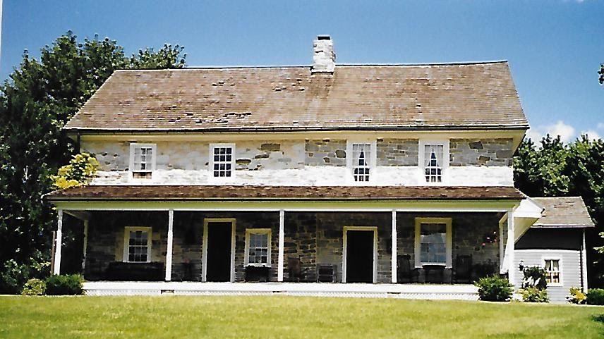{width="7.5in"
height="4.214583333333334in"}

Philip Ferree Stone House

Philip and Leah Ferree Stone House,; in the back of the house is Ferree
House Antiques

290 Old Leacock Road, Paradise, Lancaster County, Pennsylvania

{width="1.3020833333333333in"
height="1.65625in"}

[Huguenot Society of
Pennsylvania](https://pahuguenotsociety.wixsite.com/website)

In 1918 in Reading, Pennsylvania, approximately ten men and women of
known Huguenot descent founded The Huguenot Society of Pennsylvania, one
of the first societies for the descendants of Huguenots established in
the United States. They settled on April 13, 1918 (the 320th anniversary
of the Edict of Nantes) for their first official meeting, and set out to
write a charter, find interested members, and decide upon the
organization\'s structure. At this meeting, they developed a set of
objectives for the organization, which included perpetuating and
maintaining the history, principles, and beliefs of the Huguenots;
\"publicly commemorating at stated times the principal events in the
history of the Huguenot;\" maintaining a library and museum of materials
pertaining to Huguenots in America and specifically in Pennsylvania;
promoting scholarly study of their history; and above all, celebrating
and preserving the spirit of a people who withstood persecution and
intolerance \"because of their adherence to the basic tenets of the
Protestant faith and their devotion to liberty.\" This is a list of the
original Huguenot Society of Pennsylvania members in 1918.  To read the
original proceedings of the 1918 meeting,
click [here](https://cdn.website-editor.net/020d9c979f77483189db333592c7de7f/files/uploaded/huguenotsocietyo00norr.pdf).

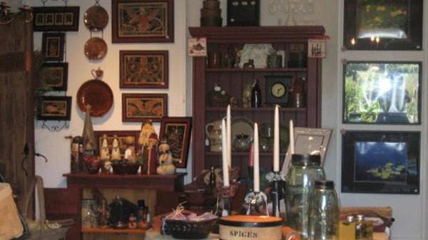{width="6.25in"
height="3.5104166666666665in"}

[ Conestoga Area Historical
Society](http://www.pennmanorhistory.org/historic-sites/)

Fall Harvest Fest

Saturday, September 28, 2023, from 10 am to 4 pm

Sunday, September 29, 2023, from noon to 4 pm

51 Kendig Road, Conestoga, PA 17516     **(717) 872-1699** 
