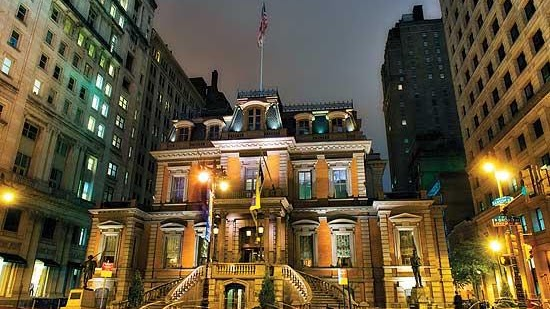
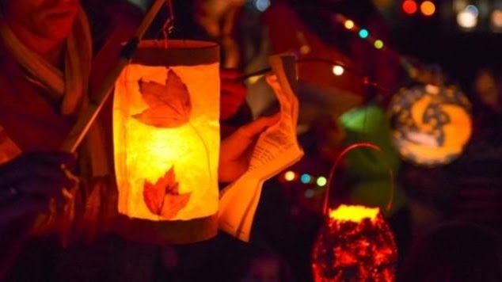
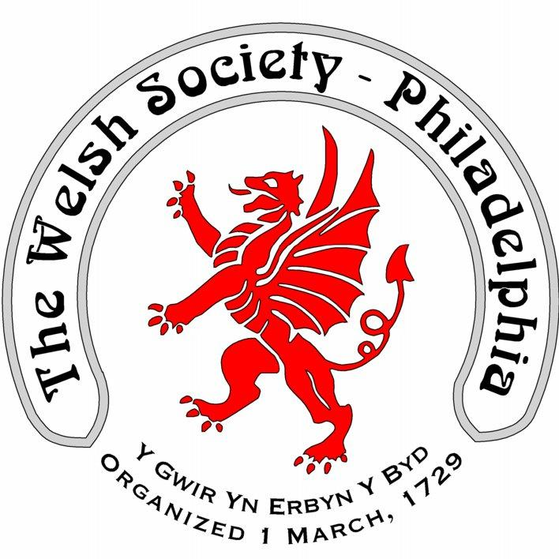
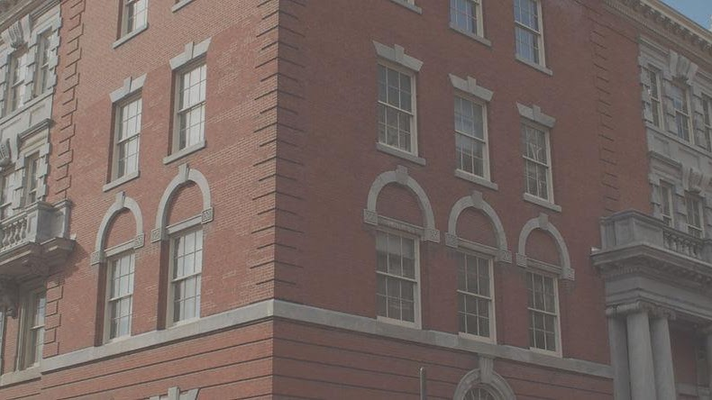

{width="5.729166666666667in"
height="3.21875in"}

Union League

When making plans to visit Philadelphia, consider using the [Union
League of Philadelphia](https://www.unionleague.org/be-our-guest) as
your home away from home. Our newly renovated Four-Diamond hotel, The
Inn at the League, located at 1450 Sansom, between Broad and 15th
Streets, is centrally located on Philadelphia's Avenue of the Arts. The
Inn at the League has 84 guest rooms and suites, each with its own
charm. Truly in a class by itself, The Inn offers an incomparable mix of
distinctive history and old world hospitality. Many of our first time
guests have referred to us as the "best-kept secret in Center City
Philadelphia."

{width="6.604166666666667in"
height="3.7083333333333335in"}

[ST. MARTINS PARADE](https://www.germansociety.org/st-martins-parade/)

The feast of [St. Martin of
Tours](https://www.firstfamilies.us/faith/saints/martin) is celebrated
on **November 11th**, and in Germany this day is traditionally
celebrated with a parade, where children sing songs about St. Martin and
walk with decorative lanterns. The German Society\'s parade is held on
the Sunday closest to St. Martin\'s Day. Children gather at the Society
to read stories and have snacks, then march with their lanterns through
Northern Liberties neighborhood to Liberty Land Park while singing
traditional songs.

[The Welsh Society of
Philadelphia](https://www.facebook.com/PhiladelphiaWelsh?__tn__=-UC*F)

The Welsh Society of Philadelphia has members that have a wide range of
ages and interests. Everyone who shares our interest in keeping current
with local Welsh American events is most welcome. Membership of the
Welsh Society of Philadelphia provides the following opportunities:

A chance to participate in the historic and vibrant Welsh American
community

Enjoy a variety of social and heritage events

Singing and community spirit at the Gymanfa Ganu

Receive notifications of upcoming events

Recognize outstanding Welsh Americans through the Robert Morris Award 

{width="6.65376312335958in"
height="3.7395833333333335in"}

[Historical Society of
Pennsylvania](https://www.portal.hsp.org/past-made-personal)

Address 1300 Locust Street Philadelphia, PA
19107  ([map](https://www.portal.hsp.org/address-and-directions)) 

T: (215) 732-6200

**The library is open for research by appointment only.y.**

**​**

[**Click HERE to schedule an
appointment**](https://www.portal.hsp.org/researchappointments)
