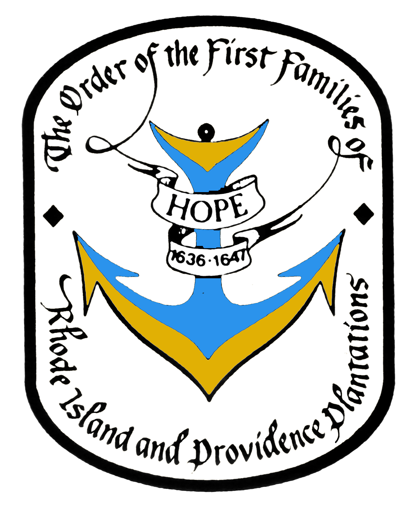

{width="7.510492125984252in"
height="9.083001968503938in"}

[Order of the First Families of Rhode Island and Providence
Plantations](https://newenglandsocieties.com/offri-pp-eligibility/)

<header class="wrapper bg-light">
  
</header>

Men and women, age 18 and older, who can prove lineal descent from an
ancestor who was resident on land presently a part of the State of Rhode
Island and the Providence Plantations prior to January 1, 1647/8, may be
eligible for membership.   
