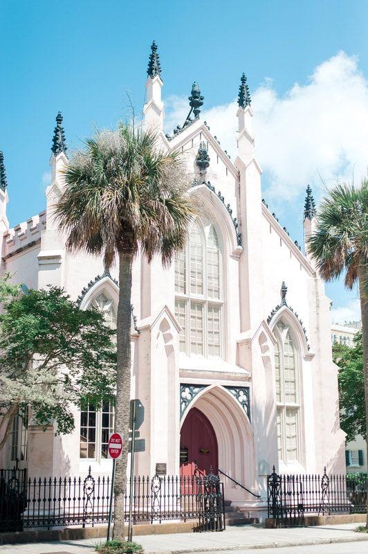

{width="5.541666666666667in"
height="8.333333333333334in"}

THE FRENCH PROTESTANT (HUGUENOT) CHURCH

Each spring the French Huguenot Society of South Carolina and the French
Huguenot Church join together to celebrate the [Edict of
Nantes](https://www.huguenot-church.org/annual-events.html), a service
celebrating King Henry of Navarre's decree in 1598 to protect the French
Protestants and allow them to read and interpret the scriptures of the
New Testament for themselves. This service is conducted in French.

In the fall, the Huguenot Church service recognizes the [revocation of
the Edict of
Nantes](https://www.huguenot-church.org/annual-events.html) and the
suffering the French Protestants endured because of their opposition to
Catholic teachings and determination to interpret for themselves. At
this time in history, the French Protestants left France for fear of
death. Many came to America seeking a new life and settled along the
coast.
