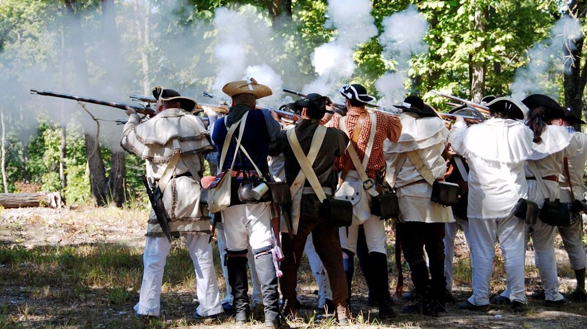
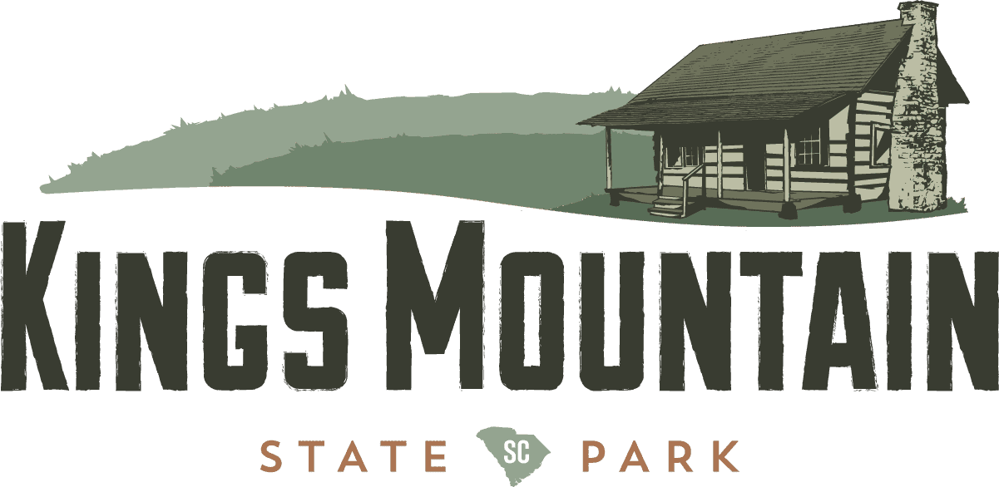
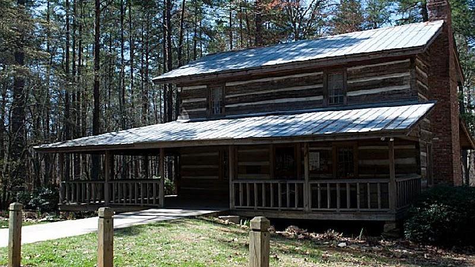
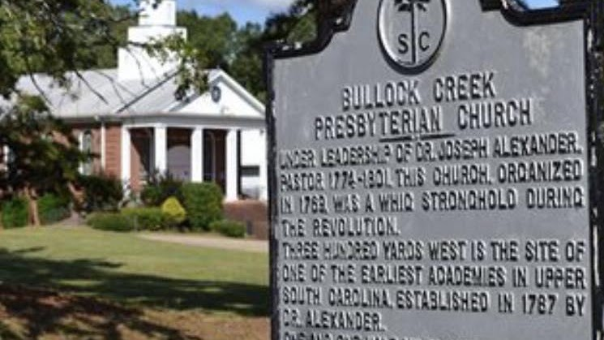

{width="7.5in"
height="4.2131944444444445in"}

[Kings Mountain National Military
Park](https://www.nps.gov/kimo/index.htm)

{width="7.395833333333333in"
height="3.608624234470691in"}

[Kings Mountain State
P](https://southcarolinaparks.com/kings-mountain/programs-and-events#jump)ark

{width="6.90625in"
height="3.8761329833770777in"}

Capt. John Dickey\'s Home

Moved to Kings Mountain State Park

{width="7.5in"
height="4.218055555555556in"}

[Bullock Creek Presbyterian Church in
America](https://www.facebook.com/bullockcreekpres/services)

7386 Lockhart Rd, Sharon, SC, United States, 29742 

- +1 803-280-4618      craiggmarshall@aol.com
