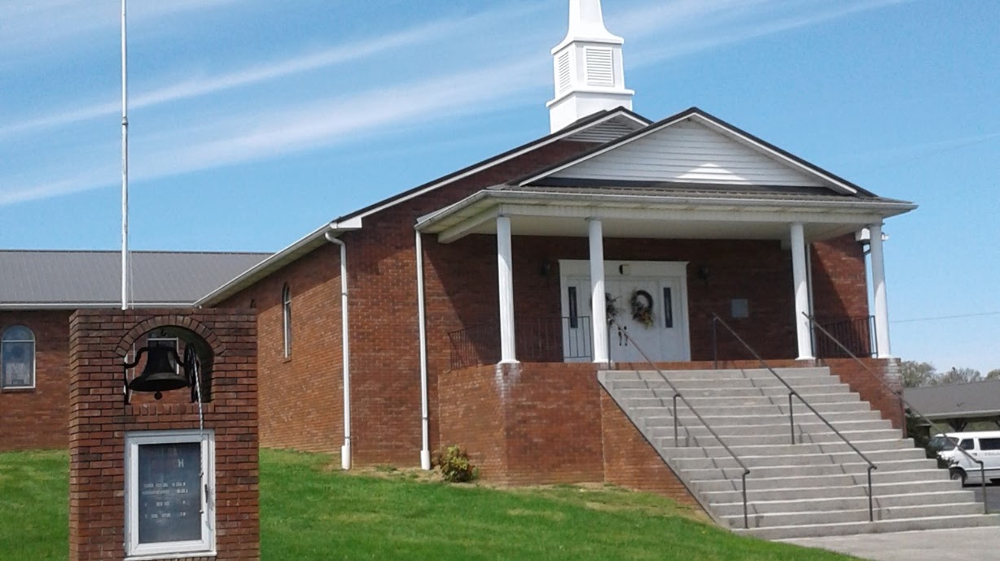

{width="7.5in"
height="4.213888888888889in"}

[First Baptist Church Of
Whitesburg](https://www.facebook.com/FBCWhitesburg)

- [201 Graves Ln, Whitesburg, TN, United States, Tennessee]{.underline}

- \(423\) 586-5534

- wilsonbrian565@yahoo.com

[Russellville,
Tennessee](https://en.wikipedia.org/wiki/Russellville,_Tennessee)

Russellville was founded by George Russell in 1784. He had been granted
a large tract of land in Greene County, North Carolina. Russellville is
a census-designated place in Hamblen County, Tennessee. Located along
U.S. Route 11E-Tennessee State Route 34 (US 11E/SR 34), it is situated
approximately at a midpoint between Whitesburg and Morristown

During the American Civil War, Confederate Lieutenant General James
Longstreet established a headquarters in the Nenney House in
Russellville just after the Battle of Bean\'s Station in December 1863.
His Confederate army used Russellville for their winter camp of 1863-64.
The house still stands and has been converted into The General
Longstreet Museum.\[7\] Also during that winter, General Lafayette
McLaws was in quarters at a house now called \"Hayslope\", a house that
also still stands and was originally a tavern built by the early
settlers. It was originally called the Tavern with the Red Door, while
General Joseph B. Kershaw was at the nearby Taylor plantation. The
nearby Bethesda Presbyterian Church was used as a hospital during the
Civil War and is listed on the National Register of Historic Places. It
has many wartime burials, 80 of which are unidentified
