As the hometown of George Washington, Alexandria and its surrounding
areas is no stranger to history. Washington, D.C., beautiful Mount
Vernon, Arlington Cemetery and the National Masonic Temple are all just
minutes away.   Before or after their visit, guests have easy access to
famous Old Town sites such as Robert E. Lee\'s boyhood home, George
Washington\'s Townhouse and Market Square, one of the oldest market
places in the whole country.

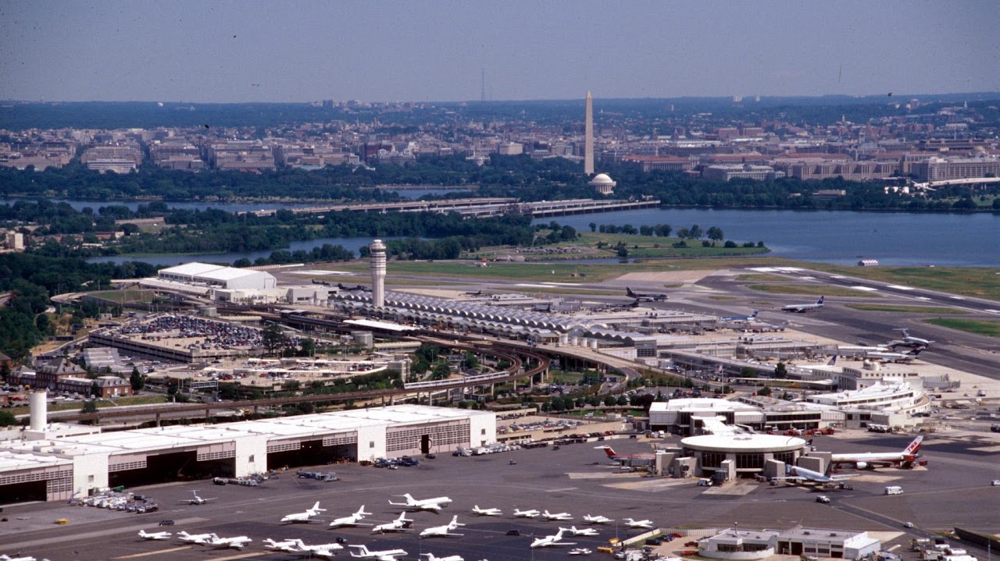{width="7.5in"
height="4.2131944444444445in"}

Reagan National Airport

From here you can go just about anywhere in the greater Washington DC
area

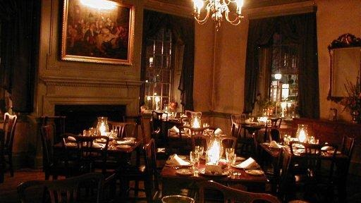{width="5.333333333333333in"
height="3.0in"}

Gadsby's Tavern

[138 N. Royal Street Alexandria, Virginia
22314](https://goo.gl/maps/ZXD1M1ZSfj3id4X88)   <info@gadsbystavernrestaurant.com> (703)
548-1288

Nearly all of the founders of American Independence enjoyed the warm
tavern hospitality of Gadsby's Tavern. No public building in America is
more intimately associated with the struggle for independence and
establishment of national sovereignty. For nearly a century, it was a
center of political, social and cultural life in this important colonial
seaport
community.  [OpenTable](https://www.opentable.com/gadsbys-tavern). 

[Sunday Brunch](https://www.opentable.com/gadsbys-tavern#menu) 11:30am
to 2:30pm

Wednesday through Saturday Lunch 11:30am to 2:30pm

Wednesday through Sunday Dinner from 5:30pm

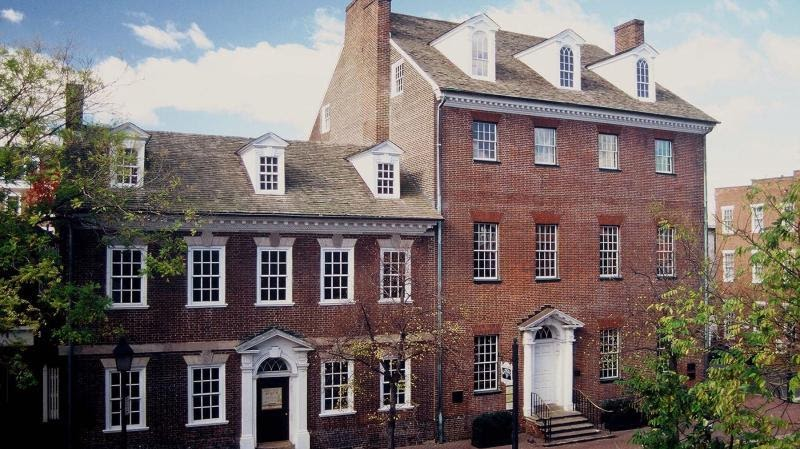{width="7.5in"
height="4.209722222222222in"}

[Gadsby's Tavern Museum](https://www.alexandriava.gov/GadsbysTavern)

Regular admission can only be purchased in-person at the Museum at the
time of your visit.

Adults: \$5    Children (ages 5 -12): \$3   Children four and under are
free with a paying adult. 

Sunday [Family Day with Young
Historians](https://apps.alexandriava.gov/Calendar/Detail.aspx?si=52194) 2:00
PM - 5:00 PM

A \$1 discounts on regular admission is available to AAA Members and
visitors who have dined at Gadsby\'s Tavern Restaurant.

[Gadsby\'s Tavern Museum, 134 N. Royal
St](https://apps.alexandriava.gov/Calendar/?sl=4) 

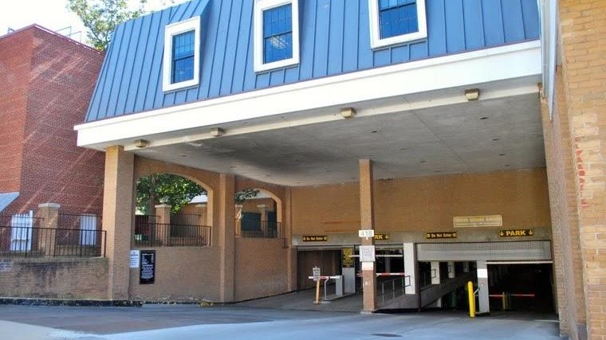{width="7.5in"
height="4.213888888888889in"}

Tavern Square Parking

418 CAMERON STREET ALEXANDRIA, VIRGINIA.

[Parking
Map](https://www.alexandriava.gov/sites/default/files/2022-08/OldTownParkingMap2022Update.pdf). 

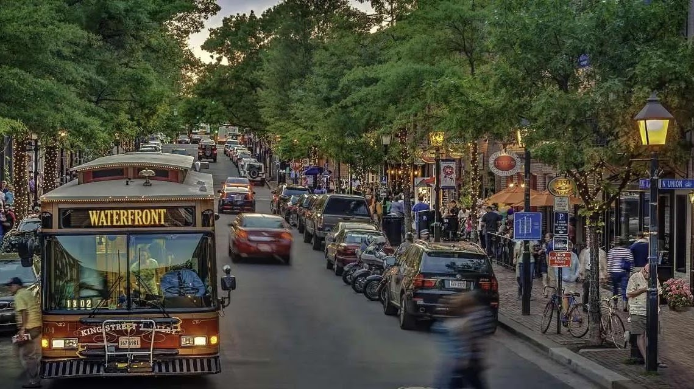{width="7.5in"
height="4.213888888888889in"}

King Street Trolley

For making your way along historic King Street in the heart of , there's
no easier, quicker way than the FREE  King Street Trolley. With stops
every two to three blocks from  to the King St -- Old Town Metrorail
station, trolleys provide easy on-off access to the more than 200 , 
and  found in Old Town Alexandria.  [Download the
map](https://documentcloud.adobe.com/link/track?uri=urn:aaid:scds:US:f57be505-0683-4bbe-b09c-8a60982a3290). 

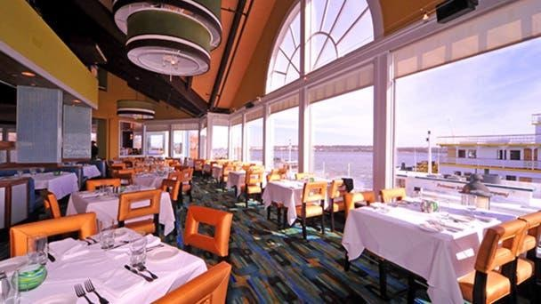{width="6.333333333333333in"
height="3.5625in"}

Chart House

Chart House Alexandria is still the sight to see. Hands down, Chart
House is the best river view restaurant in the city. Whether dining
outside on the patio or indoors, our seafood restaurant gives gorgeous
panoramic views of the waterfront and the sparkling
city.  [Brunch](https://www.chart-house.com/location/chart-house-alexandria-va/#brunch-menu-chal) is
EVERY SUNDAY \| 11 AM - 2 PM. Kids meals are currently \$12. Discounts
for AARP.  Parking next door at Thomason Alley currently \$5 for Sunday

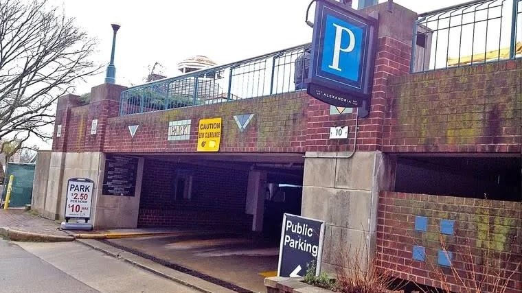{width="7.5in"
height="4.213888888888889in"}

Thompson's Alley Parking

[10 THOMPSON'S ALLEY ALEXANDRIA,
VIRGINIA](https://goo.gl/maps/TmuTge2DgYz1wiyD6)

Weekend and Holidays: one hour \$2.50; max \$5

[More
Info](https://visitalexandria.com/listings/thompsons-alley-parking-garage/).

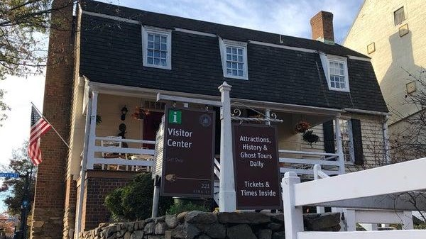{width="6.25in"
height="3.5104166666666665in"}

Visitor Center

Alexandria Visitor Center (703) 746-3301

[visitalexandria.com](https://visitalexandria.com/)

[221 King St, Alexandria, VA
22314](https://goo.gl/maps/vQcfLdcxyz7JmRhB9)

Closes 6 PM

George Washington Masonic Temple

The [Memorial](https://gwmemorial.org/) is now open on Monday, Thursday,
Friday, Saturday, and Sunday (closed on major holidays). Four tours run
daily at 9:30 a.m., 11:00 a.m., 1:30 p.m., & 3:30 p.m. The guided tour
is one hour in length. Currently the price is \$20 per adult and **FREE
for Children 12 and under**. [Advance reservations are
required](http://113905.blackbaudhosting.com/113905/tickets?tab=3&txobjid=b4fb59d8-d5f0-482e-9183-ad79bb84f414). 

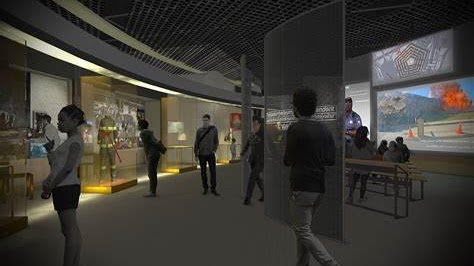{width="4.9375in"
height="2.7708333333333335in"}

Pentagon Visitor Center

{width="7.333333333333333in"
height="4.125in"}

George Washington Memorial Parkway

{width="7.5in"
height="4.2131944444444445in"}

Water Taxi

Starting at \$22 hour per person. [To
book](https://www.cityexperiences.com/washington-dc/city-cruises/water-taxi/washington-dc-water-taxi/). 

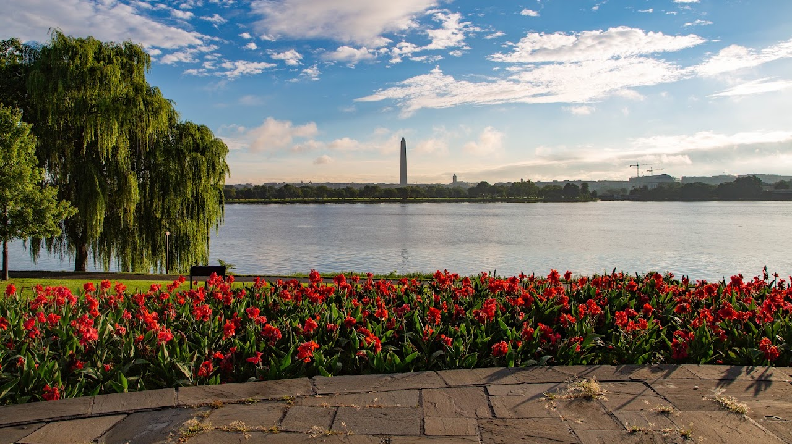{width="7.5in"
height="4.2131944444444445in"}

Lady Bird Johnson Park

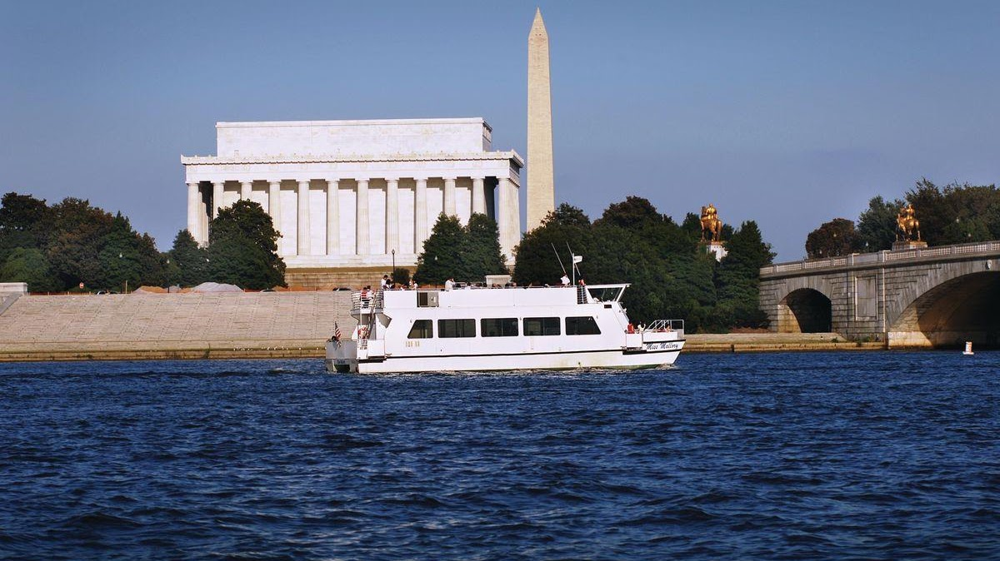

Monuments Sightseeing Tour From Alexandria

See the famous monuments of Washington, D.C. from an entirely new
perspective on this narrated sightseeing cruise. Travel along the
Potomac River to see the plethora of famous monuments and landmarks,
with stunning reflective views of the Thomas Jefferson Memorial, the
John F. Kennedy Center for the Performing Arts, the Washington Monument,
the Arlington Memorial Bridge, and more. The docks for this tour are not
ADA Compliant. Please visit our Potomac Water Taxi page which offers
cruise options to the Wharf and National Harbor. [We also offer an
option to Mount Vernon From
DC.](https://www.cityexperiences.com/washington-dc/city-cruises/mount-vernon-excursion-cruise/)  

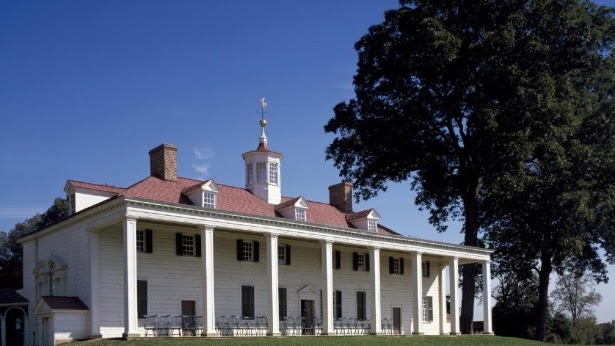{width="6.40625in"
height="3.6041666666666665in"}

Mount Vernon

[Scout
Days](https://www.mountvernon.org/plan-your-visit/group-reservations/student-groups/boys-girls-scouts/) start
on November 1

All children that are Boy Scouts, Girl Scouts, and Camp Fire Club
members, in uniform or wearing an official pin, are admitted FREE to the
estate through Feb. 17. The Mansion tour is limited and subject to
availability. Two leaders from each group will receive discounted
admission. During this time period the Farm will not be staffed,
however, we invite your troops to:

Tour the Mansion.

Lay a wreath at the General\'s Tomb (must be reserved in advance by
contacting our Reservations Office at 703-799-8688 or
groups@mountvernon.org).

Explore our state-of-the-art galleries and theaters in the Donald W.
Reynolds Museum and Education Center.

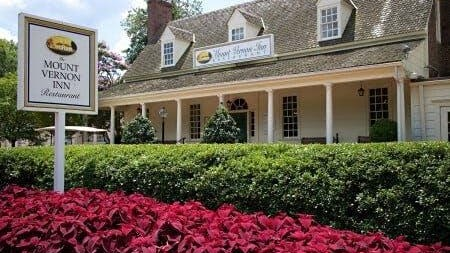{width="4.6875in"
height="2.6354166666666665in"}

Mount Vernon Inn

[3200 Mount Vernon Memorial Highway, Mount Vernon, VA 22121\
](https://maps.google.com/?cid=5534207261373258301)[703.799.5296]{.underline}

**Sunday: **10 a.m. to 5 p.m.\
**Monday: **11 a.m. to 5 p.m.\
**Tuesday - Friday: **11 a.m. to 8 p.m.\
**Saturday: **10 a.m. to 8 p.m.

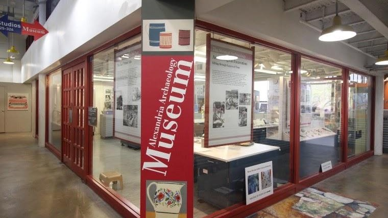{width="7.5in"
height="4.213888888888889in"}

Archaeology Museum

105 N. UNION STREET, TORPEDO FACTORY ART CENTER THIRD FLOOR, #327
ALEXANDRIA, VIRGINIA

Step right into the museum's laboratory where archaeologists reconstruct
Alexandria's history, fragment by fragment. The museum's exhibits
highlight the process of archaeology and the latest Alexandria finds. A
Community Digs its Past: The Lee Street Site, the museum's main exhibit,
weaves the story of the wharves, taverns, bakery and Civil War privy
excavated at the corner of Lee and Queen Streets together with the story
of archaeologists at work, from excavation and historical research to
artifact processing and archaeological conservation. In the Museum's
Public Laboratory, you may find volunteers washing, marking and
cataloging artifacts from the latest dig. Participate in hands-on
activities, and explore small temporary exhibits highlighting
archaeological research. The museum is open Fridays and Saturdays 11
a.m.-4 p.m., and Sundays 1-4 p.m.

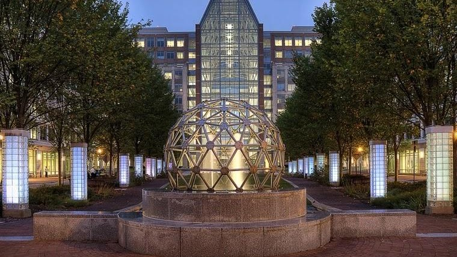{width="7.5in"
height="4.213888888888889in"}

National Inventors Hall of Fame

600 DULANY STREET ALEXANDRIA, VIRGINIA.  

Experience the past, present and future of American ingenuity as you are
introduced to more than 600 world-changing Inductees and immersed in
stories of passion, perseverance and progress.  Admission to the museum
is always **FREE** --- the perfect way to add a fun, kid-friendly
learning experience to your trip to the Washington, D.C., area.  
Monday - Friday, 10 a.m. to 4 p.m.

The first Saturday of every month, 11 a.m. to 3 p.m.\*

Sundays and federal holidays, CLOSED

{width="6.072916666666667in"
height="1.78125in"}

[St. Andrew & St.
Margaret](https://www.standrewandstmargaret.org/events)

The Church of St. Andrew and St. Margaret of Scotland is a vibrant,
growing parish within the Anglican Catholic Church located just outside
our nation's capitol in the heart of Northern Virginia.  We are Anglican
because our tradition of prayer and worship is rooted in the Church of
England and the Book of Common Prayer. We are Catholic because we
believe and practice the universal or catholic faith of the church. We
are your friendly neighborhood Traditional Anglican/Episcopal Parish.

402 E. Monroe Ave Alexandria, VA 22301

Phone: (703) 683-3343

Fax: (703) 683-2645

Email: sta_stm@comcast.net
