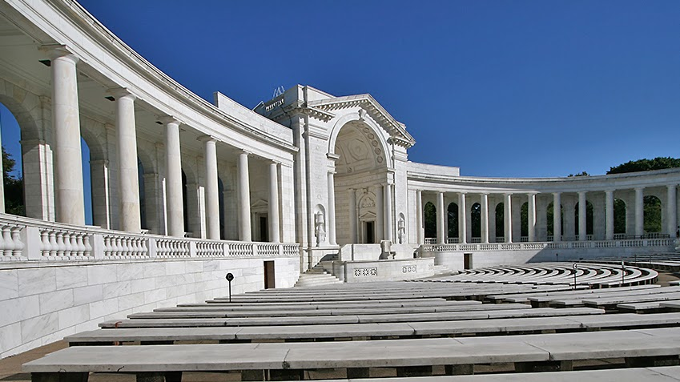
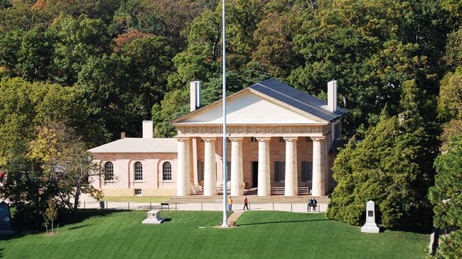
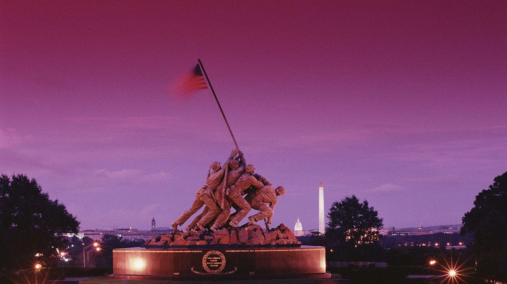
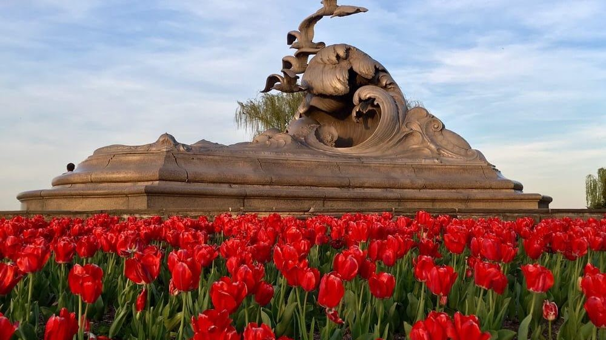
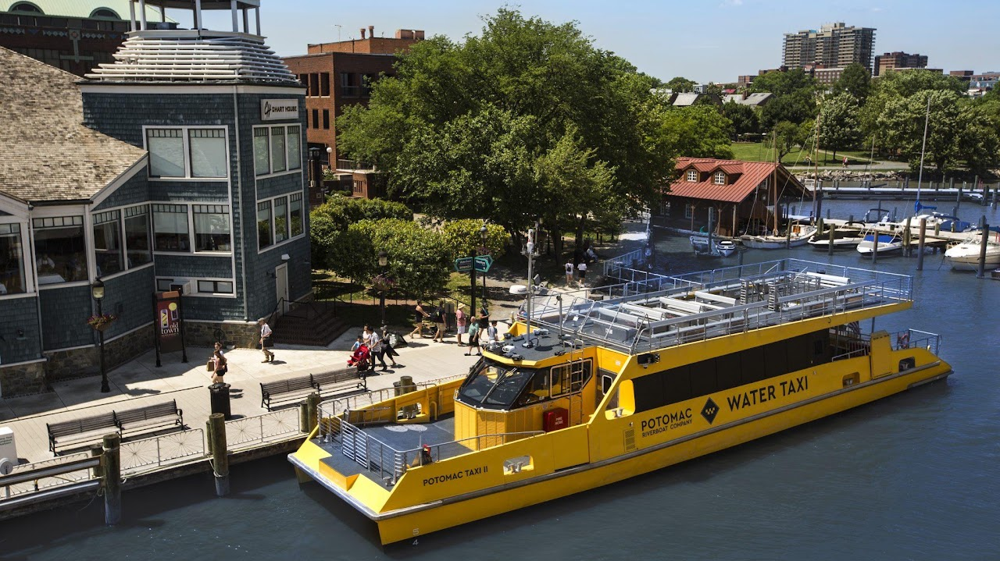
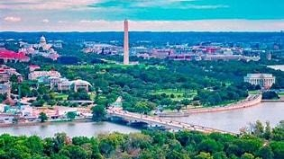
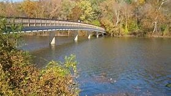

As the hometown of George Washington, Alexandria and its surrounding
areas is no stranger to history. Washington, D.C., beautiful Mount
Vernon, Arlington Cemetery and the National Masonic Temple are all just
minutes away.   Before or after their visit, guests have easy access to
famous Old Town sites such as Robert E. Lee\'s boyhood home, George
Washington\'s Townhouse and Market Square, one of the oldest market
places in the whole country.

{width="7.5in"
height="4.2131944444444445in"}

Reagan National Airport

From here you can go just about anywhere in the greater Washington DC
area

{width="4.9375in"
height="2.7708333333333335in"}

Pentagon Visitor Center

{width="7.333333333333333in"
height="4.125in"}

George Washington Memorial Parkway

{width="7.5in"
height="4.213888888888889in"}

Arlington National Cemetery

{width="6.770833333333333in"
height="3.8020833333333335in"}

Arlington House

{width="7.5in"
height="4.2131944444444445in"}

Marine Corps War Memorial

The **United States Marine Corps War Memorial** (**Iwo Jima Memorial**)
is a national memorial located in [Arlington
County](https://en.wikipedia.org/wiki/Arlington_County,_Virginia), [Virginia](https://en.wikipedia.org/wiki/Virginia).
The memorial was dedicated in 1954 to
all [Marines](https://en.wikipedia.org/wiki/United_States_Marine_Corps) who
have given their lives in defense of the [United
States](https://en.wikipedia.org/wiki/United_States) since 1775. It is
located in [Arlington Ridge
Park](https://en.wikipedia.org/wiki/Arlington_Ridge_Park) within
the [George Washington Memorial
Parkway](https://en.wikipedia.org/wiki/George_Washington_Memorial_Parkway) 

{width="7.5in"
height="4.215277777777778in"}

Merchant Marine Memorial

{width="7.5in"
height="4.2131944444444445in"}

Water Taxi

Starting at \$22 hour per person. [To
book](https://www.cityexperiences.com/washington-dc/city-cruises/water-taxi/washington-dc-water-taxi/). 

The View of DC

The[ View of DC](https://theviewofdc.com/visitors/) is pleased to
welcome the general public with free admission to experience the
Observation Deck for yourself. Please note: Each visitor to the
Observatory will need to present a valid form of identification for
admission.

1201 Wilson Blvd., Suite 115, Arlington, VA 22209 (Entrance: 1731 N.
Moore Street

{width="7.5in"
height="4.2131944444444445in"}

Lady Bird Johnson Park

Monuments Sightseeing Tour From Alexandria

See the famous monuments of Washington, D.C. from an entirely new
perspective on this narrated sightseeing cruise. Travel along the
Potomac River to see the plethora of famous monuments and landmarks,
with stunning reflective views of the Thomas Jefferson Memorial, the
John F. Kennedy Center for the Performing Arts, the Washington Monument,
the Arlington Memorial Bridge, and more. The docks for this tour are not
ADA Compliant. Please visit our Potomac Water Taxi page which offers
cruise options to the Wharf and National Harbor. [We also offer an
option to Mount Vernon From
DC.](https://www.cityexperiences.com/washington-dc/city-cruises/mount-vernon-excursion-cruise/)  

{width="2.90625in"
height="1.6354166666666667in"}

Theodore Roosevelt Island
