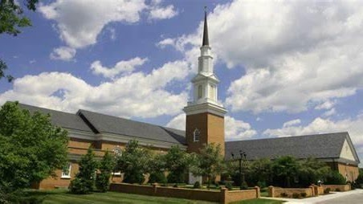

[Blue Ridge Parkway Driving
Tour](https://maps.app.goo.gl/2WVCqc5nqJQFuHKEA)

{width="4.708333333333333in"
height="2.6458333333333335in"}

[Bedford Baptist
Church](https://sites.google.com/bedfordbaptist.org/bedfordbaptistchurch/who-we-are)

Bedford Baptist Church is a traditional church. Located at the foot of
the Peaks of Otter in beautiful Bedford, Virginia. Our town is seeped in
history as is our church.  Bedford Baptist Church was organized in 1797
under the name of Little Otter Baptist Church. In 1854 the Little Otter
Baptist Church changed its name to Liberty Baptist Church. In 1901 the
Liberty Baptist Church changed its name to Bedford City Baptist Church.
In 1923 the Bedford City Baptist Church changed its name to Bedford
Baptist Church. We are located at 1516 Oakwood Street.
