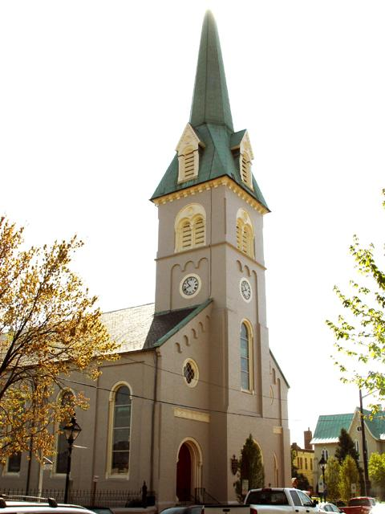
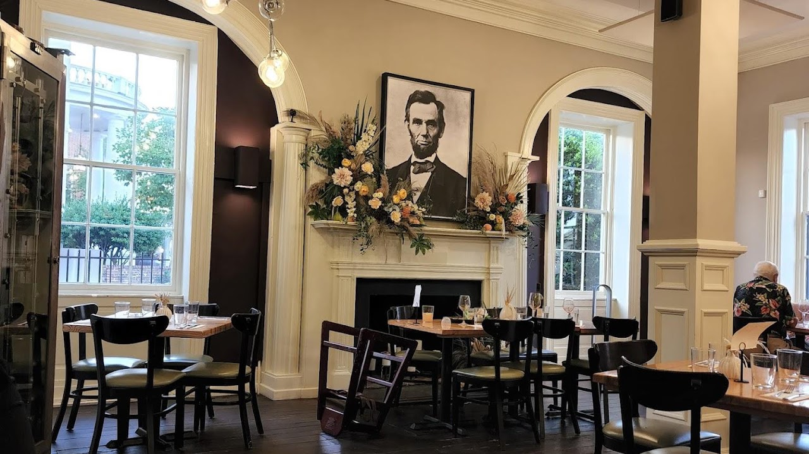
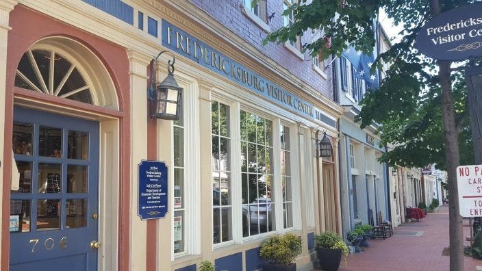
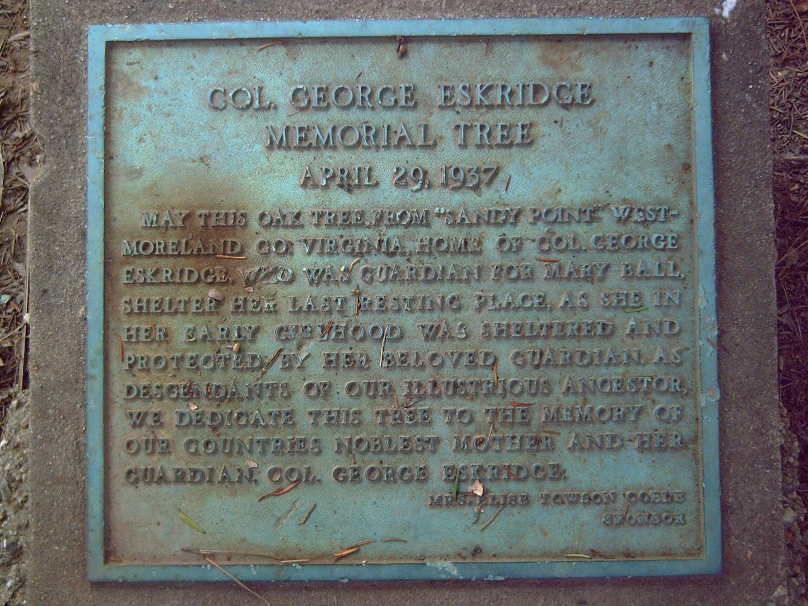
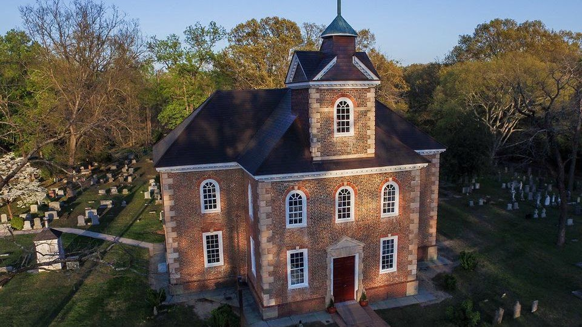
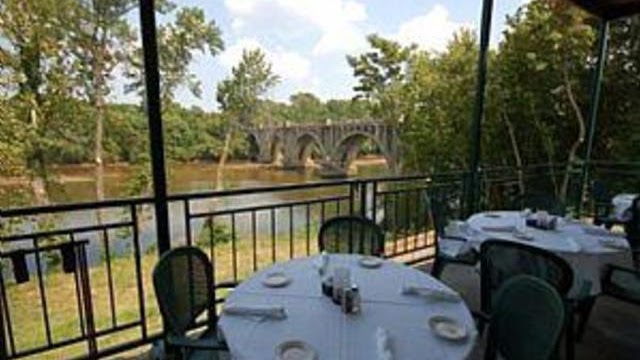

Resources

<https://www.familysearch.org/en/wiki/Overwharton_Parish,_Virginia>

<https://www.familysearch.org/en/wiki/Stafford_County,_Virginia>

{width="5.0in"
height="6.666666666666667in"}

[St George
Parish](https://en.wikipedia.org/wiki/St._George%27s_Episcopal_Church_%28Fredericksburg,_Virginia%29)

St. George\'s Episcopal Church is a church in Fredericksburg, Virginia.
The church, built in the 18th century and re-built in 1815 and 1849, is
a part of the Episcopal Diocese of Virginia. The building was listed on
the National Register of Historic Places in 2019.

 905 Princess Anne Street, Fredericksburg

[Events - St. George\'s Episcopal Church
(stgeorgesepiscopal.net)](https://www.stgeorgesepiscopal.net/events/) 

- **7:45 am:** Quiet and traditional, this spoken Eucharist service
  begins the day with prayers ancient and modern from our Book of Common
  Prayer Rite I.

- **9:00 am: ** A welcoming, multi-generational Eucharist using
  supplemental worship texts and led by our Jazz Ensemble and choir.
  Children and youth are encouraged to participate as lectors or
  acolytes. ASL Interpreting is available upon request. This service is
  also [livestreamed on YouTube
  Live](https://www.youtube.com/channel/UCmQDif5IE6Mhl3qX4KmCXLg).
  Contact the church office for more information.

- 1**1:15 am:** A Book of Common Prayer Eucharist rich in Anglican
  tradition, this service is led by the Choir of St. George's with organ
  and the Chamber Ensemble. As at 9 am, children and youth are
  encouraged to participate as leaders.

- **5:30 pm**:  Candlelight, silence, quiet reflection and prayer, and
  music from the Celtic tradition are all part of our Celtic Evensong +
  Communion service.

- **8:00 pm:** The Compline choir chants the this service for the end of
  the day. This service is livestreamed on [Facebook
  Live.](https://www.facebook.com/compline)

{width="7.155941601049869in"
height="4.019625984251968in"}

[Foode](https://www.foodefredericksburg.com/)

900 Princess Anne St Fredericksburg VA

Tel: 540-479-1370

{width="7.333333333333333in"
height="4.125in"}

[Visitor
Center](https://www.virginia.org/listing/fredericksburg-visitor-center/15742/)

706 Caroline Street Fredericksburg, VA 22401

5403731776

{width="7.347222222222222in"
height="5.510416666666667in"}

[Eskridge Marker](https://www.hmdb.org/m.asp?m=9197)

Location. 38° 18.356′ N, 77° 28.144′ W. Marker is in Fredericksburg,
Virginia. Marker can be reached from the intersection of Washington
Avenue and Pitt Street. [Touch for
map](https://www.hmdb.org/map.asp?markers=9197,9194,217565,148050,148049,1078,148051,217566,95315).
Marker is in this post office area: Fredericksburg VA 22401, United
States of America. [Touch for
directions.](https://www.google.com/maps/dir/?api=1&destination=38.305926,-77.469063) 

{width="7.179962817147857in"
height="4.03125in"}

[Aquia Episcopal
Church](https://aquiachurch.org/about/history/early-parish-history/)

2938 Richmond Highway Stafford, VA 22554

 (540) 659-4007   <office@aquiachurch.org>

Heritage Day and Homecoming are special services celebrated once a year,
Heritage Day in May and Homecoming in September. Both services use the
1662 Book of Common Prayer, the BCP used when the church was founded and
built in the Colonial era and include music that is appropriate to the
time. The service also is an opportunity for the congregation to see the
1738 communion set given to the church by The Reverend Alexander Scott
(1686-1738). We welcome anyone interested in attending the services in
period attire. We also welcome The Peyton Society of Virginia, who
visits Aquia Church on Heritage day.

{width="6.666666666666667in"
height="3.75in"}

[Brock\'s Riverside Grill](https://brocksgrill.com/menus/menu-copy/)

Location: 503 Sophia Street, Fredericksburg VA 22401

Phone Number: 540-370-1820
