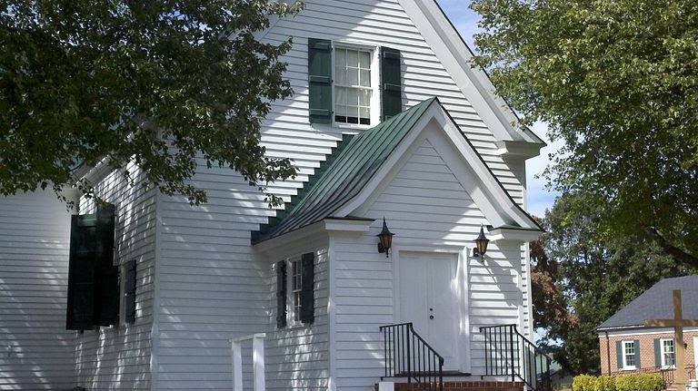

{width="7.083333333333333in"
height="3.9791666666666665in"}

[Germanna Visitor Center](http://germannafamily.org/login.php)

Historic Germanna

2062 Germanna Highway Locust Grove, VA 22508-0279

Phone: 540-423-1700

[Contact ](https://germanna.org/contact/)

{width="7.5in"
height="4.209027777777778in"}

Hebron Lutheran Church

Hebron Lutheran Church is a historic Lutheran church located in the
countryside northeast of Madison, Madison County, Virginia. The original
section was built about 1740, with the south wing added about 1800. It
is a one-story, \"T\" shaped, frame building on a stone
foundation. [Wikipedia](https://en.wikipedia.org/wiki/Hebron_Lutheran_Church)

[Address](https://www.google.com/search?sxsrf=AB5stBhWSm0H77dQB2cVykOgoAU4NYJVrg:1690141664956&q=hebron+lutheran+church+address&ludocid=3744465954009638989&sa=X&ved=2ahUKEwjh4byszKWAAxXjFlkFHSMdA9AQ6BN6BAhtEAI):
899 Blankenbaker Rd, Madison, VA 22727

[Phone](https://www.google.com/search?sxsrf=AB5stBhWSm0H77dQB2cVykOgoAU4NYJVrg:1690141664956&q=hebron+lutheran+church+phone&ludocid=3744465954009638989&sa=X&ved=2ahUKEwjh4byszKWAAxXjFlkFHSMdA9AQ6BN6BAhiEAI): [(540)
948-4381](https://www.google.com/search?q=hebron+lutheran+church+madison+va&sxsrf=AB5stBg3RxeGxKHrK8BzB_TgxjDMT_vkbA%3A1690141334362&ei=loK9ZNOiEJGv5NoPnMO34AQ&gs_ssp=eJwNyEsOQDAQANDY9hS1sDbMqHIEl5B-UwmVlNLj85aPsfZoQaweywvV3ECRkyb0xlgarCLsZiiIfgT0PQqanCS71MHpdEa-5zu4pCI3IScT-KHsdv3_qA880Rrr&oq=Hebron+Luther&gs_lp=Egxnd3Mtd2l6LXNlcnAiDUhlYnJvbiBMdXRoZXIqAggBMgoQABiABBgUGIcCMhAQLhiABBgUGIcCGMcBGK8BMgUQABiABDILEC4YgAQYxwEYrwEyBRAAGIAEMgsQLhiABBjHARivATIGEAAYFhgeMgYQABgWGB4yBhAAGBYYHjIGEAAYFhgeMh8QLhiABBgUGIcCGMcBGK8BGJcFGNwEGN4EGOAE2AEBSK8iUABY4xBwAHgBkAEAmAGWAqAB2QyqAQU0LjguMbgBAcgBAPgBAcICBxAjGIoFGCfCAggQLhiKBRiRAsICERAuGIAEGLEDGIMBGMcBGNEDwgILEAAYgAQYsQMYgwHCAhEQLhiABBixAxiDARjHARivAcICCBAAGIoFGJECwgIWEC4YgAQYFBiHAhixAxiDARjHARivAcICERAuGIoFGLEDGIMBGMcBGNEDwgILEC4YgAQYsQMYgwHCAg4QLhiABBixAxjHARjRA8ICCxAAGIoFGLEDGJECwgIIEAAYigUYsQPCAhEQLhiKBRixAxiDARjHARivAcICERAuGIMBGMcBGLEDGNEDGIAEwgILEAAYigUYsQMYgwHCAhcQLhiKBRiRAhiXBRjcBBjeBBjgBNgBAcICCBAAGIAEGLEDwgILEC4YigUYsQMYkQLCAgsQLhivARjHARiABMICDhAuGIoFGLEDGMcBGK8BwgIFEC4YgATCAg4QLhivARjHARixAxiABMICDhAuGIAEGLEDGMcBGK8BwgIaEC4YigUYsQMYkQIYlwUY3AQY3gQY4ATYAQHCAhoQLhivARjHARiABBiXBRjcBBjeBBjgBNgBAeIDBBgAIEGIBgG6BgYIARABGBQ&sclient=gws-wiz-serp)
