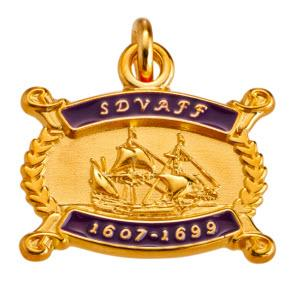

[Jamestowne
Society](https://www.jamestowne.org/qualifying-ancestors.html)

**10 April 1606** stock was sold in London Company or the Virginia
Company

Resident in Virginia at the time of the 1624/25 Muster or earlier

Governor, Secretary of State, Treasurer, Attorney General, Clerk of the
General Court, Member of the Council or House of Burgesses; Anglican
Church (Church of England) minister in Virginia;  served as an official
Indian Interpreter in Virginia  or owned land on Jamestown Island or
lived on the Island on or before **1699**

[Sons and Daughters of Virginia Founding
Fathers](http://www.virginiafoundingfathers.org/ancestors.html)

The Sons and Daughters of Virginia Founding Fathers (SDVAFF) is a
lineage society that is a non-profit, charitable organization dedicated:
To honor those hardy and enterprising early ancestors who concentrated
their efforts, labor and skills in building the enduring greatness of
the Colony of Virginia.  To recognize and record the names of those
individuals who were residents within the boundaries of the Virginia
Colony **on or before 31 December 1699**. 

[Virginia Huguenot
Society](https://www.frenchhuguenots-virginiasociety.org/)

The Edict of Nantes, signed by Henry IV in April, 1598, ended the Wars
of Religion, and allowed the Huguenots some religious freedoms,
including exercise of their religion in 20 specified towns in France.
The Revocation of the Edict of Nantes by Louis XIV in October, 1685,
began a new persecution of the Huguenots. Hundreds of thousands of them
fled France for other countries. 

Resources

[Societies](https://www.cyndislist.com/us/va/societies/)

[Wikitree](https://www.wikitree.com/wiki/Category:Virginia_Colony)

[FamilySearch](https://www.familysearch.org/en/wiki/Virginia,_United_States_Genealogy)

[Wikipedia](https://en.wikipedia.org/wiki/Virginia)
