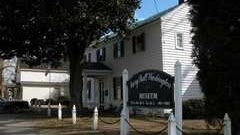

Mary Ball Washington Museum

[Mary Ball Washington Museum & Library](https://lancastervahistory.org/)

Hours: Wednesdays, Thursdays, Fridays 10:00-4:00

Address: [8346 Mary Ball Road Lancaster, VA
22503](https://goo.gl/maps/m1WdYTsa3MmqE3wR9)[ ]{.underline}· 

Contact Info (804) 462-7280.

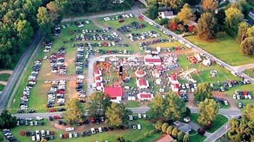{width="5.208333333333333in"
height="2.9270833333333335in"}

[KVFD Summer Carnival](https://www.facebook.com/kilmarnockcarnival)

Catch a ride on the vintage ferris wheel or merry-go-round and play tons
of carnival games starting last week of July. Run by Kilmarnock
Volunteer Fire Department.

839-945 Waverly Avenue Kilmarnock, Virginia 22482

\(804\) 436-2002

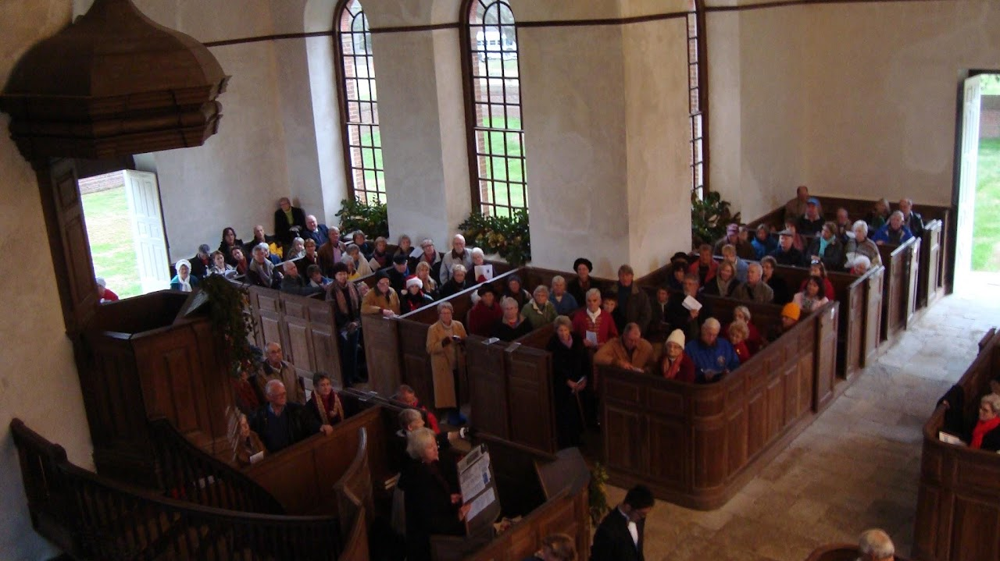{width="7.333333333333333in"
height="4.119270559930008in"}

Historic Christ Church

[Historic Christ Church](https://www.christchurch1735.org/)

Holy Eucharist Rite I Sunday 8 AM (only during summer months - check
website)

Address:  [420 Christ Church Road, Weems, VA
22576](https://goo.gl/maps/7rDZEY5YC3jEHVm8A)

Contact Info (804) 438-6855 or info@christchurch1735.org

Virginia Historical Marker[ J-86](https://www.hmdb.org/m.asp?m=24280)

National Register of Historic Places: 66000841

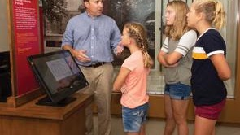{width="3.0729166666666665in"
height="1.7291666666666667in"}

Carter Museum

Carter Museum

Monday, Thursday, Friday & Saturday 10:00 a.m. -- 4:00 p.m.

Sunday 1:00 p.m. -- 4:00 p.m

Contact Info (804) 438-2441

Virginia Historical Marker  O-73

Address:  [420 Christ Church Road, Weems, VA
22576](https://goo.gl/maps/7rDZEY5YC3jEHVm8A)

Contact Info (804) 438-6855 or [info@christchurch1735.org]{.underline}

Virginia Historical Marker  O-73

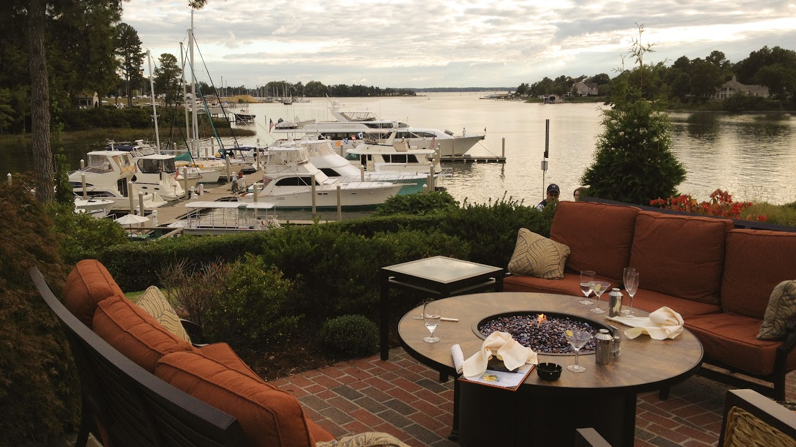{width="7.020833333333333in"
height="3.943733595800525in"}

Tides Inn Brunch

Dinner at [Chesapeake Restaurant and
Terrace](https://www.tidesinn.com/restaurant-in-irvington-va/) Tides Inn
Resort Hotel

Breakfast: Everyday 7am -- 11am  

Brunch: Saturday and Sunday 11am -- 2pm

Lunch: Monday -- Friday 11am -- 2pm  

Dinner: Everyday 5pm -- 10pm

Address:[ 480 King Carter Drive Irvington, VA.
22480](https://goo.gl/maps/4wvoXVRqgy8eooNf6)

Contact Info (804) 438--4457[ Opentable
Reservations](https://www.opentable.com/r/chesapeake-restaurant-irvington) 

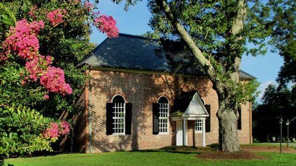{width="5.1875in"
height="2.9166666666666665in"}

St. Mary\'s White Chapel

[St. Mary\'s White Chapel](http://www.stmaryswhitechapel.org/) info:

Holy Eucharist: Sunday 11:15 AM

Address: [ 5940 White Chapel Road, Lancaster, Virginia
22503](https://goo.gl/maps/omKFMdyVL6D3nsAq7) 

Contact Info (804) 462-5908
or [stmarys.whitechapel@gmail.com](http://stmarys.whitechapel@gmail.com/)

National Register of Historic Places: 69000254

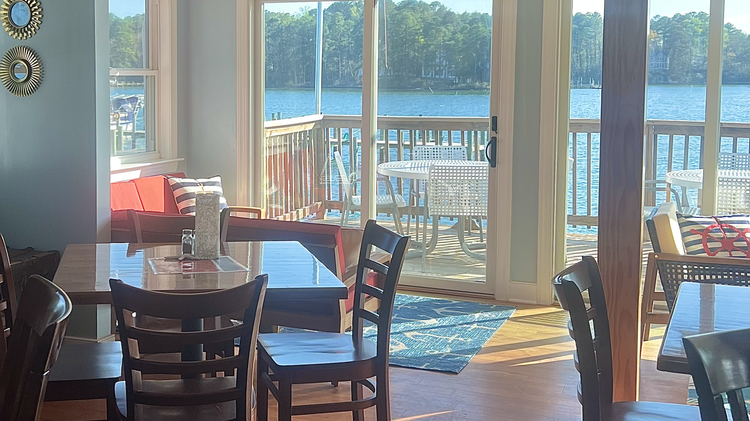{width="6.302083333333333in"
height="3.5375699912510936in"}

Captain Lounge

[Dinner](https://static1.squarespace.com/static/5e73bf6812840d475bc5ea0c/t/649c468e997edf0abd760b39/1687963282722/230628+Lunch+%26+Dinner.pdf) at
the[ Captains
Lounge](https://www.yankeepointmarina.com/captains-lounge) Yankee Point
Marina. 

Hours: Thursday & Friday 5PM-9PM; Saturday 11 AM-9PM; Sunday 10AM-8PM

Address:[ 1303 Oak Hill Rd, Lancaster, VA
22503](https://goo.gl/maps/8y9tqJBwzcASkwGM7)

Contact Info (804)
462-7635  [info@yankeepointmarina.com](http://info@yankeepointmarina.com/)

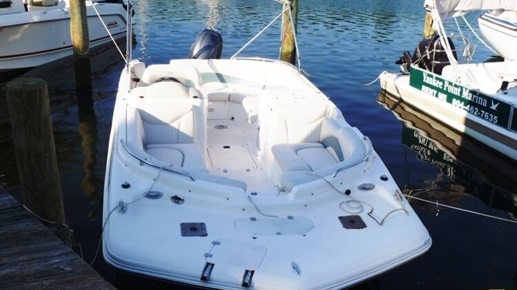{width="5.822916666666667in"
height="3.268596894138233in"}

Boat Rentals

Yankee Point Marina[ Boat
Rentals](https://www.yankeepointmarina.com/all-rentals)

Address:[ 1303 Oak Hill Rd, Lancaster, VA
22503](https://goo.gl/maps/8y9tqJBwzcASkwGM7)

Contact Info (804)
462-7635  [info@yankeepointmarina.com](http://info@yankeepointmarina.com/)

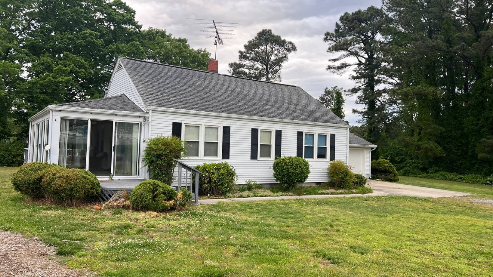{width="7.322916666666667in"
height="4.113419728783902in"}

Yankee Point Marina

Yankee Point
Marina [Airbnb](https://www.airbnb.com/rooms/903086560529762088) House.  

Virginia Historical Marker[ J-106](https://www.hmdb.org/m.asp?m=97204)

Currently 2 day minimum stay required

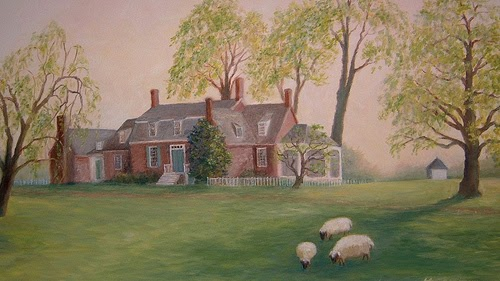{width="5.208333333333333in"
height="2.9270833333333335in"}

[Barford
Plantation](https://en.wikipedia.org/wiki/Verville_%28Merry_Point,_Virginia%29)

[Verville](https://en.wikipedia.org/wiki/Verville_%28Merry_Point,_Virginia%29) Plantation
(Barford)

Address:  [3709 Merry Point Rd, Lancaster VA
22503](https://goo.gl/maps/y4rS3ijt8BToRMNh8)

Virginia Historical Marker[ J-90](https://www.hmdb.org/m.asp?m=130231)

National Register of Historic Places: 87000609

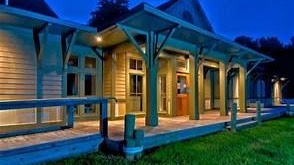

Steamboat Era Museum

156 King Carter Dr, Irvington, VA 22480

\(804\) 438-6888

steamboateramuseum.org

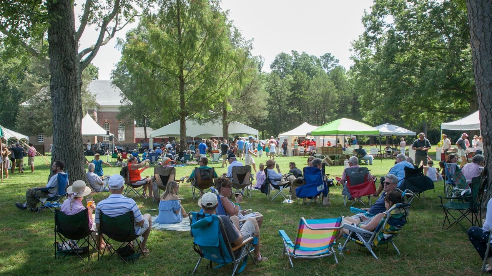{width="6.739583333333333in"
height="3.7857502187226597in"}

[Raise the Roof](https://christchurch1735.org/programs)

\"Raise the Roof\" at Historic Christ Church & Museum in Weems,
Virginia. Enjoy an array of craft beers, delicious BBQ or vegetarian
fare, homemade ice cream, and live music, all at one of Virginia's most
historic sites.  Funds benefit preservation of Historic Christ Church
(1735), a National Historic
Landmark.  [Tickets](https://host.nxt.blackbaud.com/registration-form/?formId=5f6a1b5d-fdc0-4120-8015-466724fae232&envId=p-6xkVcRwaz0eY-1TeDEKA2A&zone=usa)  

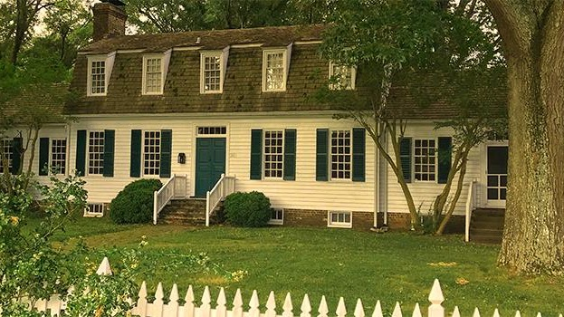{width="6.489583333333333in"
height="3.6458333333333335in"}

[Belle Isle State
Park](https://www.dcr.virginia.gov/state-parks/belle-isle#nearby_attractions)

Belle Isle has seven miles of shoreline on the Northern Neck\'s
Rappahannock River and provides access to Mulberry and Deep creeks. The
park lets visitors explore a wide variety of tidal wetlands interspersed
with farmland and upland forests. It has a campground, three picnic
shelters, hiking, biking and bridle trails, and motor boat and car-top
launches. Belle Isle also offers overnight lodging at Bel Air and the
Bel Air Guest House. Bicycle, canoe and kayak rentals are available.
Guests also enjoy the park\'s universal access playground, boardwalk and
fishing pier, and educational programs. [**The Bel Air historic area is
ideal for
weddings**](https://www.dcr.virginia.gov/state-parks/weddings#wedbi). 

Its address is 1632 Belle Isle Rd., Lancaster, VA  22503; Latitude,
37.774414. Longitude: -76.599364. 

[Northern Neck Driving Tour](https://maps.app.goo.gl/zmP5rDtczJEAy3w16)
