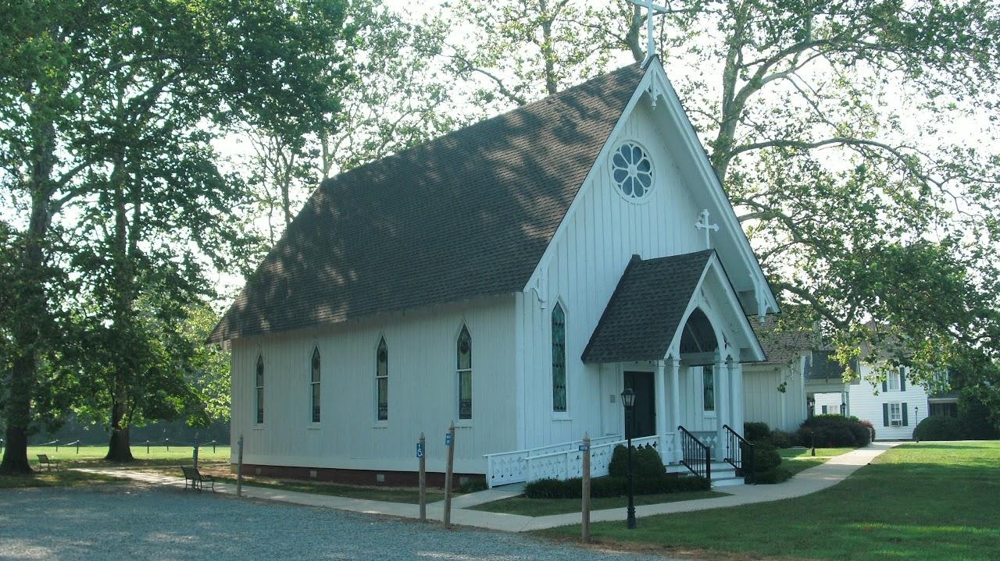
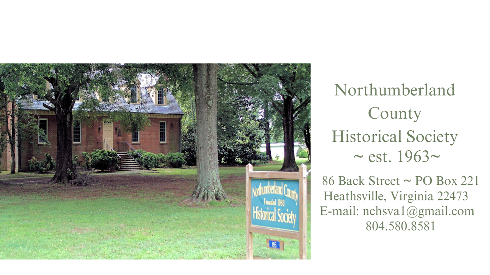
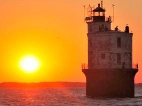
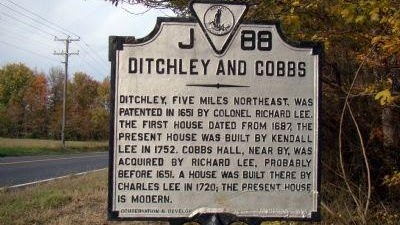
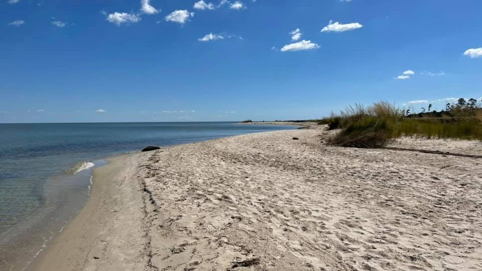
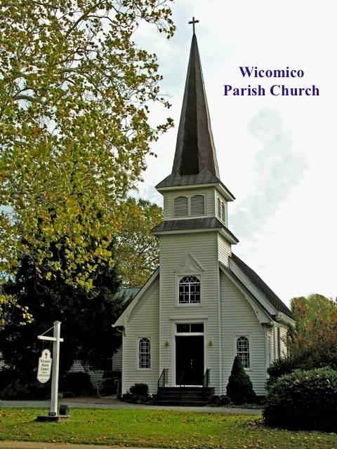
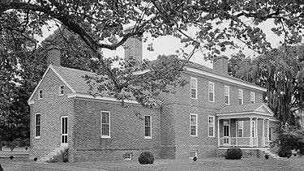
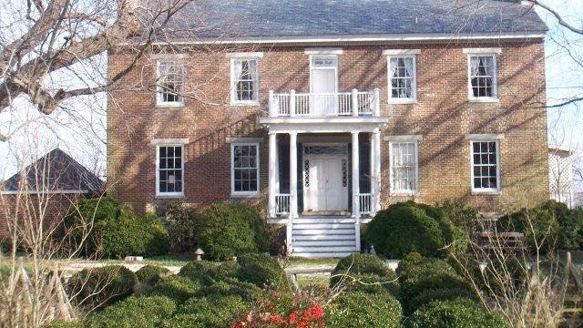

{width="7.213722659667542in"
height="4.052083333333333in"}

[St. Stephens
Episcopal](https://ststephensheathsville.org/parish-calendar#8b30b641-3118-47dd-993e-9df758198039)

The original St. Stephen\'s Parish was formed in 1698 by combining
Bowtracy and Fairfield parishes. Fairfield, earlier known as Chickacoan
Parish, embraced the area to the north of the Wicomico River, dated from
1648. St. Stephen\'s was represented in the first convention of the
Episcopal Church of Virginia in 1785, and the  parish sent
representatives to the Council Conventions intermittently until 1799. 
National Register of Historic
Places ([#79003060](https://npgallery.nps.gov/AssetDetail/NRIS/79003060) 

6807 NORTHUMBERLAND HIGHWAY, HEATHSVILLE, VA 22473

{width="7.479166666666667in"
height="4.201187664041995in"}

[Northumberland County Historical
Society](https://northumberlandvahistory.org/)

Northumberland County Historical Society

86 Back Street • P.O. Box 221   Heathsville, Virginia 22473

Please call us at 804.580.8581 or [contact
us](https://northumberlandvahistory.org/contact/)  

[Surname List](https://northumberlandvahistory.org/surnames/)

{width="2.9375in"
height="2.2083333333333335in"}

[Bay and River Cruises](https://captbillyscharters.com/about/)

We offer a wide variety of cruises for any occasion. If you don't see it
on the following list -- just ask!

- Tangier Island Cruises

- Waterfront Dining Cruises

- Lighthouse Tours

- Creek Peek Tours

- Sunset Cruises

- Moonlight Cruises

- Chesapeake Bay

{width="4.166666666666667in"
height="2.34375in"}

[Ditchley and Cobbs](https://www.hmdb.org/m.asp?m=24475)

Ditchley, five miles northeast, was patented in 1651 by Colonel Richard
Lee. The first house dated from 1687, the present house was built by
Kendall Lee in 1752. Cobbs Hall, near by, was acquired by Richard Lee,
probably before 1651. A house was built there by Charles Lee in 1720;
the present house is modern.

[map](https://www.hmdb.org/map.asp?markers=24475,24477,176061,24248,24218,97240,97241,97210,97243) 

{width="6.920223097112861in"
height="3.8854166666666665in"}

[Dameron Marsh Natural
Area](https://www.dcr.virginia.gov/natural-heritage/natural-area-preserves/dameron)

The 316-acre Dameron Marsh Natural Area Preserve is one in a series of
protected lands that line the western and eastern shore of the
Chesapeake Bay in Virginia. This preserve contains one of the most
significant wetlands on the Chesapeake Bay for marsh-bird communities,
and its pristine beach habitat is highly important for the federally
threatened northeastern beach tiger beetle (Cicindela dorsalis
dorsalis). DCR\'s efforts to conserve sites like Dameron Marsh are an
effective means to sustain these important coastal ecosystems and both
rare and common species. Dameron Marsh supports impressive salt marsh
communities, sand beach, and upland forest habitats.

QMMX+3C Kilmarnock, Virginia

{width="5.0in"
height="6.666666666666667in"}

[Wicomico Parish Church](https://www.wicomicoparishchurch.com/calendar)

In 1646 during the government of Sir William Berkeley, an Act of the
Assembly: . . \"Whereas, the inhabitants of Chicawane, alias
Northumberland, being members of this Colony,\" etc. The following year
an Act . . .\"That the ninth Act of Assembly of 1647, for reducing the
inhabitants of Chickoun and other parts of the neck of land Rappahannock
and Potomacke Rivers, be repealed, and that the said tract of land be
hereafter called and known by the name of the county of
Northumberland.\" 

On May 9, 1753, to replace the second church. Work was to be completed
in five years. It was to be an explicit copy of Christ Church,
Irvington/Weems, only five feet bigger. (A little society thing, what
with the LEE family at Wicomico and the CARTERS at Christ Church.)
Serious delays and modifications set back the start of the third church
until 1766, ten years before the American Revolution began. 

5191 Jessie Ball DuPont Memorial Hwy, PO Box 70, Wicomico Church, VA
22579

804-580-6445

{width="3.90625in"
height="2.1979166666666665in"}

D[itchley](https://en.wikipedia.org/wiki/Ditchley_%28Kilmarnock,_Virginia%29)

Ditchley is a historic plantation house located near Kilmarnock,
Northumberland County, Virginia. It was built in 1762, and is a
two-story, Georgian style brick mansion with a hipped roof. It consists
of a five bay main block flanked by one-story wings.  Original built in
1687. This plantation was a grant to Col. [Richard Lee
I](https://en.wikipedia.org/wiki/Richard_Lee_I) and was named for a Lee
estate near Oxford, England.  It was listed on the National Register of
Historic
Places [92001272](https://npgallery.nps.gov/AssetDetail/NRIS/92001272) 

[37°44′03″N
76°20′05″W](https://geohack.toolforge.org/geohack.php?pagename=National_Register_of_Historic_Places_listings_in_Northumberland_County,_Virginia&params=37.734167_N_76.334722_W_&title=Ditchley) 

{width="6.666666666666667in"
height="3.75in"}

[Cobb\'s Hall](https://www.facebook.com/profile.php?id=100064819893078)

Cobbs Hall is a historic plantation house located at Kilmarnock,
Northumberland County, Virginia. It was built in 1853, on the
foundations of an earlier dwelling of the same design. It is a
two-story, five-bay, double pile brick dwelling with a gable roof. The
front and rear facades feature similar porches supported by Tuscan order
columns. The ends have two semi-exterior end chimneys flanking the peak
of the gable. Also on the property are the contributing Cobbs Hall
graveyard containing Lee family remains, the remains of a 1+1⁄2-story
brick dwelling, and a brick meat house. Cobbs Hall is one of the noted
Northern Neck plantations associated with the Lee family of Virginia
since the middle of the 17th century. It was listed on the National
Register of Historic
Places [0100069](https://npgallery.nps.gov/AssetDetail/NRIS/01000699) 

582 Cobbs Hall Ln., Kilmarnock, Virginia

[Northern Neck Driving Tour](https://maps.app.goo.gl/zmP5rDtczJEAy3w16)
