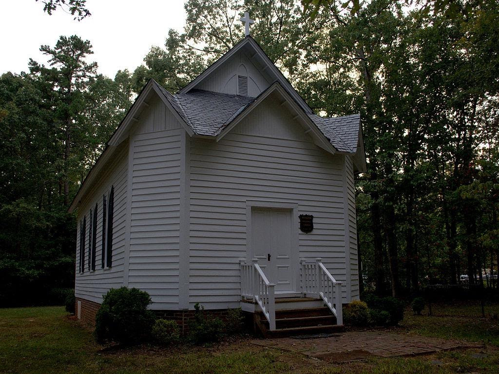
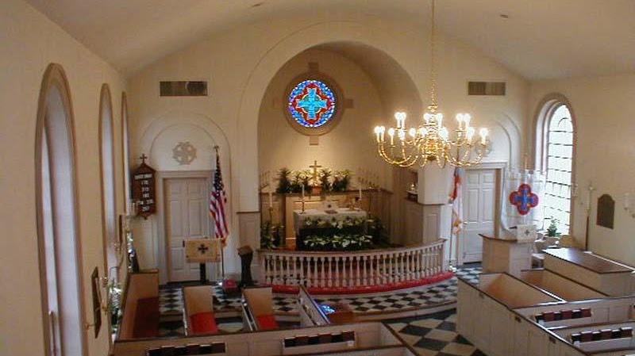

{width="7.5in"
height="5.639583333333333in"}

[Huguenot Memorial Chapel and
Monument](https://en.wikipedia.org/wiki/Huguenot_Memorial_Chapel_and_Monument)

Huguenot Memorial Chapel and Monument is a historic church located at
Manakin, Powhatan County, Virginia. Built in 1700 by French Huguenots,
Protestant refugees, it was moved to its current location in 1710. It
burned down in the Revolutionary War and was later rebuilt with parts of
the original building. It is in what is called the Carpenter Gothic
style. A new church was built next to this in 1954, and is the one still
currently used. It was added to the National Register of Historic Places
in 1988

{width="7.5in"
height="4.209722222222222in"}

[Manakin Episcopal Church](https://manakin.org/history/)

Our church origins extend back over three hundred years to the year
1701. The founding community of Huguenots was made up of French
Protestants who followed the teachings of John Calvin. They had been
forced to leave their homeland by the religious persecution that
followed Louis XIV's revocation of the Edict of Nantes in 1685. Fleeing
to England, they became ardent supporters of William of Orange and
helped him defeat James II. In gratitude for their support, William made
it possible, in 1700, for many of them to move to the American Colonies
by providing them with both land and financial aid. On June 23, 1700,
the first shipload of Huguenots arrived in Virginia, followed later that
same year by two more shiploads of refugees. Further aided by William
Byrd, they settled on land along the James River about twenty miles west
of Richmond. Formerly a Monacan Indian settlement, the new community was
known as Manakintowne. In December 1700, the Virginia House of Burgesses
passed an act stating that the French settlers constituted a "distinct
parish themselves" that would be called King William Parish.
Additionally, they were exempted from having to pay any parish taxes and
were allowed to determine the appropriate salary for their clergy. "The
parish was duly organized and, by common consent or agreement, the
liturgy of the Church of England was used in their services. There seems
no reason to doubt that they might have retained a dissenting status and
held services in their own language if they had so desired, as did the
German Lutherans who came into the Shenandoah Valley forty years later.
But certainly the Huguenots adopted the wiser course in holding their
services in the language of the country in which they expected to make
their future home." 
