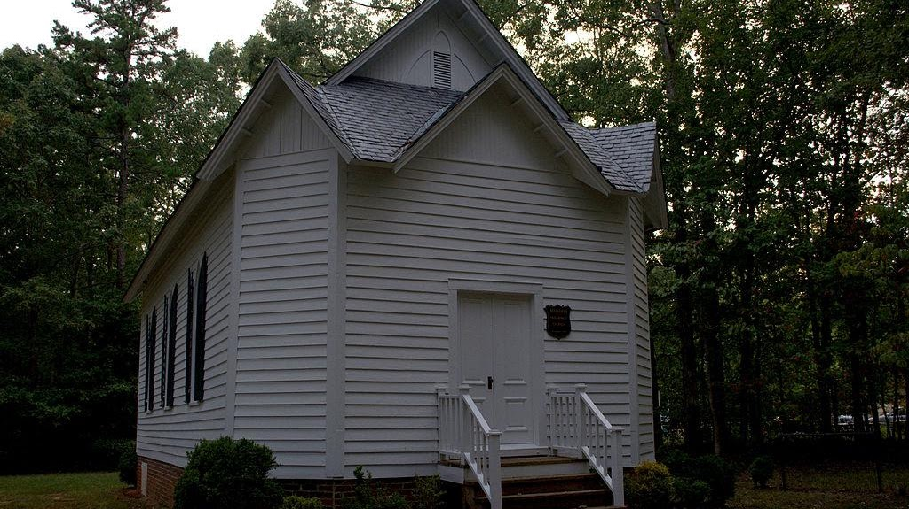

[Richmond Driving Tour](https://maps.app.goo.gl/BJ1p5Qyq6shU7e4p8)

[Huguenot Society of the Founders of
Manakin](https://www.huguenotmanakin.org/copy-of-old-registered-lineages)

The Huguenot Society of the Founders of Manakin in the Colony of
Virginia is a society dedicated to preserving the history and genealogy
of all French Protestant Huguenots who came to Virginia prior to 1786.  

The Society maintains a headquarters with an excellent research library
to help trace Huguenot histories. 

981 Huguenot Trail Midlothian, Virginia   23113

{width="7.5in"
height="4.209722222222222in"}

[Manakin Episcopal Church](https://manakin.org/history/)

Our church origins extend back over three hundred years to the year
1701. The founding community of Huguenots was made up of French
Protestants who followed the teachings of John Calvin. They had been
forced to leave their homeland by the religious persecution that
followed Louis XIV's revocation of the Edict of Nantes in 1685. Fleeing
to England, they became ardent supporters of William of Orange and
helped him defeat James II. In gratitude for their support, William made
it possible, in 1700, for many of them to move to the American Colonies
by providing them with both land and financial aid.

**985 Huguenot Trail, Midlothian, VA 23113   (804) 794-6401**

{width="7.5in"
height="4.211111111111111in"}

[Huguenot Memorial Chapel and
Monument](https://en.wikipedia.org/wiki/Huguenot_Memorial_Chapel_and_Monument)

**NRHP
reference [No.]{.underline}** [88000214](https://npgallery.nps.gov/AssetDetail/NRIS/88000214)

**VLR [No.]{.underline}** 072-0093
