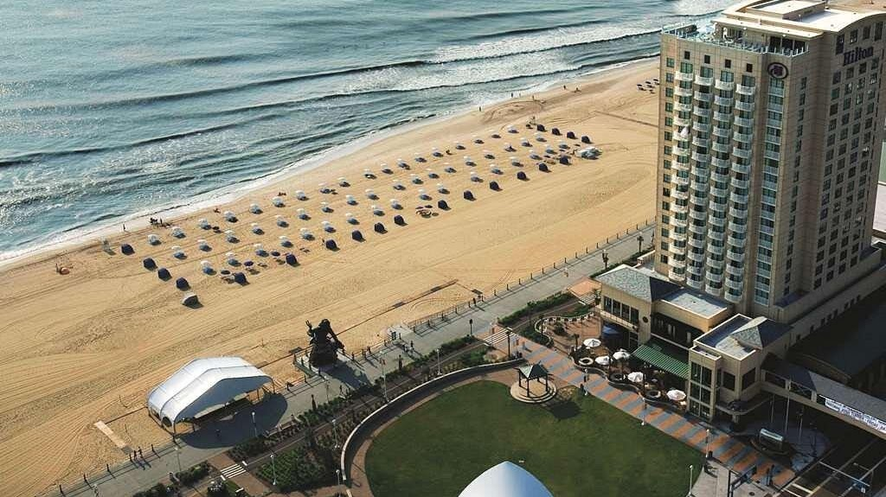{width="7.5in"
height="4.211111111111111in"}

Hilton

Hey this is a vacation and you should have some fun. All of our
ancestors would have passed by Virginia Beach regardless if their
destination. If you can afford it you should definitely stay at the
Hilton on Virginia Beach, if not at least stop there for Happy Hour.
Many times the city will provide free entertainment next door at the
Neptune statue and you can enjoy the music from the Hilton. 

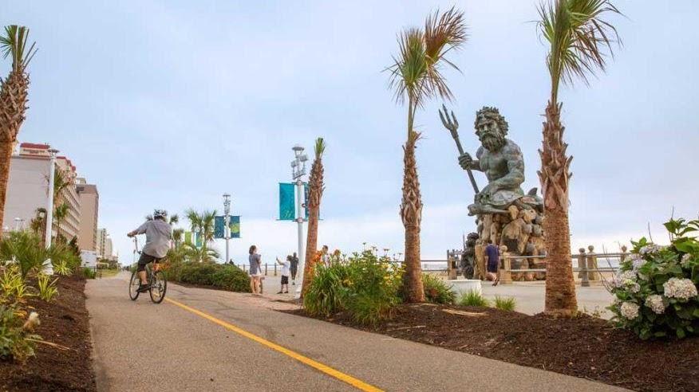

[Neptune Park](https://www.virginia.org/listing/neptunes-park/15487/)

[Neptune\'s
Park](https://www.virginia.org/listing/neptunes-park/15487/), a
picturesque outdoor venue featuring nightly entertainment throughout the
summer, is on the Virginia Beach oceanfront at 31st Street, part of the
31 Ocean Corridor. The Free Summer Concert Series includes a series of
eight extremely talented and diverse national recording artists
performing for the residents and guests of Hampton Roads to enjoy. All
concerts are FREE and Open to the Public and begin at 7pm. The 31 Ocean
Corridor at 31st Street and Atlantic Avenue offers a beautiful four-star
hotel, two award winning restaurants, the only roof top bar at the
oceanfront, a picturesque outdoor venue featuring nightly entertainment
throughout the summer and fabulous boutiques all in one location,
31Ocean truly is a destination unto itself.

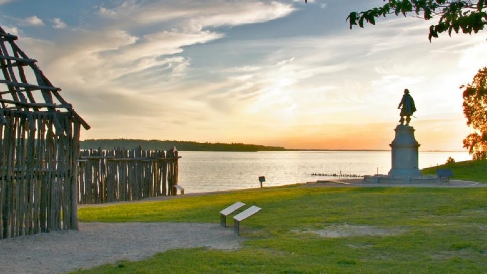{width="7.5in"
height="4.214583333333334in"}

[Jamestowne National Park](https://www.nps.gov/jame/index.htm)

Walk in the footsteps of Pocahontas and John Smith at the original site
of the first permanent English settlement in America. Witness the moment
of discovery with Jamestown Rediscovery archaeologists as they excavate
James Fort. Take a walking tour with an archaeologist, park ranger, or
costumed living history character. View exhibits and galleries located
in our award-winning archaeological museum. At the Glasshouse, costumed
glassblowers demonstrate Jamestown\'s first industry, and the Island
Loop Drive explores the natural environment. 

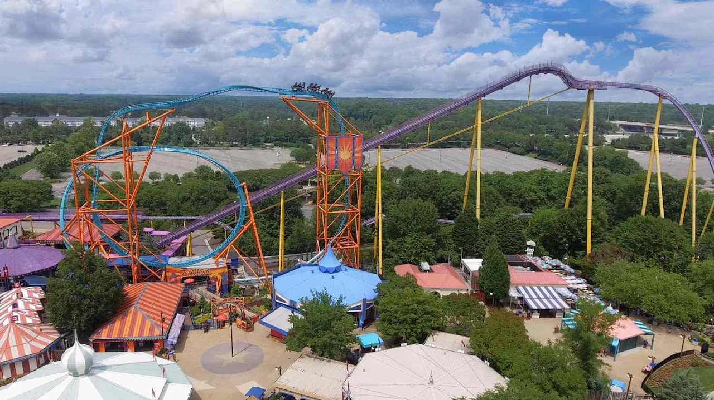{width="7.5in"
height="4.2131944444444445in"}

Busch Gardens Williamsburg

10:00 am - 8:00 pm

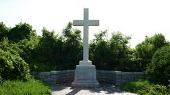{width="2.96875in"
height="1.6666666666666667in"}

First Cross

First Cross. Virginia Beach, Virginia (great place to go swimming).
Listed on: Seashore State Park Historic District, U.S. National Register
of Historic Places, U.S. Historic district, Virginia Landmarks Register

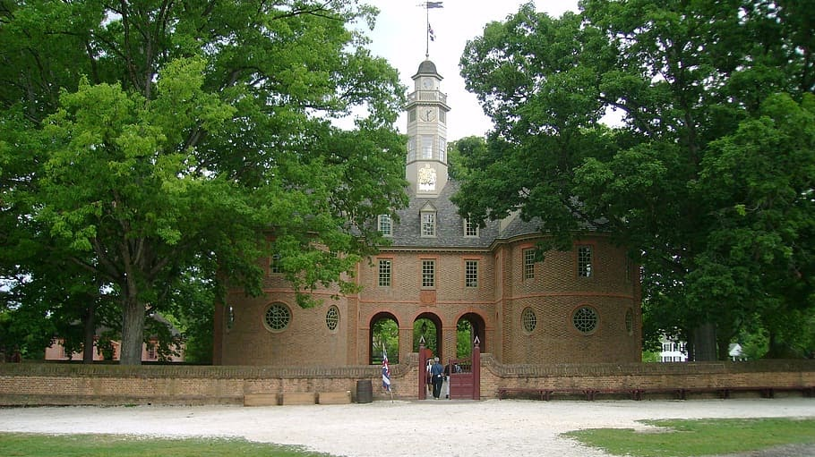{width="7.5in"
height="4.211805555555555in"}

[House of Burgesses](https://en.wikipedia.org/wiki/House_of_Burgesses)

Where many of ancestors served. The House of Burgesses was the elected
representative element of the Virginia General Assembly, the legislative
body of the Colony of Virginia. From 1642 to 1776, the House of
Burgesses was an instrument of government alongside the
royally-appointed colonial governor and the upper-house Council of State
in the General House.

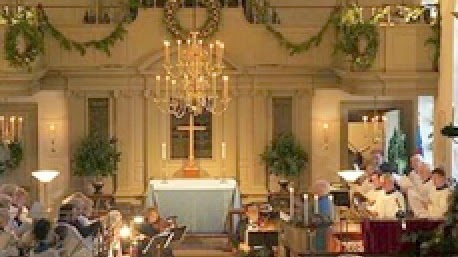{width="4.770833333333333in"
height="2.6770833333333335in"}

[Bruton Parish](https://www.brutonparish.org/heritage)

Bruton Parish, (Episcopalian). This is the church were so many of
America's Founding Fathers worshipped, including the Holy Trinity:
George Washington, Thomas Jefferson and James Madison.  Also our
ancestors worshipped here.  It is beautifully restored. Stop at least to
sit in George Washington's pew and give thanks to God. 

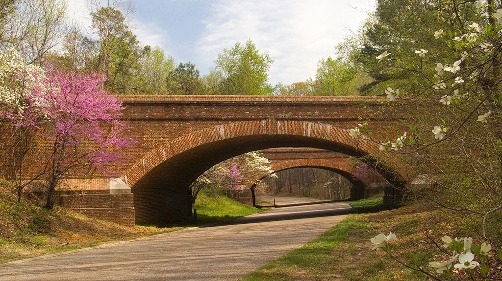{width="7.5in"
height="4.211111111111111in"}

Colonial Parkway

scenic parkway linking the three points of Virginia\'s Historic
Triangle, Jamestown, Williamsburg, and Yorktown. It is part of the
National Park Service\'s Colonial National Historical Park.

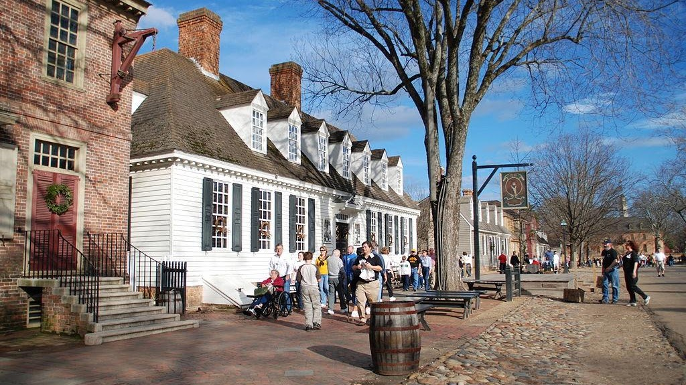{width="7.5in"
height="4.211111111111111in"}

Colonial Williamsburg

Colonial Williamsburg is a living-history museum and private foundation
presenting a part of the historic district in the city of Williamsburg,
Virginia. Its 301-acre (122 ha) historic area includes several hundred
restored or recreated buildings from the 18th century, when the city was
the capital of the Colony of Virginia; 17th-century, 19th-century, and
Colonial Revival structures; and more recent reconstructions. The
historic area includes three main thoroughfares and their connecting
side streets that attempt to suggest the atmosphere and the
circumstances of 18th-century Americans. Costumed employees work and
dress as people did in the era, sometimes using colonial grammar and
diction

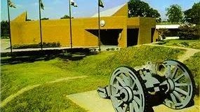{width="2.96875in"
height="1.6666666666666667in"}

Yorktown National Park

The Yorktown Visitor Center is the orientation point for your visit to
Yorktown and Yorktown Battlefield. At the visitor center information
desk, you can obtain a park brochure with maps and information, an
orientation to the park, and an opportunity to schedule your visit
around the various interpretive programs going on throughout the day.

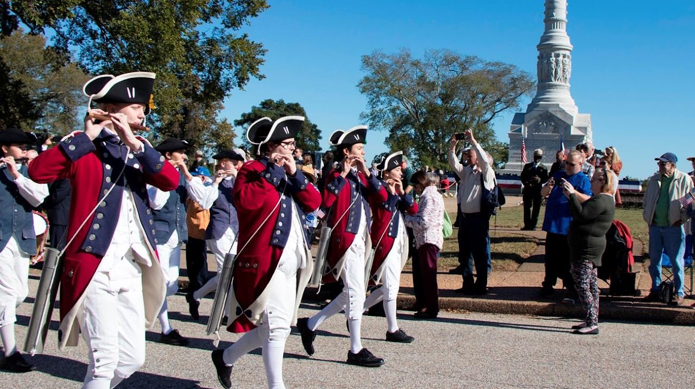{width="7.5in"
height="4.2131944444444445in"}

Yorktown Battlefield

Discover what it took for the United States to be independent as you
explore the site of the last major battle of the Revolutionary War. 
Here at [Yorktown](https://www.nps.gov/york/index.htm), in the fall of
1781, General George Washington, with allied American and French forces,
besieged General Charles Lord Cornwallis's British army.  On October 19,
Cornwallis surrendered, effectively ending the war and ensuring
independence.

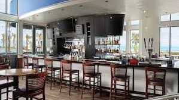{width="3.1145833333333335in"
height="1.75in"}

Catch 31

Located next to Neptune Park and overlooking the spectacular views of
the Atlantic Ocean Catch 31 Fish House and Bar is the spot for the
freshest local seafood and live entertainment. Whether you are dining on
one of our many patios or indoors the views lure visitors and local
alike. The menu boasts of wood fired fish, succulent steaks, and
decadent desserts. Live nightly entertainment is the perfect backdrop
for your night out May through September. Visit
our [website](https://www.catch31.com/) for full menu details and live
entertainment schedule.

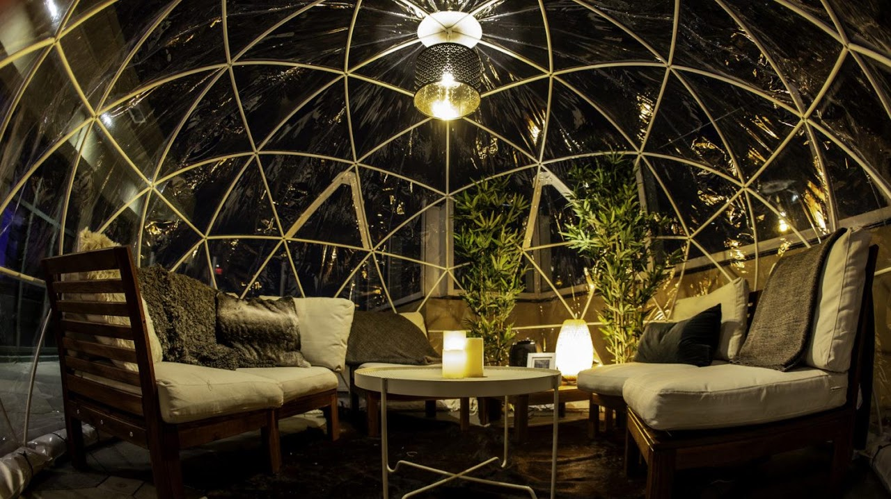{width="7.5in"
height="4.2131944444444445in"}

Sky Bar

OPEN TO THE PUBLIC \| Doors open at 10pm \| FREE ENTRY \| Reserve VIP by
emailing skybar@hiltonvb.com

Visit [The Rooftop
Guide](https://www.therooftopguide.com/rooftop-bars-in-virginia-beach.html) to
learn everything you need to know about our rooftop!

{width="2.8125in"
height="1.5833333333333333in"}

Atlantic Fun Park

Calling all families! Are you ready to experience FUN? If so then
Atlantic Fun Park located in Virginia Beach, Virginia is exactly what
you\'re looking for! Come experience Midway Games, 16 Family Fun Rides,
and all the Fun Foods you can handle! We offer some of the most thrill
seeking rides around with the most famous of them including the
Gravitron, Flying Bob\'s, 100 ft tall Skyflyer and the Sea Dragon! Test
your wits against these rides that are sure to leave you with one of the
biggest adrenaline rushes of your life. You wont be able to resist
another ride ever again! On top of all the rides we also offer a wide
variety of kiddy and family rides such as the Ferris Wheel (biggest in
Virginia Beach!) and the Kiddy Elephants. [Atlantic Fun
Park](http://www.atlanticfunpark.com/index.html) in Virginia Beach is
family safe and friendly and great for all ages. Come check us out!

Motor World

[Motor World](https://vbmotorworld.com/) features 11 Go- Kart tracks,
250 Karts with 16 different style Go Karts. Be sure to check out
Virginia Beach's most challenging Shipwreck Mini Golf Courses, Bumper
Boats, Kiddie & Thrill Rides.

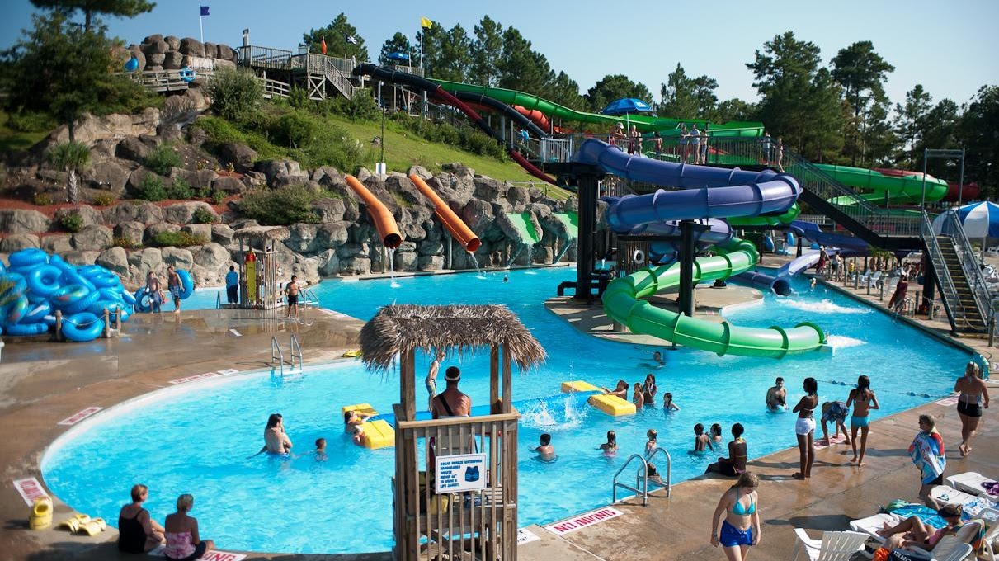{width="7.5in"
height="4.211111111111111in"}

Ocean Breeze Waterpark

At [Ocean
Breeze](https://www.oceanbreezewaterpark.com/attractions/?types=water-playground) enjoy
the million gallon WAVE POOL with a new big screen, WATER SLIDES like
the all new six story family raft ride Operation Splashdown, a quarter
mile WINDING RIVER, and a WATER PLAYGROUND for the littlest buccaneers.
WAHOOOO! Don\'t forget about those beautiful poolside cabanas, treats
like DOLE WHIP and a visit with our mascot Hugh Mongous. Are you ready?

{width="7.5in"
height="2.359722222222222in"}

[Jamestowne
Society](https://www.jamestowne.org/lineage-paper-project.html)

Members of the Jamestowne Society are descended from early settlers who
lived or held colonial government positions in Jamestowne, Virginia
prior to 1700, or who invested in its establishment. The Jamestowne
Society was organized for educational, historical, and patriotic
purposes. The Society has a range of activities, from visiting early
American sites, providing an annual graduate fellowship for research on
Colonial Virginia prior to 1700, funding the restoration of records, and
supporting preservation of Colonial sites. Want to learn more about
Jamestowne during the period 1607-1700, the Jamestowne Society, and its
members? You are in the right place!

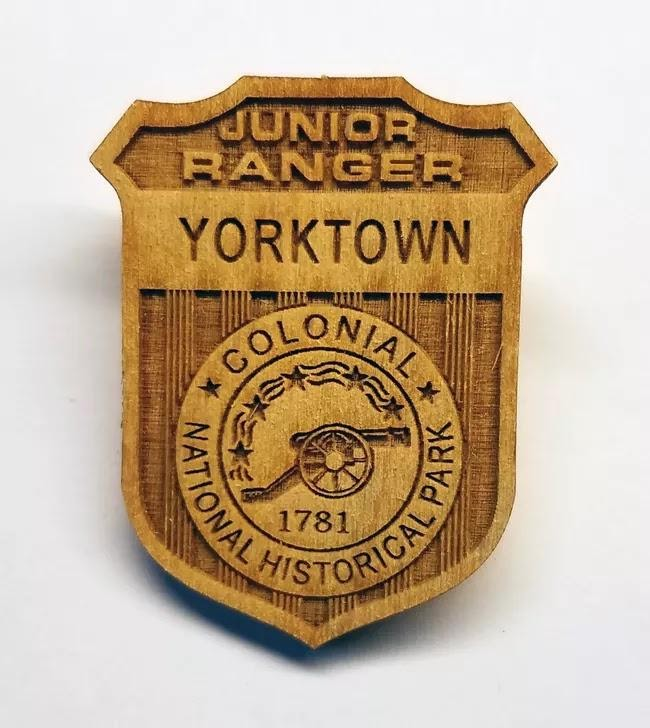{width="6.770833333333333in"
height="7.583333333333333in"}

York Town Junior Ranger

[Yorktown
Battlefield](https://www.nps.gov/york/learn/kidsyouth/beajuniorranger.htm) has
a Junior Ranger Program. The program was developed to allow families to
learn together and are designed for **children through age of 12**. Each
Junior Ranger Program takes about two hours to complete. Booklets can be
picked up at the Yorktown Battlefield front desk. Experience the end of
colonial America with the final major battle of the American Revolution
to become a Yorktown Junior Ranger. Successful completion of the program
earns a Certificate of Merit and a badge. 

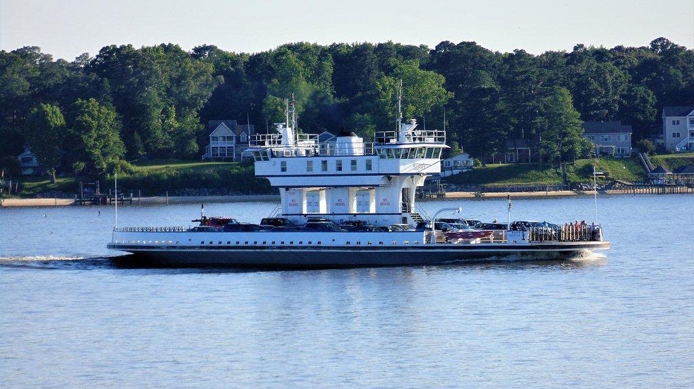{width="7.5in"
height="4.211111111111111in"}

[Jamestown
Ferry](https://www.vdot.virginia.gov/travel/ferry-jamestown.asp)

The Jamestown Ferry (also known as the Jamestown-Scotland Ferry) is
a **FREE** automobile and bus ferry service across a navigable portion
of the James River in Virginia. It carries State Route 31, connecting
Jamestown in James City County with Scotland Wharf in Surry County. The
service provides the only vehicle crossing of the river between the
James River Bridge downstream at Newport News and the Benjamin Harrison
Memorial Bridge upriver near Hopewell. It is toll-free and operated 24
hours a day, 7 days a week by the Virginia Department of Transportation
(VDOT). The vessels carry over 900,000 passengers annually. Operations
are based at the Scotland Wharf in Surry County.

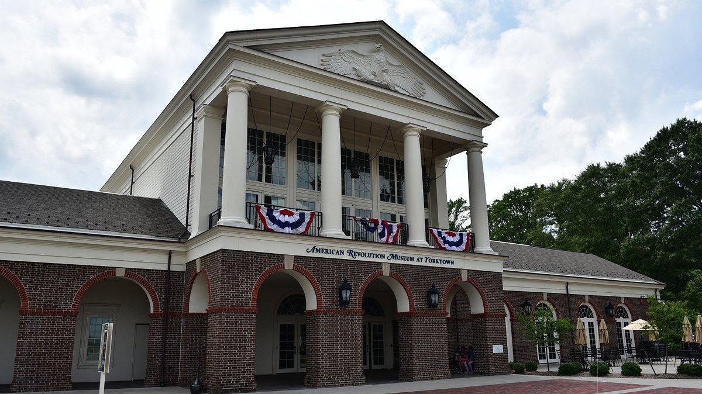

[American Revolution Museum at
Yorktown](https://www.jyfmuseums.org/events)

Journey to the [American Revolution Museum at
Yorktown](https://www.jyfmuseums.org/visit/american-revolution-museum-at-yorktown) and
learn the story of the nation's founding, from the twilight of the
colonial period to the dawn of the Constitution and beyond. Explore
period artifacts, immersive environments and films, with a 180-degree
surround screen and dramatic special effects. In the outdoor
living-history areas, visitors can learn about the rank and file of a
soldier's life at a re-created [Continental Army
encampment](https://www.jyfmuseums.org/visit/american-revolution-museum-at-yorktown/living-history/continental-army-encampment) and
explore a [Revolution-era
farm](https://www.jyfmuseums.org/visit/american-revolution-museum-at-yorktown/living-history/revolution-era-farm) based
on a real-life 18th-century family. 
