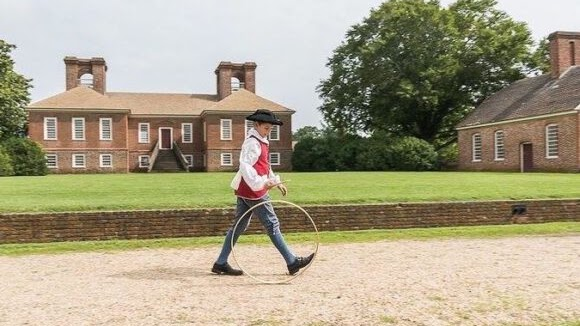{width="6.041666666666667in"
height="3.3958333333333335in"}

[Stratford Hall &
Grounds](https://www.stratfordhall.org/events-programs/)

This is the Lee Manor and 2 Signers of the Declaration of Independence.
Explore the Great House, garden, grounds, Visitor Center exhibit:
Stratford at the Crossroads, & the Gift Shop. Enjoy \$4 admission,
18th-century colonial games, outdoor yard games, and a summer
craft-making activity. Explore the historic grounds, nature trails, and
Potomac River beachfront and tour the Great House with one of our five
self-guided audio tours. Live music in the Great Hall from 12 -- 3 pm.
National Historic
Landmark [#66000851](https://npgallery.nps.gov/AssetDetail/NRIS/66000851) 

[483 Great House Rd, Stratford Hall, VA, United States,
22558](https://maps.app.goo.gl/Tanxg9cbC9UcpxbBA)

\(804\) 493-8038

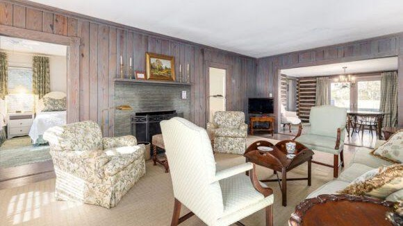{width="6.041666666666667in"
height="3.3958333333333335in"}

[Cabins at Stratford Hall](https://www.stratfordhall.org/lodging/)

Nestled in the woods between the Great House and the Potomac River,
Stratford Hall's rustic and comfortable lodging provides a unique
opportunity to stay on the property of one of the great historic houses
in America. 

Phone reservations are taken daily 9 a.m. to 5 p.m. Rooms are available
to book [**online**](https://us01.iqwebbook.com/SH2VA237/) 24 hours a
day. All rooms are non-smoking. During festival weekends in May &
September, we require a two-night weekend. We offer a special discount
of 10% off standard lodging rates for military & veterans, AAA members.
To inquire about availability, please call (804) 493 -- 1967 or email
reservations@stratfordhall.org. Our Reservations department is available
daily 9 a.m. to 5 p.m. Please call by 2 p.m. for same day reservations. 

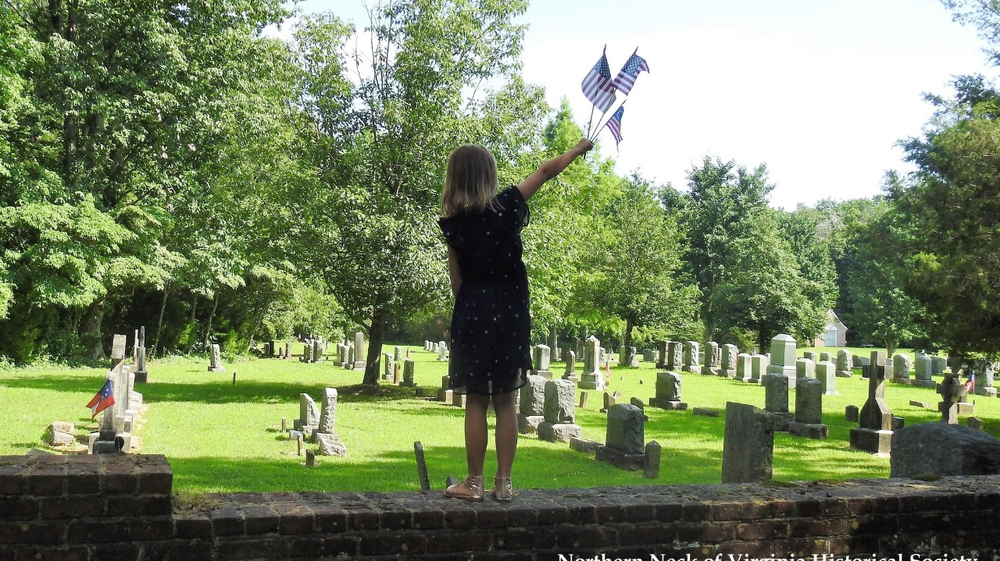{width="7.3125in"
height="4.107568897637795in"}

Burnt House Field

4 July 8:15 AM

The Northern Neck of Virginia Historical Society and Cople Episcopal
Parish invite you their annual Independence Day Celebration. This event
is supported by the James Monroe Chapter, Sons of the American
Revolution.

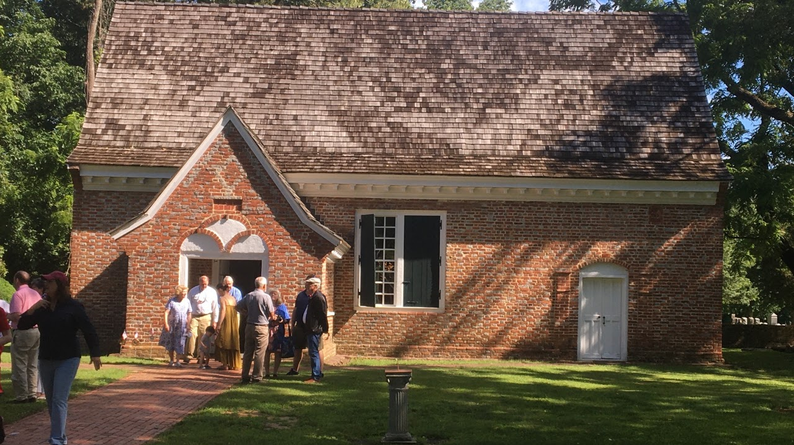{width="7.5in"
height="4.2131944444444445in"}

[Yeocomico Church](https://en.wikipedia.org/wiki/Yeocomico_Church)

4 July 9:00 AM Patriotic Service

Richard Henry Lee and his father, Thomas, both served on the Cople
Parish Vestry in the 18th century. This is also where George Washington
was Christened by Col. George Eskridge. This Independence Day service
will be filled with related messages and the singing of our favorite
national hymns. This Family Friendly Event Is Open To The Public And
Admission Is **Free**.

[1219 Old Yeocomico Rd, Kinsale, VA
22488 ](https://maps.app.goo.gl/z26SNckHorQhd9KT6)

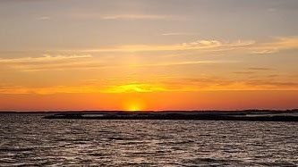{width="3.46875in"
height="1.9479166666666667in"}

[Westmoreland State
Park](https://www.dcr.virginia.gov/state-parks/westmoreland)

Sunset Kayak Paddle Tour

Extra fee: **The cost is \$20 for a solo kayak and \$25 for a tandem
kayak..**

Children welcome: **Yes**.

Phone: **804-493-8821**

Email Address: **westmoreland@dcr.virginia.gov** 

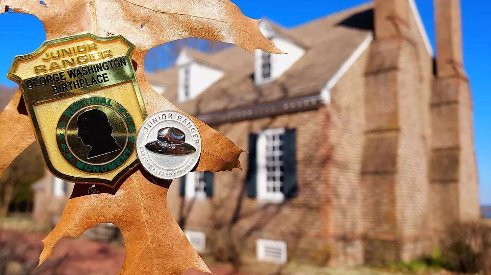{width="7.5in"
height="4.2131944444444445in"}

[George Washington Birthplace](https://www.nps.gov/gewa/index.htm)

National Monument

Tour George Washington Birthplace and become a Junior Ranger. Junior
Ranger activity booklets are free and available upon request at the park
visitor center. After completing the booklet, Junior Rangers receive a
special badge to mark their accomplishment. Can\'t make it to George
Washington Birthplace National Monument? Not a problem. [**Contact
us**](https://www.nps.gov/common/utilities/sendmail/sendemail.cfm?o=4C80CCBAA2C7A7AF80841AA1FF18B9A047894F805296828F4C51A98808&r=/gewa/learn/kidsyouth/beajuniorranger.htm) to
request a digital copy for you to print at home. 

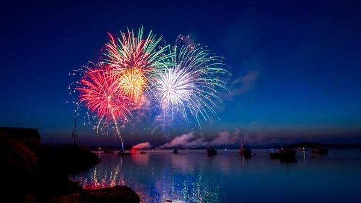{width="6.25in"
height="3.5104166666666665in"}

[Colonial
Beach](https://www.colonial-beach-virginia-attractions.com/4th-of-july.html)

Restaurants & Casino

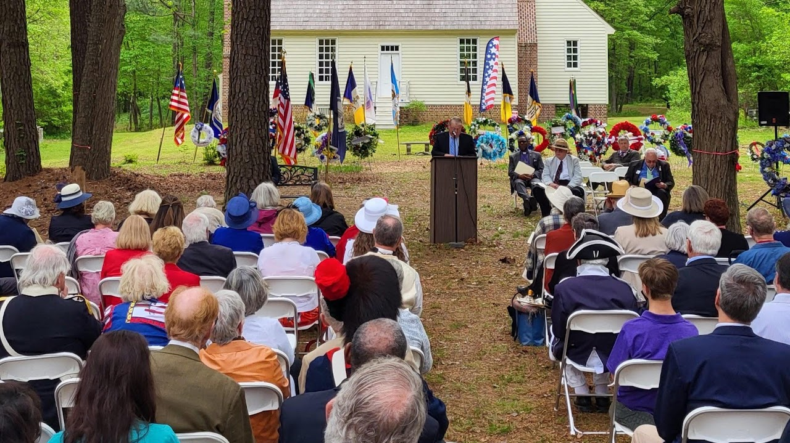{width="7.47334208223972in"
height="4.197916666666667in"}

James Monroe Birthplace

The James Monroe Birthplace Park & Museum is a +70-year project of the
James Monroe Memorial Foundation, which was established by the
descendants of President James Monroe. Through the charitable
contributions and generous donations of everyday people both here and
abroad, we are now beginning to see the culmination of this project with
the establishment of the Visitors Center and the completion of the
Birthplace Home with the park\'s various activity trails.

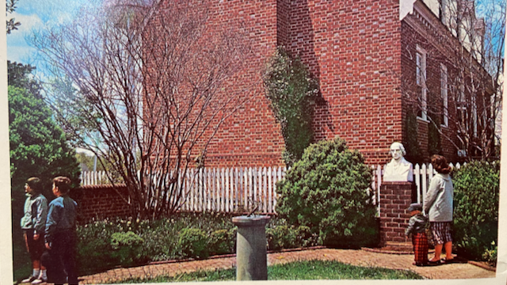{width="6.666666666666667in"
height="3.75in"}

[Westmoreland County
Museum](https://westmorelandcountymuseum.org/research/)

The Presidents Garden contains marble busts of George Washington, James
Monroe, and James Madison (all born in the Norhtern Neck), plus a
sundial in the center with the names of all eight president's born in
Virginia. The marble busts are the work of sculptor, Attilio
Piccirilli. 

Mondays-Saturdays 10:00am -- 4:00pm

[15880 Kings Hwy Montross, VA
22520](https://maps.app.goo.gl/FYBXrF5eUt7RgPvq6)

Email: <wcmuseum@verizon.net>   Phone: (804) 493-3133

[Download and fill out our research request form
here](https://westmorelandcountymuseum.org/wp-content/uploads/2022/12/Research-Request_fillable.pdf). 

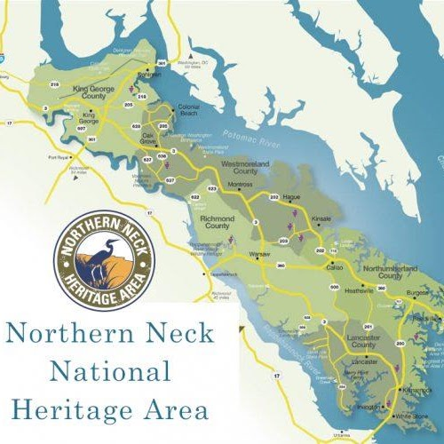{width="5.208333333333333in"
height="5.208333333333333in"}

[Northern Neck](https://www.northernneck.org/historical-heritage-sites/)

This peninsula nestled between the Potomac and the Rappahannock Rivers
and spilling into the Chesapeake Bay was part of the enormous 1649 land
grant by Charles II, known as the Fairfax Grant. The bountiful waters of
the Potomac and Rappahannock Rivers, and the Chesapeake Bay supported
and induced English settlement. The English built stately homes and
farmed tobacco for export to England, which became the basis of the
Northern Neck's economy during the Colonial era. The Northern Neck's
most famous son, George Washington, born on Pope's Creek off the Potomac
River, called the region "the Garden of Virginia." Our nation's fifth
president, James Monroe, was born in Westmoreland County in 1758.

The Lee family of Virginia called the Northern Neck home and built
Stratford Hall in the 1730s, of bricks fired from the clay soil on the
premises. A son of Thomas Lee, Richard Henry Lee, co-wrote the
Westmoreland Resolves, which proposed American independence in 1766 in
protest against the Stamp Act. Richard Henry Lee and his brother Francis
Lightfoot Lee were the only two brothers to sign the Declaration of
Independence. The last Lee to survive to maturity, Robert E. Lee, was
born at Stratford Hall in 1807.

[Kid Friendly
Activities](https://www.northernneck.org/kid-friendly-activities/)

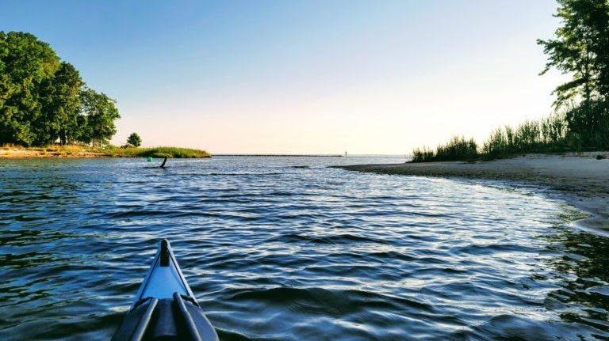{width="7.5in"
height="4.209027777777778in"}

[Bonum Creek
Landing ](https://www.northernneck.org/MAPS/wc_bonums_creek_water_trail_final_set.pdf)

this creek has a water trail that offers protected paddling, suitable
for beginners (just avoid winds out of the north, which can make this
creek a little wavy).  Bonum Creek Landing is located right next to a
working waterfront, so as soon as you launch, you get a feel for that
true Chesapeake watermen's culture.  If you head up the creek, there are
some long stretches of undeveloped shorelines that are perfect for some
wildlife viewing.  Osprey, bald eagles, and great blue herons are
frequent sightings.

[1336 State Rte 763, Kinsale, VA
22488](https://maps.app.goo.gl/KReXgsPMDNsLHZ3Q8)

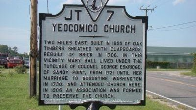{width="4.166666666666667in"
height="2.34375in"}

[Yeocomico Church Marker](https://www.hmdb.org/m.asp?m=22400)

Two miles east. Built in 1655 of oak timbers sheathed with clapboards.
Rebuilt of brick in 1706. In this vicinity Mary Ball lived under the
tutelage of Colonel George Eskridge, of Sandy Point, from 1721 until her
marriage to Augustine Washington in 1730, and attended church here. In
1906 an association was formed to preserve the church.

[map](https://www.hmdb.org/map.asp?markers=22400,22407,22429,22399,76406,22463,22395,22397,22393)

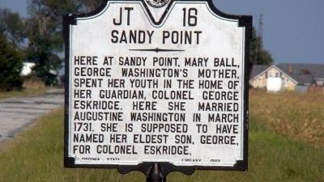{width="4.166666666666667in"
height="2.34375in"}

[Sandy Point Marker](https://www.hmdb.org/m.asp?m=22434)

Here at Sandy Point, Mary Ball, George Washington's mother, spent her
youth in the home of her guardian, Colonel George Eskridge. Here she
married Augustine Washington in March 1731. She is supposed to have
named her eldest son, George, for Colonel Eskridge.

[map](https://www.hmdb.org/map.asp?markers=22434,76406,97088,97081,97084,97087,22463,22400,22407) 

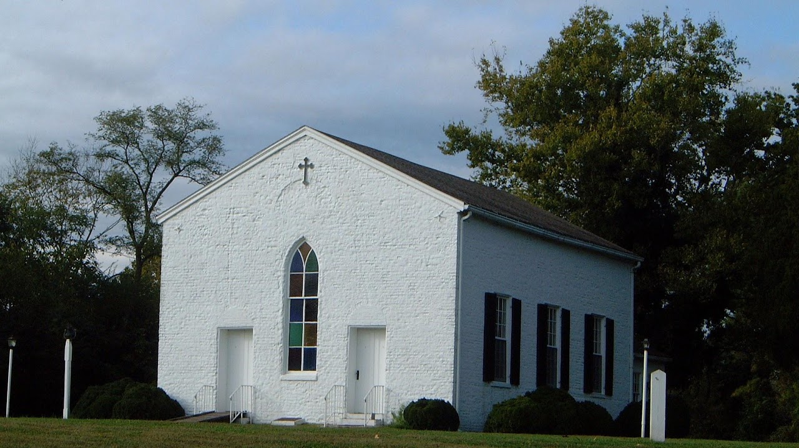{width="7.5in"
height="4.2131944444444445in"}

[Nomini Episcopal Church](https://www.copleparish.com/copy-of-st-james)

One of the two churches of the Cople Parish. It was built in 1704 on
land given by Youell Watkins, and was replaced in 1755 by a brick church
at the same site. George Washington attended services here twice in
1768. This was the last colonial church burned (1814) by the British
Admiral Cockburn, who carried off the church silver during his
pillaging-expedition on the Potomac and its tributaries. The present
building was erected about 1652. The first Nominy Church of 1655 stood
on the north side of the river opposite of this place.

Worship at Nomini Church

Fifth Sundays Starting at 10 am

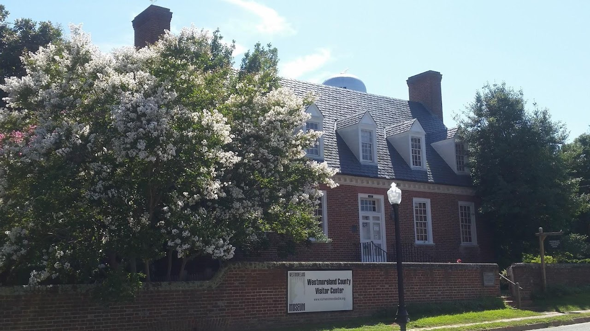{width="7.1395461504811895in"
height="4.010416666666667in"}

[Westmoreland County
Museum](https://www.westmorelandcountymuseum.org/the-library)

Westmoreland County, Virginia is ancestral home of three of our nations
first five presidents -- George Washington, James Monroe and James
Madison. The only two brothers to sign the Declaration of Independence-
Richard Henry and Francis Lightfoot Lee were also Westmoreland County
residents. The County is also the location of Nomini Hall, where Robert
Carter III voluntarily freed nearly 500 of his enslaved people,
beginning in 1791. 

15803 Kings Hwy Montross, VA 22520

Courthouse: (804) 493-3133

Museum: (804) 493-8440

Merchantile: (804) 493-3018

[Northern Neck Driving Tour](https://maps.app.goo.gl/zmP5rDtczJEAy3w16)

Resources

[Wikitree](https://www.wikitree.com/wiki/Category:Westmoreland_County%2C_Virginia_Colony)

[The Library & Genealogical Center \| Westmoreland County Museum \|
Montross
Virginia](https://www.westmorelandcountymuseum.org/the-library) 

[Westmoreland County, Virginia Genealogy •
FamilySearch](https://www.familysearch.org/en/wiki/Westmoreland_County,_Virginia_Genealogy) 

[News \| Westmoreland County Government
(westmoreland-county.org)](https://www.westmoreland-county.org/) 

[Westmoreland County, Virginia -
Wikipedia](https://en.wikipedia.org/wiki/Westmoreland_County%2C_Virginia) 

[History & Genealogy \| Central Rappahannock Regional Library
(librarypoint.org)](https://www.librarypoint.org/resources/history-genealogy/) 

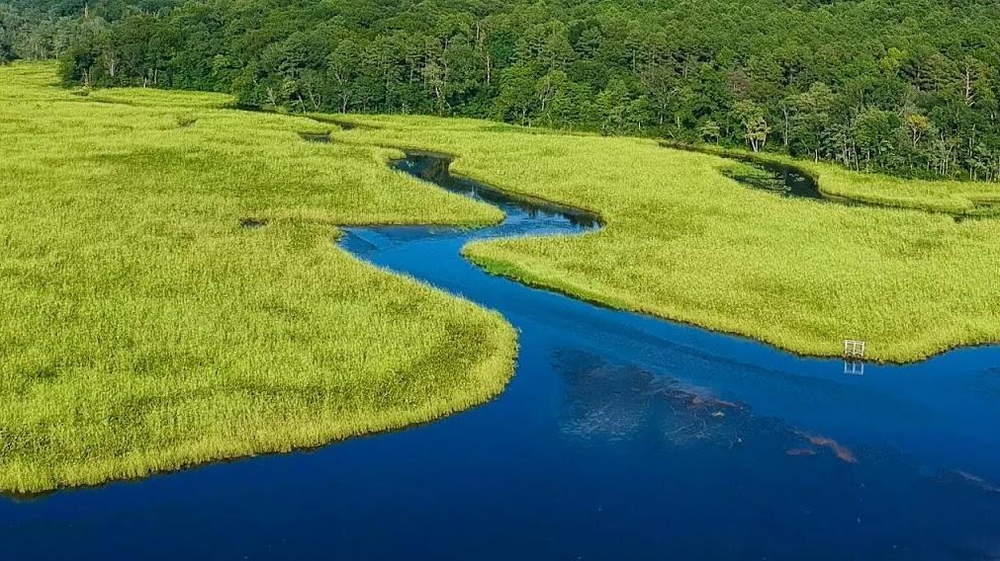{width="6.989932195975503in"
height="3.9270833333333335in"}

[Rappahannock River Valley National Wildlife
Refuge](https://www.fws.gov/refuge/rappahannock-river-valley)

\(804\) 333-1470

336 Wilna Road Warsaw, VA 22572-2961
