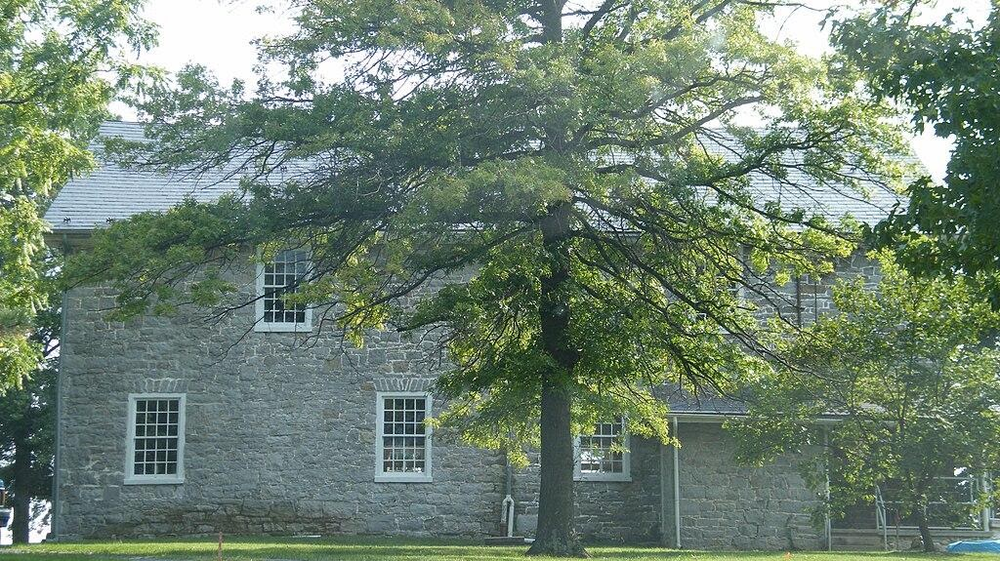
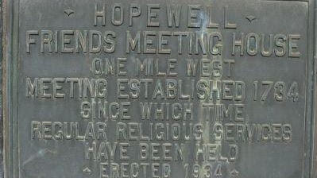
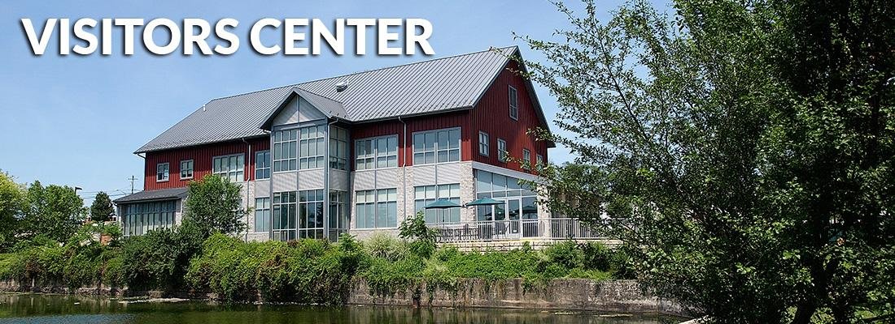
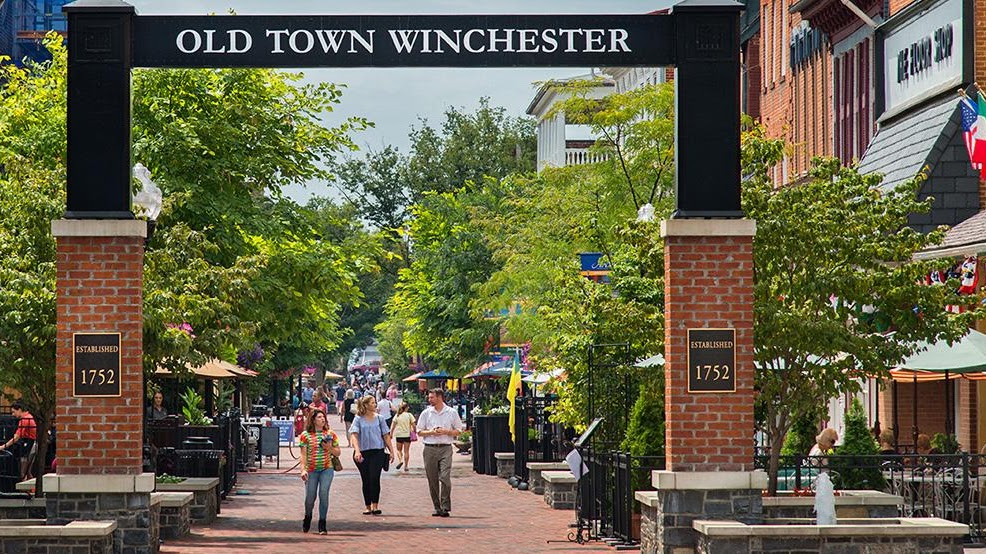
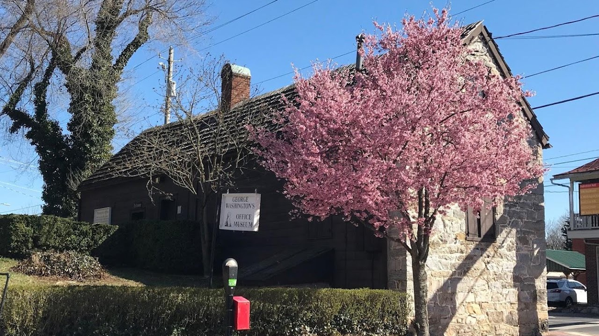
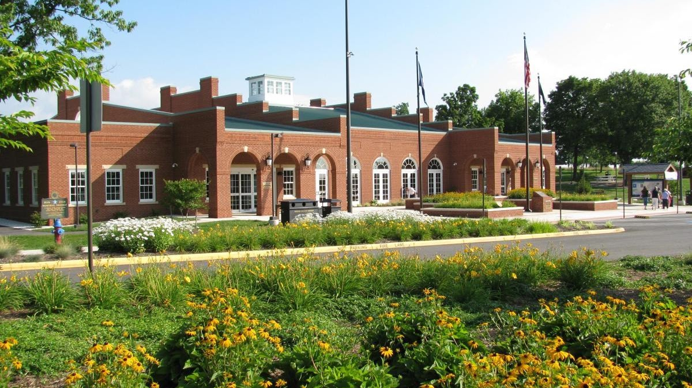
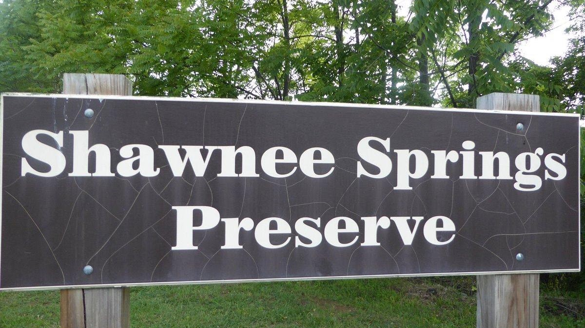
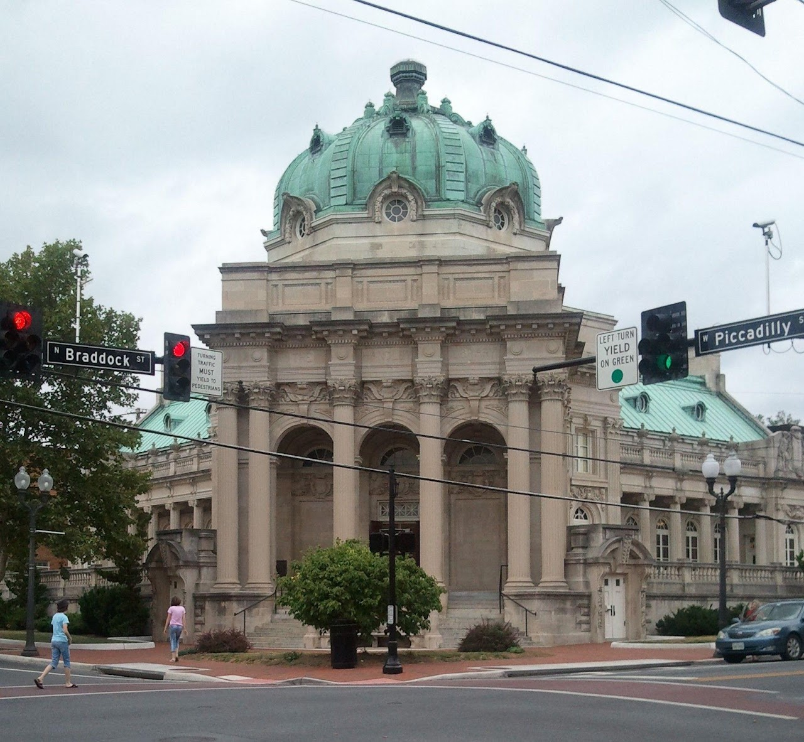

Research Resources

<https://www.familysearch.org/en/wiki/Frederick_County,_Virginia_Genealogy>

{width="6.826666666666667in"
height="3.8333333333333335in"}

[Hopewell Friends Meeting
House](https://winchesterquakers.org/visit-us-1)

Hopewell Friends Meeting House is an 18th-century Quaker meeting house
located the northern Frederick County, Virginia one mile west of the
community of Clear Brook at 604 Hopewell Road (formerly State Route
672). Clear Brook, VA 22624.  The Hopewell Meeting House was listed on
the Virginia Landmarks Register in 1977. It was listed on the National
Register of Historic Places by the National Park Service in 1980. In
1995 it was designated as a Frederick County Historic Site. 

Sunday Services 10 AM

540-667-9114

[Opequon Quaker Camp](https://bymcamps.org/our-camps/opequon/)

2710 Brucetown Rd, Clear Brook, VA 22624

+15406784900

{width="4.25in"
height="2.3854166666666665in"}

[Frederick County Fair](https://www.frederickcountyfair.com/)

Frederick County Fair

​250 Fairgrounds Rd Clear Brook, VA 22624

\(540\) 313-4911

{width="4.15625in"
height="2.3333333333333335in"}

[Hopewell Friends Marker](https://www.hmdb.org/m.asp?m=2282)

39° 15.379′ N, 78° 5.794′ W. Marker is in Clear Brook, Virginia, in
Frederick County. Marker is at the intersection of Martinsburg Turnpike
(U.S. 11) and Hopewell Road (County Route 672), on the right when
traveling south on Martinsburg Turnpike. [Touch for
map](https://www.hmdb.org/map.asp?markers=2282,168405,2329,41659,204192,204193,193320,167182,2358).
Marker is in this post office area: Clear Brook VA 22624, United States
of America. [Touch for
directions.](https://www.google.com/maps/dir/?api=1&destination=39.25631603,-78.09657097) 

{width="7.046875546806649in"
height="2.5625in"}

[Winchester-Frederick County Visitors
Cente](https://visitwinchesterva.com/location/annual-events/)r 

Winchester-Frederick County Convention & Visitors Bureau   \|

1400 S. Pleasant Valley Road, Winchester, VA 22601

\(540\) 542-1326   \|   Toll Free (877) 871-1326   

info@visitwinchesterva.com   \|   GPS coordinates: 39.1689, -78.1615

{width="6.802083333333333in"
height="3.8218602362204726in"}

[Old Town
Winchester](https://visitwinchesterva.com/location/attractions/historic-downtown/)

A vital marketplace for more than 250 years, Old Town Winchester
cherishes its heritage. Visitors are welcomed here with the grace and
style typical of Virginia hospitality. Old Town Winchester is located
within the heart of a 45-block National Register Historic District and
features a quaint pedestrian walking mall bursting with outdoor cafes,
fun & specialty retail shops, historic attractions and family-oriented
activities throughout the year. The Loudoun Street Pedestrian Mall has
earned a listing on the National Register of Historic Places Travel
Itinerary. A 7 million dollar renovation of the Mall was completed in
2013.

{width="7.343532370953631in"
height="4.125in"}

[George Washington Office
Museum](https://www.shenandoahatwar.org/washingtons-office)

32 West Cork St. Winchester, Virginia

{width="7.447916666666667in"
height="4.183246937882765in"}

[Clear Brook Welcome
Center](https://visitshenandoah.org/events-listings/)

I-81, Mile Marker 320 Clearbrook, VA 22624

[Shawnee
Springs](https://www.winchesterva.gov/Parks-Recreation/Facilities/Trails-and-Natural-Areas/Shawnee-Springs-Preserve)

Located between downtown Winchester and Jim Barnett Park, the 14-acre
Shawnee Preserve protects natural springs, wetlands, and rocky upland
forested areas. It also contains the site of an old Civil War hospital,
Sheridan\'s Field Hospital. The Shawnee Springs Trail is a 0.26-mile
long trail provides a more natural trail option in the form of a gravel
trail meandering through the wooded heart of the Springs where trail
users can see remnants of the City's old waterworks settlement basins.
The trail is a spur off of the Green Circle Trail and the two trails
connect up again at mile marker 1.0 on the north end so there is no need
to double-back. The main trail and the spur trail are almost the same
distance.

{width="6.948674540682415in"
height="6.416666666666667in"}

[Handley Library](https://www.handleyregional.org/events/month)

Family Files

100 West Piccadilly St. Winchester, VA 22601 

Phone: 540-662-9041
