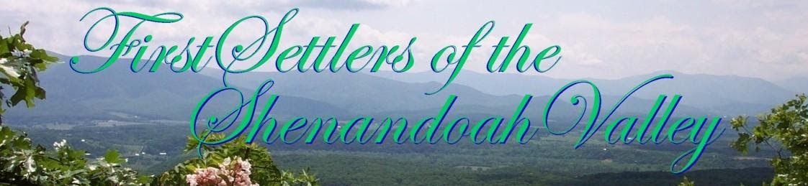

[First Settlers of Shenandoah
Valley](http://www.firstsettlersshenandoahvalley.com/settlers.html)

The qualifying FIRST SETTLER ancestor needed for FSSV membership is a
person who resided in an area that is located in present-day Shenandoah
Valley before 31 December 1799. 

 

First Governor was [Arthur
Boreman](https://www.firstfamilies.us/ancestors/scotland/kenner).   
West Virginia Day is 20 June
