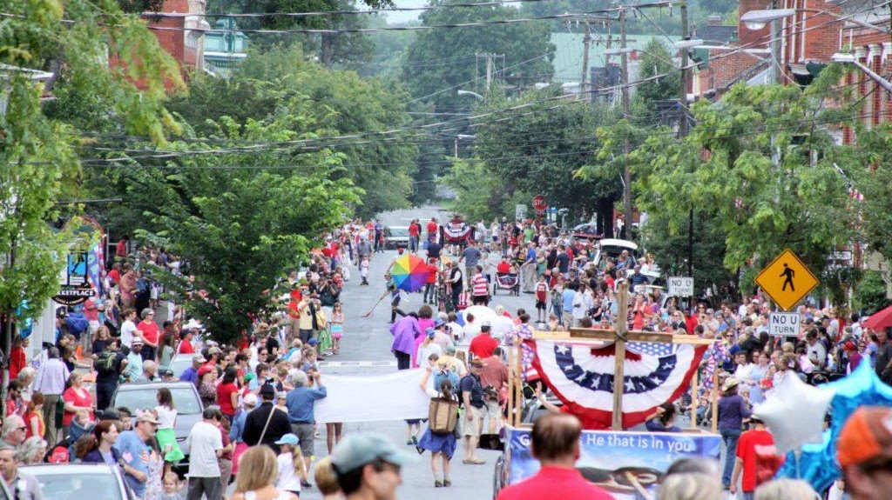
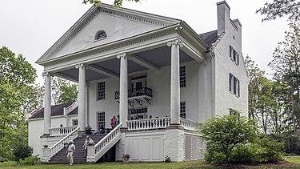
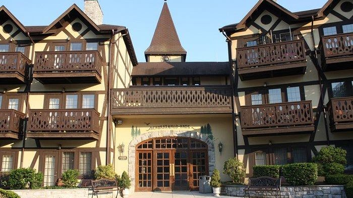
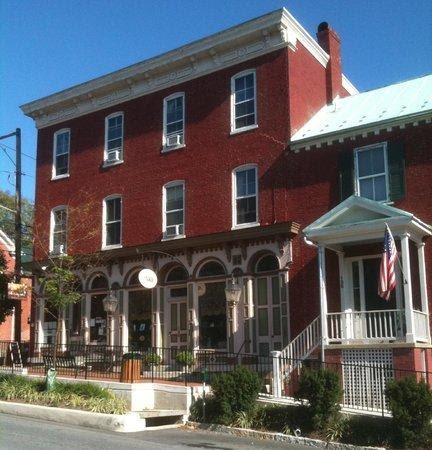
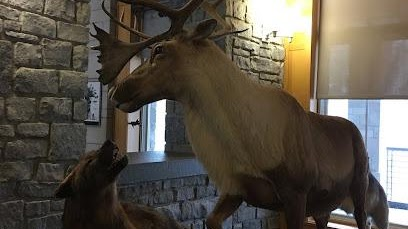

Research

[JCHS: Preserving Jefferson County\'s History Since 1927
(jeffersonhistoricalwv.org)](https://www.jeffersonhistoricalwv.org/) 

[Jefferson County, West Virginia Genealogy •
FamilySearch](https://www.familysearch.org/en/wiki/Jefferson_County,_West_Virginia_Genealogy) 

[Jefferson County, West Virginia -
Wikipedia](https://en.wikipedia.org/wiki/Jefferson_County%2C_West_Virginia) 

Map

{width="6.958333333333333in"
height="3.907267060367454in"}

[Shepherdstown](https://shepherdstown.info/calendar-of-events/)

Shepherdstown is a town in Jefferson County, West Virginia, United
States, located in the lower Shenandoah Valley along the Potomac River.
Home to Shepherd University, the town\'s population was 1,531 at the
time of the 2020 census. The town was established in 1762 along with
Romney; they are the oldest towns in West Virginia.

{width="3.90625in"
height="2.1979166666666665in"}

[Morgan\'s
Spring](https://en.wikipedia.org/wiki/Falling_Spring-Morgan%27s_Grove)

Falling Spring was completed by 1837 as a large, house and farm complex.
The property was first settled by Richard Morgan, who noted several
springs on the property, including \"Bubbling Spring\" and \"Morgan\'s
Spring\", the starting point of the 1775 Bee-Line March. The house was
built by Jacob Morgan, Richard\'s grandson

{width="7.291666666666667in"
height="4.09375in"}

[Bavarian Inn](https://www.bavarianinnwv.com/events.php)

For over 45 years, the Asam family has been hosting friends and
neighbors for relaxing getaways, gourmet meals, special occasions, and
the finest in guest comforts. Perched on a spectacular bluff overlooking
the Potomac River, our 11-acre European Inspired Boutique Resort offers
comfort, elegance, and world-class food and service. The Bavarian Inn
has proudly won many awards, including the AAA Four Diamond and Wine
Spectator\'s Best of Award of Excellence . We invite you to experience
our hospitality and enjoy this place we live and love.

[Shepherdstown Museum](https://historicshepherdstown.com/home-2/museum/)

[surname
research](https://historicshepherdstown.com/research/surname-files/)

**The Museum is open!  Hours through October will be Saturdays 11 -- 5 
and Sunday 1-4.**

**Special tours are possible if a volunteer docent is available. Call
304-876-0910 on Tuesday, Wednesday or Friday to inquire. **

Suggested donation: \$5.00 per person. FREE admission to Historic
Shepherdstown members, children, students and military.

129 E. German Street\
(corner of German and Princess Streets)\
Shepherdstown, WV

[Google
Maps](https://www.google.com/maps/@39.4303644,-77.8044621,3a,75y,26.72h,86.86t/data=!3m9!1e1!3m7!1sTQaG-qIYPWi3hM6WFaUC7A!2e0!7i16384!8i8192!9m2!1b1!2i41)

{width="4.25in"
height="2.3854166666666665in"}

National Conservation Training Center

698 Conservation Way, Shepherdstown, WV 25443

+13048761600

Near Terrapin Neck

Families

[Tingle](https://www.firstfamilies.us/ancestors/england/tingle)

[York](https://www.firstfamilies.us/ancestors/england/york)
