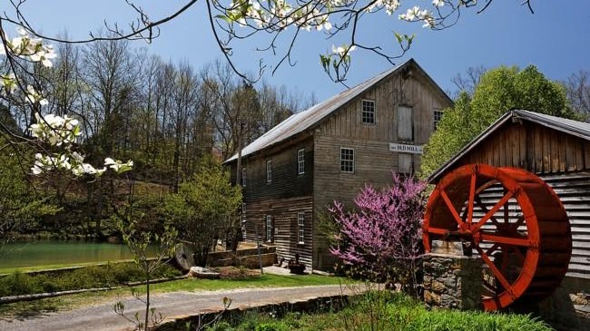

{width="6.770833333333333in"
height="3.8020833333333335in"}

[Cook\'s Old
Mill](http://www.cooksoldmill.com/text/genealogy-vcook-bio.html)

Cook\'s Old Mill is a mid-1800\'s gristmill on route 122, just ¼ mile
west of Greenville, West Virginia. It is a privately owned park-like
venue for tourists, history buffs, Cook descendants and mill
enthusiasts. The mill is an anchor point on the Farm Heritage Road, one
of Monroe County\'s Scenic Byways. The National Registry of Historic
Places describes the mill as follows:---

Cook\'s Mill was built in 1857 on the original foundation and site of an
earlier mill constructed in approximately 1796. The property surrounding
this mill includes dam, mill pond, tail race and stream, and consists of
3 ½ acres. The mill was an important part of the community, serving as a
gathering place. Construction elements include massive hand-hewn,
mortise and tenon posts and beams.
