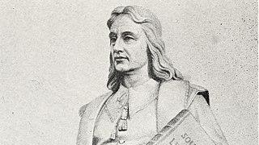
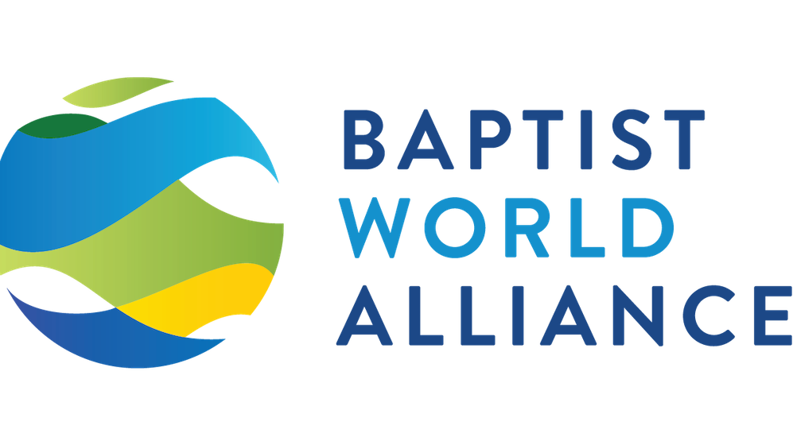
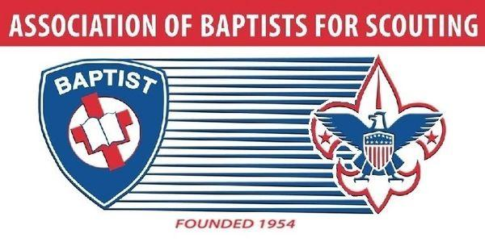
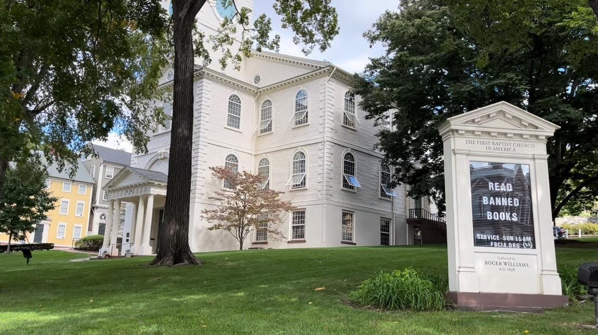
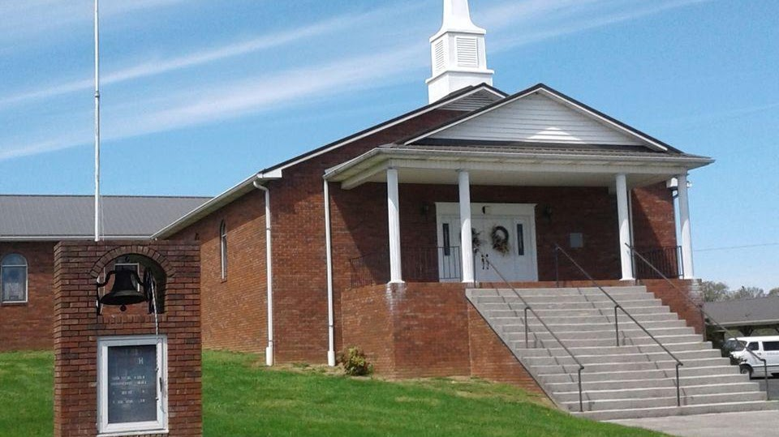
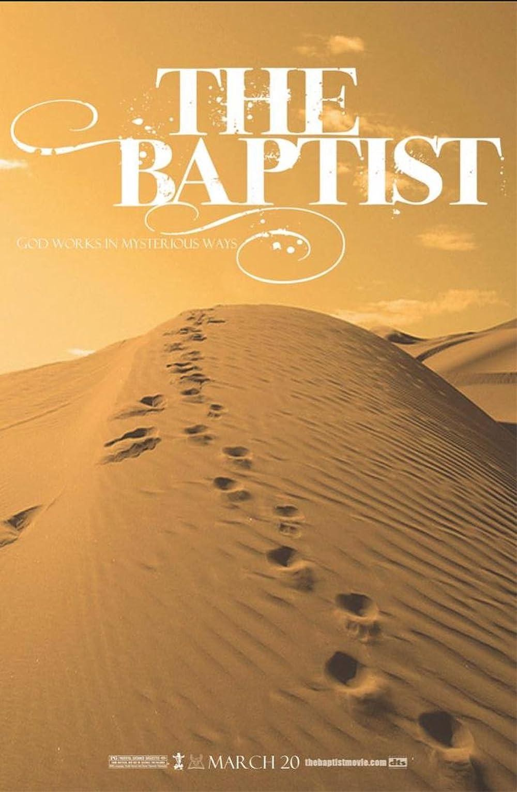

<section class="wrapper bg-light">

<article class="card shadow-lg">

Ecumenical

This National Council of Churches members  include
Evangelical [Lutheran ](https://www.firstfamilies.us/faith/lutheran)Church
in America,
American [Baptist](https://www.firstfamilies.us/faith/baptist) Churches
USA, [Moravian](https://www.firstfamilies.us/faith/moravians) Church in
America, Polish
National [Catholic](https://www.firstfamilies.us/faith/old-catholics) Church, [Presbyterian](https://www.firstfamilies.us/faith/presbyterians) Church
USA, [Friends United
Meeting](https://www.firstfamilies.us/faith/quakers),  [Philadelphia
Yearly Meeting,](https://www.firstfamilies.us/faith/quakers) [United
Church of
Christ](https://www.firstfamilies.us/faith/congregationalists), [Reformed
Church in America](https://www.firstfamilies.us/faith/dutch-reformed),
United [Methodist ](https://www.firstfamilies.us/faith/methodist)Church
and
the [Episcopal](https://www.firstfamilies.us/faith/episcopalian) Church
USA 

[Westminster Savoy Philadelphia Confessions of
Faith](https://drive.google.com/file/d/1OcGjZowpmyAyw3Ma_dftxYKEd7bfAGh2/view?usp=sharing)

In [England](https://www.firstfamilies.us/ancestors/england) in 1646
the [Presbyterians](https://www.firstfamilies.us/faith/presbyterians) wrote
the [Westminster Confession of
Faith](https://drive.google.com/file/d/1OcGjZowpmyAyw3Ma_dftxYKEd7bfAGh2/view?usp=sharing). 
In 1658
the [Congregationalists](https://www.firstfamilies.us/faith/congregationalists) took
the [Westminster Confession of
Faith](https://drive.google.com/file/d/1OcGjZowpmyAyw3Ma_dftxYKEd7bfAGh2/view?usp=sharing) and
added \"Congregational governance\" and called it the [Savoy Declaration
of
Faith](https://drive.google.com/file/d/1OcGjZowpmyAyw3Ma_dftxYKEd7bfAGh2/view?usp=sharing). 
In 1689 the [Baptist](https://www.firstfamilies.us/faith/baptist) took
the [Savoy Declaration of
Faith](https://drive.google.com/file/d/1OcGjZowpmyAyw3Ma_dftxYKEd7bfAGh2/view?usp=sharing) and
added \"Believers Baptism\" and called it the [London Baptist Confession
of
Faith](https://drive.google.com/file/d/1OcGjZowpmyAyw3Ma_dftxYKEd7bfAGh2/view?usp=sharing).
In [Pennsylvania](https://www.firstfamilies.us/events/pennsylvania), in
1742 the  [Baptist](https://www.firstfamilies.us/faith/baptist)  took
the  [London Baptist Confession of
Faith](https://drive.google.com/file/d/1OcGjZowpmyAyw3Ma_dftxYKEd7bfAGh2/view?usp=sharing) and
added 2 more ordinances: \"Signing\" and the \"Laying on of Hands\" and
called it the [Philadelphia Confession of
Faith](https://drive.google.com/file/d/1OcGjZowpmyAyw3Ma_dftxYKEd7bfAGh2/view?usp=sharing).

[Roger William](https://en.wikipedia.org/wiki/Roger_Williams)

Roger Williams (c. 1603 -- March 1683) was an English-born New England
Puritan minister, theologian, and author who founded Providence
Plantations, which became the Colony of Rhode Island and Providence
Plantations and later the State of Rhode Island and Providence
Plantations. He was a staunch advocate for religious freedom, separation
of church and state, and fair dealings with the Native Americans

{width="7.102882764654418in"
height="3.9895833333333335in"}

Baptist World Alliance

Modern Baptist churches trace their history to the English Separatist
movement in the 17th century, over a century after the foundation of the
Church of England during the Protestant Reformation. This view of
Baptist origins has the most historical support and is the most widely
accepted. Adherents to this position consider the influence of
Anabaptists upon early Baptists to be minimal. It was a time of
considerable political and religious turmoil. Both individuals and
churches were willing to give up their theological roots if they became
convinced that a more biblical \"truth\" had been discovered. During the
Reformation, the Church of England (Anglicans) separated from the Roman
Catholic Church. There were some Christians who were not content with
the achievements of the mainstream Protestant Reformation. There also
were Christians who were disappointed that the Church of England had not
made corrections of what some considered to be errors and abuses. Of
those most critical of the church\'s direction, some chose to stay and
try to make constructive changes from within the Anglican Church. They
became known as \"Puritans\" and are described by Gourley as cousins of
the English Separatists. Others decided they must leave the church
because of their dissatisfaction and became known as the Separatists. In
1579, Faustus Socinus founded the Unitarians in Poland, which was a
tolerant country. The Unitarians taught baptism by immersion. When
Poland ceased to be tolerant, they fled to Holland. In Holland, the
Unitarians introduced immersion baptism to the Dutch Mennonites.

Baptist Catechism

[Baptist Scouts](https://baptistscouters.org/)

 The Association of Baptists for Scouting was founded in 1954 on the
principles of the common goals of scouting and the moral teachings of
faith-based (Baptist) churches 

**membership@baptistscouters.org** 

{width="7.197916666666667in"
height="4.043274278215223in"}

[First Baptist
Church](https://en.wikipedia.org/wiki/First_Baptist_Church_in_America)

The First Baptist Church in America is the First Baptist Church of
Providence, Rhode Island, also known as the First Baptist Meetinghouse.
It is the oldest Baptist church congregation in the United States,
founded in 1638 by Roger Williams in Providence, Rhode Island. The
present church building was erected between 1774 and 75 and held its
first meetings in May 1775. It is located at 75 North Main Street in
Providence\'s College Hill neighborhood. It was designated a National
Historic Landmark in 1960. It is affiliated with the American Baptist
Churches USA.

{width="7.161409667541557in"
height="4.020833333333333in"}

[Whitesburg Baptist
Church](https://www.firstfamilies.us/events/tennessee/hamblen)

- [201 Graves Ln, Whitesburg, TN, United States, Tennessee]{.underline}

- \(423\) 586-5534

- wilsonbrian565@yahoo.com

{width="7.393437226596675in"
height="11.311957567804024in"}

[St. John the Baptist](https://en.wikipedia.org/wiki/John_the_Baptist)

1st century BC -- c. AD 30) was a Judaean preacher active in the area of
the Jordan River in the early 1st century AD. He is also known as John
the Forerunner in Eastern Orthodoxy, John the Immerser in some Baptist
Christian traditions, and Prophet Yahya in Islam. He is sometimes
alternatively referred to as John the Baptiser.

          

        </article>
      

    

  

</section>
