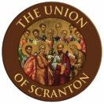

<section class="wrapper bg-light">
  

    

      

        <article class="card shadow-lg">
          

All Catholics in the United States on or prior to 17 September 1787
would be what is known today as Old Catholics since they did not believe
in the Infallibility of the Pope and the Immaculate Conception of the
Virgin Mary .   Old Catholics separated from Roman Catholics with the
Declaration of Utrecht. Old Catholics are in Full Communion with
the [Episcopal](https://www.firstfamilies.us/faith/episcopalian) Church
with the [Bonn
Agreement](https://en.wikipedia.org/wiki/Bonn_Agreement_%28Christianity%29).

Old Roman Symbol

I believe in God the Father almighty;

and in Christ Jesus His only Son, our Lord, Who was born of the Holy
Spirit and the Virgin Mary, Who under Pontius Pilate was crucified and
buried, on the third day rose again from the dead, ascended to heaven,
sits at the right hand of the Father, whence He will come to judge the
living and the dead;

and in the Holy Spirit, the holy Church, the remission of sins, and the
life everlasting.

NOTE: *this is the earliest creed, sited in the 2nd century of which the
Apostle\'s Creed is base*

[Union of Scranton](https://theunionofscranton.org/)

     

          

        </article>
      

    

  

</section>
